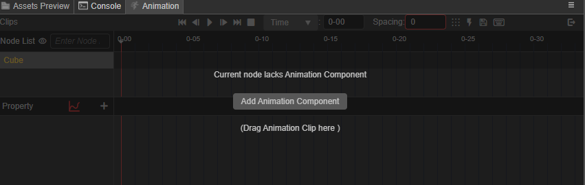
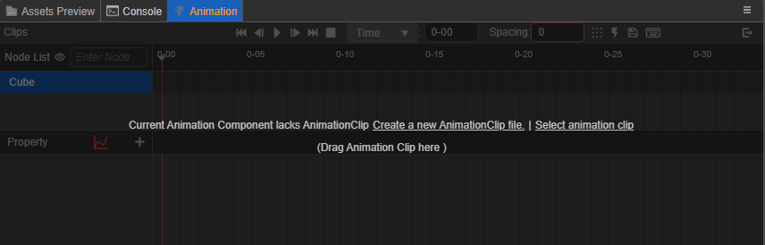
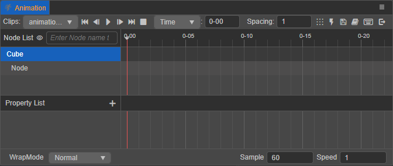
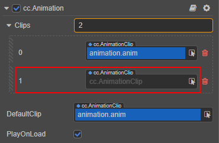
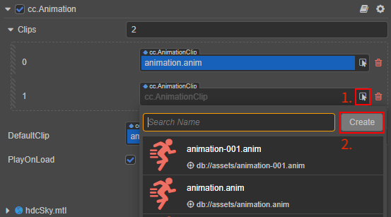

# 创建动画组件和动画剪辑

在使用 **动画编辑器** 制作动画之前需要先在 **层级管理器** 或者 **场景编辑器** 中选择要添加动画的节点，然后添加 **动画组件**，并在组件上挂载 **动画剪辑（Animation Clip）**，便可以编辑动画数据，编辑后的动画数据会保存在当前的动画剪辑中。没有挂载 Clip 的节点是无法编辑动画数据的。

如果当前选中节点没有动画组件，则 **动画编辑器** 的界面上会显示 **添加 Animation 组件** 按钮，点击即可在 **属性检查器** 上添加 **动画组件**。

继续点击 **动画编辑器** 中的 **新建 AnimationClip 文件** 按钮并命名（例如 `animation`）：

便可在 **资源管理器** 中自动创建一个动画剪辑（`animation.anim`）并挂载到 Animation 组件的 `DefaultClip` 属性上：

以上简单介绍了如何在 **动画编辑器** 中创建动画组件和动画剪辑，更多关于动画组件的创建和属性请参考下文 **动画组件参考** 部分的内容。更多创建动画剪辑的方法请参考文末部分的内容。

然后继续点击 **进入动画编辑模式** 即可开始 [编辑动画剪辑](edit-animation-clip.md)。新建的空的动画剪辑在动画编辑器中显示如下：

## 动画组件参考

添加动画组件除了上述方法，还可以

除了在 **动画编辑器** 中添加动画组件，还可以在 **层级管理器** 中选中需要添加动画的节点，然后在 **属性检查器** 中选择 **添加组件 -> Animation -> Animation** 来添加一个动画组件到节点上。

| 属性 | 功能说明 |
| :-- | :------ |
| Clips        | 添加的动画剪辑列表，默认为空，在这里添加的 AnimationClip 可以直接在 **动画编辑器** 中进行编辑 |
| DefaultClip | 默认的动画剪辑，若该项在挂载了动画剪辑的同时，还勾选了下方的 **PlayOnLoad** 属性，那么动画便会在加载完成后自动播放 Default Clip 的内容 |
| PlayOnLoad | 布尔类型，若勾选该项则在动画加载完成后会自动播放 Default Clip 的内容 |

如果一个动画需要包含多个节点，那么一般会新建一个节点作为动画的 **根节点**，再将动画组件挂载到根节点上，则这个根节点下的其他子节点都会自动进入到这个动画剪辑中，并显示在 **动画编辑器** 的 **节点列表** 区域。详情可参考 [熟悉动画编辑器](animation-editor.md)。

Animation 组件也提供了一些常用的动画控制函数，若要程序化控制动画，请参考 [动画组件](animation-component.md)。

## 挂载新动画剪辑

一个 Animation 组件可以挂载多份动画剪辑，若需要额外在已有动画剪辑的对象上创建并挂载新的动画剪辑，有以下几种方式：

1. 在 **资源管理器** 中点击左上方的 **+** 按钮，或者右键点击空白区域，然后选择 **Animation Clip**，这时候会在 **资源管理器** 中生成一个动画剪辑文件（默认名为 `animation`）。

    然后在 **层级管理器** 中选中对应节点，在 **属性检查器** 中找到 Animation 组件（`cc.Animation`），修改 `Clips` 属性的数值。例如原本只挂载了一个 clip 文件，现在想要再添加一个，那么就将原本的 **1** 改成 **2**。

    

    最后将刚刚在 **资源管理器** 中创建的动画剪辑，拖拽到上图中的 `cc.AnimationClip` 选择框中即可。

2. 在 **属性检查器** 中找到 Animation 组件（`cc.Animation`），修改 `Clips` 属性的数值。

    然后点击新出现的空的 `cc.AnimationClip` 选择框后面的查找按钮，在弹出的搜索窗口中点击右上方的 **创建** 按钮，即可自动在 **资源管理器** 中创建动画剪辑并挂载到 `cc.AnimationClip` 选择框中。

    

3. 通过脚本动态创建动画剪辑，详情请参考 [程序化编辑动画剪辑](use-animation-curve.md)。

可以在 **动画编辑器** 左上角的 **Clips** 下拉列表切换需要编辑的动画剪辑。
