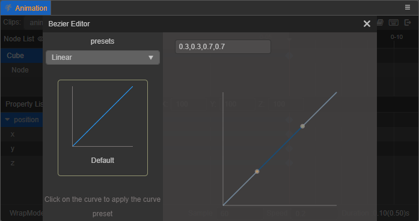
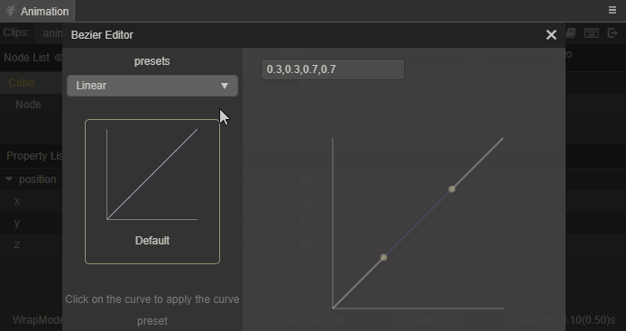
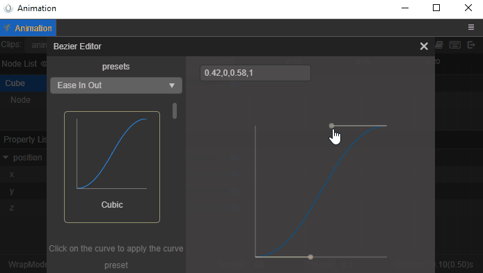
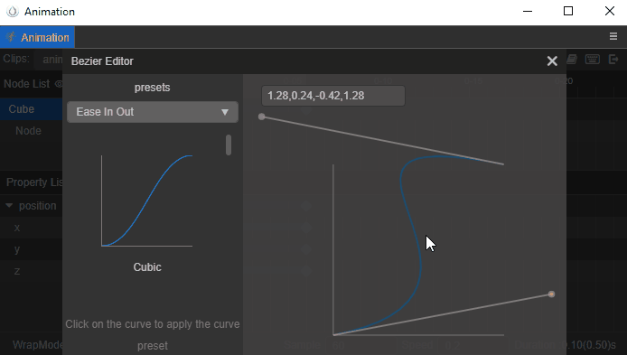

# 编辑动画缓动曲线

在创建了基本的动画剪辑之后，有时候会需要在两个关键帧之间实现 EaseInOut 等缓动效果，那么在 **动画编辑器** 中如何实现呢？

首先需要添加一个动画属性，并在动画属性轨道上创建两个不相等的关键帧。例如在动画属性 `position` 上创建两个关键帧，从 `(0, 0, 0)` 到 `(100, 100, 100)`，此时两个关键帧之间会出现一条蓝色的连接线，双击连接线，即可打开曲线编辑器，面板默认设置如下所示：

动画曲线的修改都是实时的，无需点击保存，修改完点击右上角的关闭按钮即可。

## 使用预设缓动曲线

缓动曲线编辑器在左上角的预设菜单中按照 **Linear**、**Static**、**Ease In**、**Ease Out**、**Ease In Out**、**User** 对预设的缓动效果做了分类，每种分类下都有若干对应类型的缓动曲线预设。其中 **User** 是自定义的曲线预设类别，用于存储自定义的一些曲线效果，详情可参考下文 **自定义缓动曲线** 部分的内容。

点击左侧预设的曲线即可直接应用到当前的动画曲线上，而左侧被使用的预设会有金黄色边框的选中效果。

## 自定义缓动曲线

若预设的缓动曲线无法满足动画需求，可以直接在右侧的曲线预览区域修改缓动曲线。

在曲线编辑器的预览曲线图中有两个灰色的控制点，拖拽控制点即可更改曲线轨迹。如果控制点需要超出视野外，可以通过鼠标滚轮缩放预览图。

修改过程中的曲线数据会实时地显示在曲线预览区域左上角的输入框中，同时还支持在输入框 **手动输入曲线数据以生成曲线**。曲线数据的格式必须是 **由四个数字组成并用逗号隔开**，否则无法正常应用。

### 保存自定义曲线

若自定义的曲线数据需要保存以便复用，可以将其保存在 **User** 的预设库中。 
自定义的曲线编辑完成后，在左上方的预设菜单中选择 **User**，然后在下方的输入框中输入希望保存的曲线数据名称，点击 **Add** 按钮即可将自定义曲线保存到 **User** 的预设库中。

> **注意**：**同名曲线会做覆盖处理**，自定义曲线的保存是无法撤销的，所以如果被覆盖了就需要再重新添加。

保存在 **User** 预设库中的自定义曲线，和其他库的预设曲线一样，**点击即可直接应用**。同时，当鼠标移动到自定义曲线，右下角会出现一个删除的图标按钮，点击即可删除对应的缓动曲线数据。
