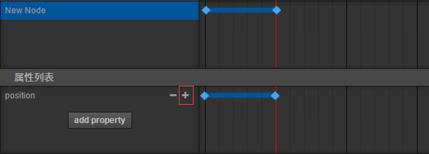
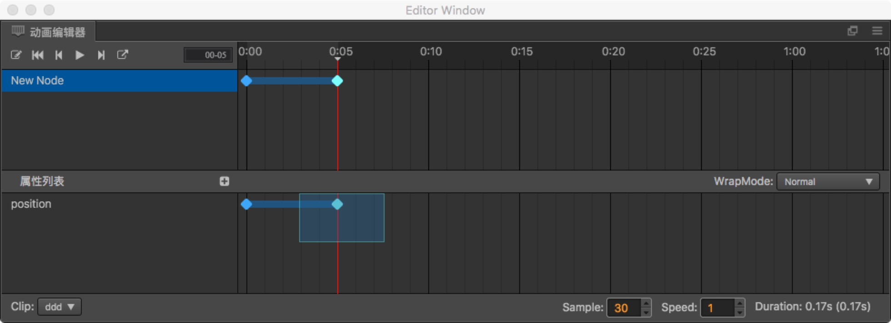

# 编辑动画序列

我们刚刚已经在节点上挂载了动画剪辑，现在我们可以在动画剪辑中创建一些动画曲线了。

我们首先了解一下动画属性，动画属性包括了节点自有的 `position`、`rotation` 等属性，也包含了组件 Component 中自定义的属性。
组件包含的属性前会加上组件的名字，比如 `cc.Sprite.spriteFrame`。
比如下图的 position 那条就是属性轨道，而对应的蓝色菱形就是关键帧。

## 添加一个新的属性轨道

常规的添加方式，我们需要先选中节点，然后在属性区域右上角点击 `+`。
弹出菜单中，会将可以添加的所有属性罗列出来，选中想要添加的属性，就会对应新增一个轨道。

## 删除一个属性轨道

将鼠标焦点移动到要删除的属性轨道上，右边会显示一个  按钮，点击按钮，在弹出菜单中选择 **删除属性**，选中后对应的属性就会从动画数据中删除。

## 添加关键帧

在属性列表中点击对应属性轨道右侧的  按钮，在弹出的菜单中选择 `插入关键帧` 按钮。

也可以在编辑模式下直接更改节点对应的属性轨道 - 例如直接在 **场景编辑器** 中拖动当前选中的节点，`position` 属性轨道上就会在当前的时间上添加一个关键帧。需要注意的是，如果更改的属性轨道不存在，则会忽略此次的操作，所以如果想要修改后自动插入关键帧，需要预先创建好属性轨道。

## 选择关键帧

点击我们创建的关键帧后关键帧会呈现选中状态，此时关键帧由蓝变白。如果需要多选，可以按住 <kbd>ctrl</kbd> 再次选择其他关键帧。或者直接在属性区域拖拽框选。

## 移动关键帧

此时我们将鼠标移动到任意一个被选中的关键帧上，按下鼠标左键并拖动，鼠标会变换成左右箭头，这时候就可以拖拽所有被选中的关键帧了。

## 更改关键帧

在时间轴上选中需要修改的关键帧，直接在 **属性检查器** 内修改相对应的属性即可（确保动画编辑器处于编辑状态）。例如属性列表中有 position、x、y 三个属性轨道，选中关键帧之后，则可以修改 **属性检查器** 中的 position、x、y 属性。

或者在时间轴上选择一个没有关键帧的位置，然后在属性检查器中修改相对应的属性，便会自动插入一帧。

## 删除关键帧

选中关键帧后，点击对应属性轨道的  按钮，选择 `删除选中帧`。或者直接按下键盘上的 `delete` 按键，则所有被选中的节点都会被删除。

## 复制/粘贴关键帧

> 仅支持 v1.9.2 以上版本

在动画编辑器内选中关键帧之后，可以按下 <kbd>ctrl + c</kbd>（Windows）或 <kbd>command + c</kbd>（Mac）复制当前的关键帧。然后选中某一个时间轴上的点，按下 <kbd>ctrl + v</kbd>（Windows）或 <kbd>command + v</kbd>（Mac）会将刚刚复制的关键帧粘贴到选中的时间点上。

根据选中的节点数量有两种建立索引的方式：

1. 只选择了一个节点上的数据的时候，直接粘贴到当前选中节点上
2. 如果复制的是多个节点上的数据，则会把复制的节点的路径信息也粘贴到当前的 clip 内

如果复制的节点在粘贴的节点树内不存在，则会显示为丢失的节点。

## 节点操作

动画是按照节点的名字来进行索引关联的，有时候我们会在 **层级管理器** 内改变节点的层级关系，而 **动画编辑器** 内的动画就会找不到当初指定对应的节点。 
这时候我们需要手动更改一下动画上节点的搜索路径：

1. 鼠标移动到要迁移的节点上，点击右侧出现的菜单按钮
2. 选择移动节点数据
3. 修改节点的路径数据

根节点的数据我们是不能改变的，我们可以修改后续的节点路径，比如我们要将 /root/New Node 的帧动画移动到根节点上，我们可以将 New Node 删除，剩下 /root/ 然后回车（/root/是无法修改的根节点路径）。再比如我们要将 /root 跟节点上的动画数据移动到 /root/New Node 上，我们只需要将路径改成 /root/New Node