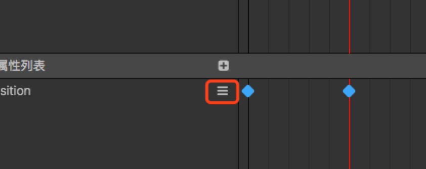

# 编辑动画序列

我们刚刚已经在节点上挂载了动画剪辑，现在我们可以在动画剪辑中创建一些动画曲线了。

我们首先了解一下动画属性，动画属性包括了节点自有的`position`,`rotation`等属性，也包含了组件Component中自定义的属性。
组件包含的属性前会加上组件的名字，比如`cc.Sprite.spriteFrame`。
比如下图的 position 那条就是属性轨道，而对应的蓝色棱形就是动画帧。

## 添加一个新的属性轨道

常规的添加方式，我们需要先选中节点，然后在属性区域右上角点击 `+`。
弹出菜单中，会将可以添加的所有属性罗列出来，选中想要添加的属性，就会对应新增一个轨道。

## 删除一个属性轨道

右键点击属性列表中的属性，在弹出菜单中选择`delete` 选项，选中后对应的属性就会从动画数据中删除。

## 添加动画帧

直接在属性列表中右键点击对应属性右侧的 “更多” 按钮，点击菜单内的添加属性帧按钮。

也可以在编辑模式下直接更改节点的对应轨道的属性 - 例如直接在场景编辑器中拖动当前选中的节点，`position` 轨道上就会在当前的时间上增加一个关键帧。
需要注意的是，如果更改的属性轨道不存在，则会忽略此次的操作，所以如果想要修改后自动插入关键帧，需要预先创建好属性轨道。

## 选择动画帧

点击我们创建的序列帧后序列帧会显示成选中状态，此时关键帧由蓝变白，如果需要多选，可以按住ctrl再次选择其他序列帧。或者直接在属性区域拖拽框选。

## 移动动画帧

此时我们将鼠标移动到任意一个选中的关键帧（蓝色棱形）或序列帧（包括关键帧和关键帧之间的连线）上，鼠标会显示出左右箭头，这时候按下鼠标左键就可以拖拽所有被选中的节点了。

## 更改动画帧

点击需要修改的动画帧，此时时间轴上选中的帧也会跳到这一帧，然后确保打开了录制状态，直接在属性检查器内修改对应的属性即可。

## 删除动画帧

选中序列帧后，点击属性区域的`-`，此时当前属性被选中的序列帧会被删除。或者直接按下键盘上的 delete 按键，则所有被选中的节点都会被删除。

## 复制/粘贴 动画帧

**仅支持1.9.2以上版本**

我们在选中节点后，可以按下键盘上的组合键 ctrl+c 复制已经选中的帧。然后在新的区域按下 ctrl+v 可以将刚刚复制的帧，粘贴到新的位置。

粘贴的时候以当前选中帧为复制的最前方一帧的位置，按照相对位置粘贴到指定的位置。

根据选中的节点数量有两种建立索引的方式：

1. 只选择了一个节点上的数据的时候，直接粘贴到当前选中节点上
2. 如果复制的是多个节点上的数据，则会把复制的节点的路径信息也贴到当前的 clip 内