# 熟悉动画编辑器

**动画编辑器** 面板用于编辑和预览当前所选节点的动画剪辑。编辑动画数据或者相关属性时，鼠标焦点离开后会立即生效。

Cocos Creator 的默认布局中已经包含了 **动画编辑器**，也可以通过点击编辑器上方主菜单的 **面板 -> 动画 -> 动画编辑器** 打开 **动画编辑器**。

## 面板介绍

**动画编辑器** 面板可以划分为以下几个主要部分：

1. **菜单工具栏**：放置一些常用的功能按钮，例如播放/暂停/停止动画、添加事件帧、保存动画、退出编辑等。
2. **节点列表**：用于显示/设置当前选中节点及其子节点。
3. **动画时间轴与关键帧预览**：用于显示/设置当前节点（及其子节点）添加的事件帧以及所添加的动画属性上所有关键帧的预览。
4. **动画属性列表**：用于显示/设置当前选中的节点在当前编辑的动画剪辑中包含的所有动画属性。
5. **动画属性关键帧预览**：用于显示/设置当前选中节点的各个动画属性上的所有关键帧，当切换到曲线视图时，将显示关键帧连接的曲线轨迹。
6. **设置当前动画剪辑的相关属性**：用于设置当前动画剪辑的播放模式、播放速度等。

更多具体内容请参考下文介绍。

### 1. 菜单工具栏

**菜单工具栏** 中的功能按钮从左到右依次为：

| 图标 | 功能说明 | 快捷键 |
| :---- | :--- | :--- |
| 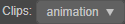 | 切换动画剪辑。当动画组件上挂载了多个动画剪辑时，可通过该按钮切换进行编辑。 | - |
| 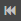 | 将红色的时间控制线移动到当前动画剪辑的开头  | <kbd>Ctrl</kbd>/<kbd>Cmd</kbd> + <kbd>←</kbd> |
|  | 将时间控制线移动到上一帧  | <kbd>←</kbd> |
|  | 播放/暂停当前动画  | <kbd>Ctrl</kbd>/<kbd>Cmd</kbd> + <kbd>P</kbd> |
| 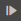 | 将时间控制线移动到下一帧  | <kbd>→</kbd> |
|  | 将时间控制线移动到当前动画剪辑的结尾 | <kbd>Ctrl</kbd>/<kbd>Cmd</kbd> + <kbd>→</kbd> |
|  | 点击停止当前动画，停止后时间控制线将会移动到第一帧 | <kbd>Ctrl</kbd>/<kbd>Cmd</kbd> + <kbd>S</kbd> |
|  | 时间轴的刻度单位显示方式，包括三种： **时间：0-00** **帧：0** **时间（s）：0 s** 详情可参考下文 **时间轴的刻度单位显示** 部分的内容。 | - |
| | 用于设置同时生成多个关键帧时，关键帧之间的间隔大小。| - |
|  | 间隔排列同时选中的多个关键帧。选中的关键帧将会以第一个帧为基准，以 **Spacing** 输入框中的数值作为间隔大小依次排列  | -  |
|  | 添加事件帧，点击该按钮即可在当前时间线上方的位置添加事件帧  | - |
|  | 保存当前编辑的动画数据。 | - |
| 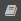 | 点击该按钮即可跳转到官方手册文档关于动画编辑器部分的内容 | <kbd>Ctrl</kbd>/<kbd>Cmd</kbd> + <kbd>S</kbd> |
|  | 打开快捷键面板，支持自定义快捷键。详情可参考下文 **快捷键** 部分的内容 | - |
| | 退出动画编辑模式 | <kbd>Ctrl</kbd> + <kbd>Q</kbd> |

### 2. 节点列表

该区域会显示当前选中的动画节点及其子节点，并以与 **层级管理器** 中的节点树一一对应的方式排列。可点击上方的 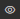 按钮来隐藏/显示无动画数据的节点，或者直接在输入框中输入节点名称来快速查找节点。

目前支持右键点击节点来选择清空节点数据、迁移节点数据、复制粘贴节点数据。具体内容请参考 [节点数据常见操作](edit-animation-clip.md#%E8%8A%82%E7%82%B9%E6%95%B0%E6%8D%AE%E5%B8%B8%E8%A7%81%E6%93%8D%E4%BD%9C)。

### 3. 动画时间轴与关键帧预览

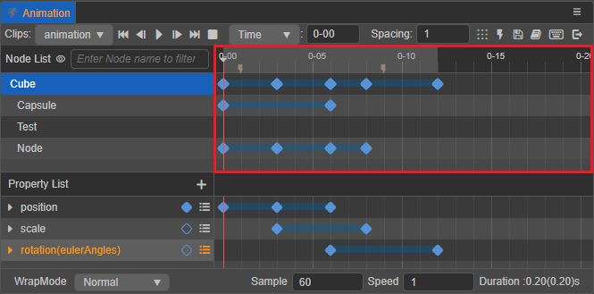

动画时间轴主要用于显示/设置当前节点添加的自定义 [事件帧](animation-event.md)、节点（及其子节点）添加的所有动画属性上的 [关键帧](edit-animation-clip.md)（蓝色菱形）并显示预览。

时间控制线（红色竖线）表示当前动画所处的时间节点，可通过以下几种方式更改当前选中时间：

- 直接拖拽时间控制线
- 双击关键帧
- 在菜单工具栏中使用相关移动控制按钮
- 使用快捷键，具体控制键可查询下文 **快捷键** 部分的内容
- 在动画时间轴上方区域内点击任意位置

  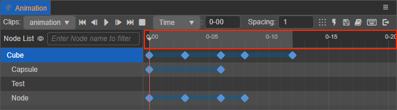

移动时间控制线则 **场景编辑器** 中的节点也会根据动画轨迹进行相应的移动。

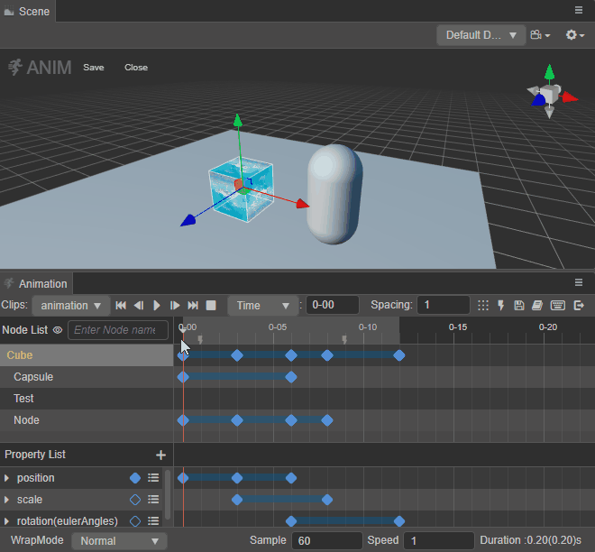

#### 时间轴的刻度单位显示

**菜单工具栏** 中的  按钮可用于切换动画时间轴的刻度显示方式。输入框中的数值会随着时间控制线的移动而变化，支持手动输入，输入完成后时间控制线会自动定位到相应的位置。

目前支持以下三种显示方式：

- **时间：0-00**（默认）：以秒和帧组合为单位的方式来显示动画时间轴的刻度。输入框前面的数值表示 **秒**，后面的数值表示 **帧**，例如 `01-05` 表示 1 秒又 5 帧。

  

- **帧：0**：以帧为单位的方式来显示动画时间轴的刻度。

  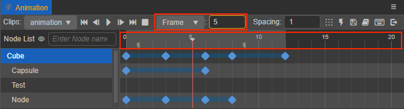

- **时间（s）：0 s**：以秒为单位的方式来显示动画时间轴的刻度。

  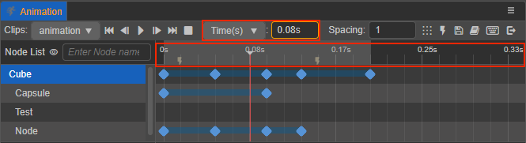

我们一般用帧率（Sample）来表示一秒要划分为多少帧，可以在 **动画编辑器** 底部的 **Sample** 选项中进行调整。当时间轴的刻度单位显示方式不同时，受影响程度也不同。

当刻度单位设置为 **帧** 时，以帧数为单位，不受帧率影响。 
当设置为 **时间** 或者 **时间（s）** 时，同一个刻度表示的时间点会随着帧率的变化而有所不同，这两者之间的转换计算方式如下：

| 帧率（Sample）| 时间：00-00 | 时间（s）：0 s |
| :-- | :--------- | :------------ |
| 30  | 01-05      | 1 + 5/30 = 1.17 s |
| 10  | 01-05      | 1 + 5/10 = 1.5 s  |

例如将帧率设置为 30，在 `01-05` 刻度上添加了一个关键帧，则该关键帧位于动画开始后的第 35 帧。然后把帧率修改为 10，该关键帧所在的总帧数并没有发生变化，仍然处在动画开始后的第 35 帧，而此时关键帧所在位置的刻度读数变成了 `03-05`，换算成时间（s）以后正好是之前的 3 倍。

#### 更改动画时间轴缩放比例

在操作中如果觉得 **动画编辑器** 显示的范围太小，需要按比例缩小，让更多的关键帧显示到编辑器内怎么办？

在 **动画时间轴** 和 **动画属性关键帧预览** 任一区域内滚动鼠标滚轮，即可放大或者缩小时间轴的横向显示比例。

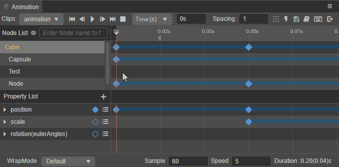

#### 移动动画时间轴显示区域

在 **动画时间轴** 或者 **动画属性关键帧预览** 任一区域按下鼠标中键/右键进行拖拽，即可查看动画时间轴左/右侧超出显示区域而被隐藏的关键帧。

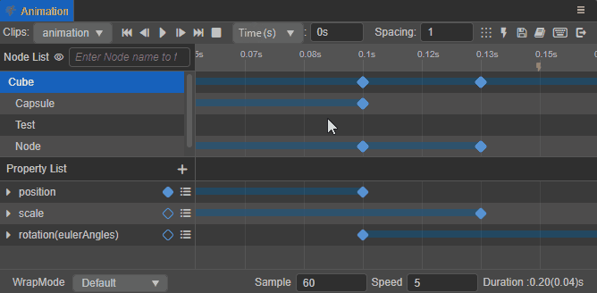

### 4. 动画属性列表

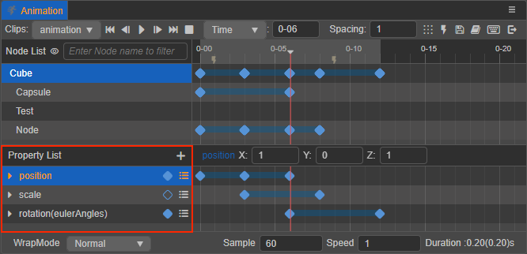

该区域主要用于显示/添加/设置当前选中的节点在当前动画剪辑中的动画属性。点击右上角的 **+** 按钮即可添加动画属性，动画属性包括了节点自有的属性、组件属性（包含用户自定义脚本组件中的属性）。组件包含的属性前会加上组件的名字，比如 `cc.Sprite.spriteFrame`。

右键点击动画属性或者单击动画属性右侧的  按钮即可选择 **移除当前属性轨道**、**清空关键帧**，或者 **复制粘贴当前属性轨道**。具体内容请参考 [动画属性数据常见操作](edit-animation-clip.md#%E5%8A%A8%E7%94%BB%E5%B1%9E%E6%80%A7%E6%95%B0%E6%8D%AE%E5%B8%B8%E8%A7%81%E6%93%8D%E4%BD%9C)。

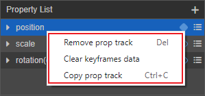

### 5. 动画属性关键帧预览

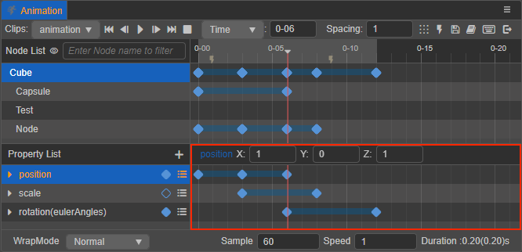

该区域主要用于显示当前选中节点在各动画属性上具体的关键帧设置情况，也是关键帧编辑的主要区域。可以直接在右侧的动画属性上点击右键来添加关键帧。同时在该区域也支持框选、点选关键帧来进行移动、复制、粘贴等操作。详情请参考 [关键帧常见操作](edit-animation-clip.md#%E5%85%B3%E9%94%AE%E5%B8%A7%E5%B8%B8%E8%A7%81%E6%93%8D%E4%BD%9C)。

单击选中某一关键帧，关键帧会由蓝色变成白色并且该区域上方会显示当前关键帧的相关信息，若双击关键帧还会将时间控制线移动到当前关键帧所在位置。

### 6. 设置当前动画剪辑的相关属性

当前动画剪辑在动画编辑器上可直接设置的属性包括：**WrapMode**、**Sample**、**Speed** 和 **Duration**。具体内容请参考 [动画剪辑属性设置](edit-animation-clip.md#%E5%8A%A8%E7%94%BB%E5%89%AA%E8%BE%91%E5%B1%9E%E6%80%A7%E8%AE%BE%E7%BD%AE)。

## 调整动画编辑器布局

节点列表与时间轴之间的分界线，以及属性列表与时间轴之间的分界线都是可以用于拖拽更改布局的，通过拖拽可以自由地将 **动画编辑器** 调整成适合编辑的布局效果。

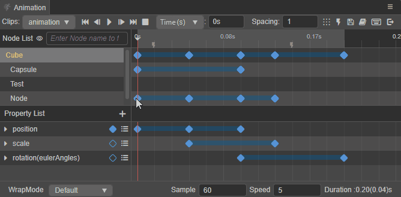

## 快捷键

点击菜单工具栏的  按钮，即可打开快捷键面板：

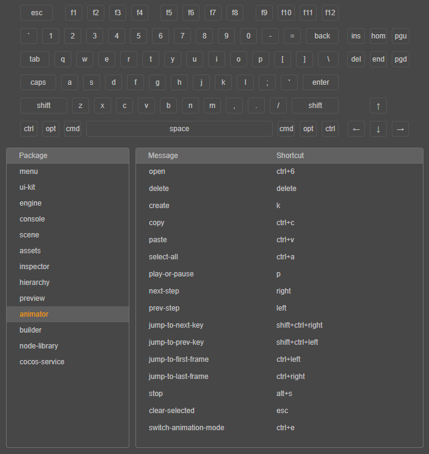

支持开发者自定义 **动画编辑器** 的快捷键，直接点击要修改的功能的快捷键组合，会出现如下图所示的提示，即可直接修改快捷键。

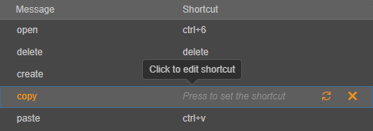

### 默认快捷键汇总

功能 | 快捷键 | 说明
:--- | :----- | :---
进入/退出动画编辑器 | <kbd>Ctrl</kbd>/<kbd>Cmd</kbd> + <kbd>E</kbd> | -
保存动画数据 | <kbd>Ctrl</kbd>/<kbd>Cmd</kbd> + <kbd>S</kbd> | -
向前移动一帧 | <kbd>←</kbd> | 如果已经在第 0 帧，则忽略当前操作。未选中关键帧时移动的是时间控制线，选中关键帧时移动的是关键帧
向后移动一帧 | <kbd>→</kbd> | 未选中关键帧时移动的是时间控制线，选中关键帧后移动的是关键帧
移动到第一帧 | <kbd>Ctrl</kbd>/<kbd>Cmd</kbd> + <kbd>←</kbd> | 将红色的时间控制线移动到当前动画剪辑的开头
移动到最后一帧 | <kbd>Ctrl</kbd>/<kbd>Cmd</kbd> + <kbd>→</kbd> | 将时间控制线移动到当前动画剪辑的结尾
删除当前选中关键帧 |  <kbd>Delete</kbd> / <kbd>Cmd</kbd> + <kbd>Backspace</kbd> | -
播放/暂停动画 | <kbd>P</kbd> | -
停止动画 | <kbd>Alt</kbd> + <kbd>S</kbd> | 当前时间将变为 0，且时间控制线将会移动到第一帧
添加关键帧 | <kbd>K</kbd> | 选中任一动画属性后，将会在时间控制线所在位置添加关键帧，没有选中动画属性则忽略
跳到上一个关键帧 | <kbd>Ctrl</kbd>/<kbd>Cmd</kbd> + <kbd>Shift</kbd> + <kbd>←</kbd> | 将时间控制线移动到左侧最近的一个关键帧（在选中的属性轨道上或选中的节点上）
跳到下一个关键帧 | <kbd>Ctrl</kbd>/<kbd>Cmd</kbd> + <kbd>Shift</kbd> + <kbd>→</kbd> | 将时间控制线移动到右侧最近的一个关键帧（选中的属性轨道上或选中的节点上）
多选关键帧 | <kbd>Ctrl</kbd> | 按住 <kbd>Ctrl</kbd> 点击关键帧可多选关键帧，按下 <kbd>Ctrl</kbd> 后也可以叠加框选关键帧后
全选动画属性关键帧 | <kbd>Ctrl</kbd>/<kbd>Cmd</kbd> + <kbd>A</kbd> | 全选选中的动画属性上的所有关键帧
复制选中的动画数据 | <kbd>Ctrl</kbd>/<kbd>Cmd</kbd> + <kbd>C</kbd> | 支持复制选中的关键帧、属性轨道、节点数据，同时只能复制一种数据，且按照这个顺序来决定复制优先级
粘贴上一次复制的动画数据 | <kbd>Ctrl</kbd>/<kbd>Cmd</kbd> + <kbd>V</kbd> | 支持跨编辑器（限 v3.x）粘贴上一次复制的动画数据（例如动画关键帧数、动画属性、动画节点数据，并按照该排序依次检查当前可粘贴的数据）。
取消选中的关键帧/事件帧/属性轨道 | <kbd>Esc</kbd> | -

> **注意**：目前除了 **进入/退出动画编辑器**、**保存动画** 的快捷键是全局可用以外，其他快捷键都需要鼠标焦点在动画编辑器面板时才生效。
