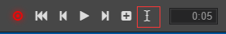

# 添加动画事件

在游戏中，经常需要在动画结束或者某一帧的特定时刻，执行一些函数方法。那么在动画编辑器中怎么实现呢？

## 添加事件

首先选中某个位置，然后点击按钮区域最左侧的按钮（add event），这时候在时间轴上会出现一个白色的矩形，这就是我们添加的事件。

## 删除事件

双击刚刚出现的白色矩形，打开事件编辑器后点击 function 后面的回收图标，会提示是否删除这个 event，点击确认则删除。

也可以在动画编辑器中右键点击 event，选择delete。

## 指定事件触发函数以及传入参数

双击刚刚出现的白色矩形，可以打开事件编辑器，在编辑器内，我们可以手动输入需要出发的function名字，触发的时候会根据这个函数名，去各个组件内匹配相应的方法。

如果需要添加传入的参数，则在 Params 旁点击 `+` 或者 `-` ，只支持Boolean，String，Number三种类型的参数。
