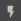
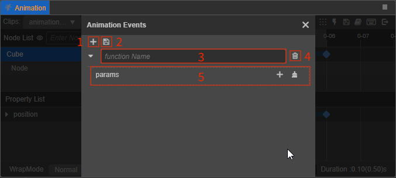

# 添加动画事件

通过在动画时间轴的指定帧调用 **动画事件** 函数可以更好地充实动画剪辑。在动画时间轴某一帧上添加 **事件帧** 后，动画系统将会在动画执行到该帧时，根据事件帧中设置的触发函数名称去匹配动画根节点中对应的函数方法并执行。

若要通过脚本添加动画事件，详情请参考 [帧事件](animation-component.md#%E5%B8%A7%E4%BA%8B%E4%BB%B6)。

## 添加事件帧

在 **动画编辑器** 中添加事件帧包括以下两种方式：

1. 将时间控制线拖动到需要添加事件帧的位置，然后点击 **菜单工具栏** 中的  按钮，即可在 **动画时间轴** 上方添加事件帧。

2. 在动画时间轴上方区域点击右键，然后选择 **新建事件帧** 即可。

事件帧添加完成后，将鼠标移动到事件帧，颜色会从白色变成黄色。右键点击事件帧即可执行 **编辑**、**删除**、**复制粘贴** 等操作。同时也支持批量操作事件帧，在按住 <kbd>Ctrl</kbd> 的同时点击多个事件帧即可。

- **编辑**：用于打开事件编辑器，添加事件函数
- **删除**：用于删除事件帧
- **复制/粘贴**：事件帧数据的复制和粘贴，支持跨编辑器（v3.x）使用。

### 编辑事件帧

右键点击添加的事件帧并选择 **编辑** 或者直接双击，即可打开事件编辑器。在事件编辑器中可以手动输入需要触发的事件函数名称，触发时会根据这个函数名，去动画根节点的各个组件内匹配相应的函数方法，并对其进行调用，传入参数。

- 1 — 用于添加新的触发函数
- 2 — 用于保存事件函数
- 3 — 填写需要触发的函数名称
- 4 — 用于删除当前事件函数
- 5 — 用于添加传入的参数，目前支持 **String**、**Number**、**Boolean** 三种类型

  

    - 1 — 用于添加传入的参数，可根据需要选择参数类型
    - 2 — 用于删除下方所有已添加的传入参数
    - 3 — 当鼠标移动到某一参数上时，便会出现该按钮，点击即可删除当前选中的参数

### 删除事件帧

在动画时间轴上方右键点击已经添加的事件帧（可多选），然后选择 **删除** 或者使用快捷键 <kbd>Delete</kbd> 即可删除该事件帧及所有的事件函数。

### 复制粘贴事件帧

事件帧及其事件函数的复制和粘贴，支持跨编辑器（v3.x）使用。复制粘贴包括以下两种使用方式：

- 选中事件帧后（可多选），使用快捷键 <kbd>Ctrl</kbd> + <kbd>C</kbd> 和 <kbd>Ctrl</kbd> + <kbd>V</kbd> 即可进行复制粘贴。需要注意的是快捷键粘贴的位置将会以当前时间控制线所在的位置为起点。
- 选中事件帧后（可多选），右键点击（任一）事件帧，在弹出的菜单中选择 **复制**，然后在动画时间轴上方点击右键，选择 **粘贴事件帧** 即可。
