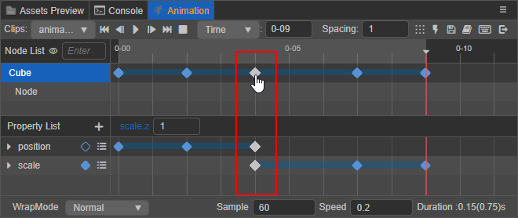
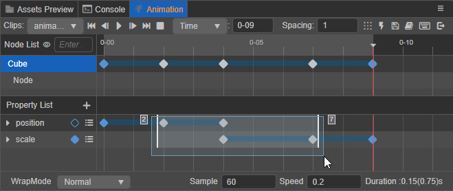
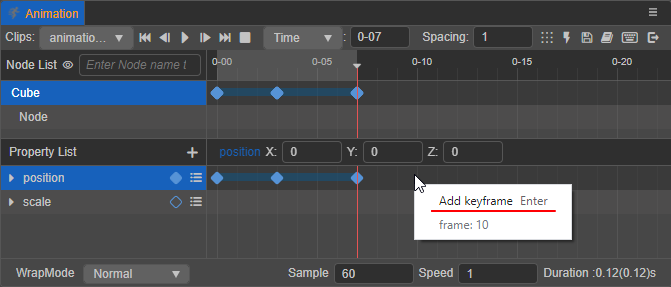
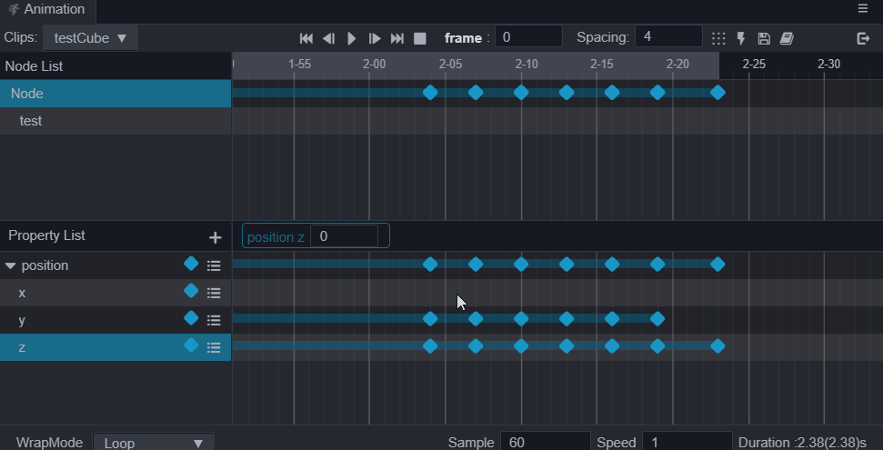
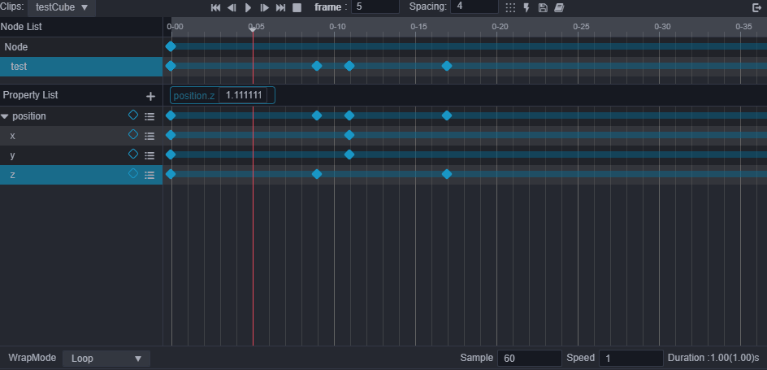
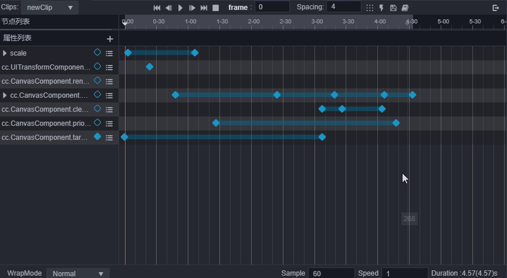
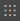
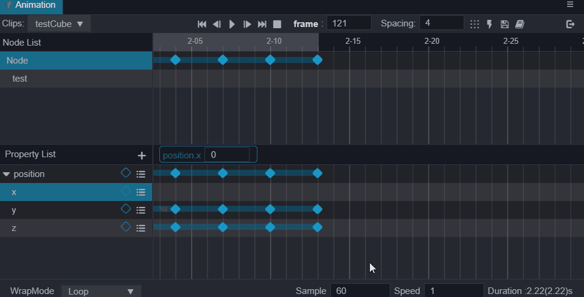
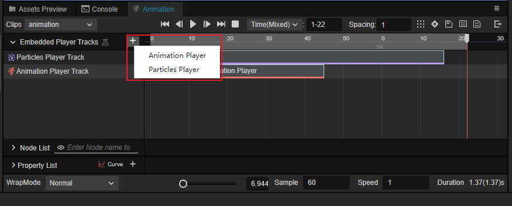

# 关键帧编辑视图

节点轨道显示区域与属性轨道显示区域，默认均为关键帧编辑视图的显示方式。在这种视图下，可以更方便的编辑整体的关键帧排布、添加以及删除关键帧。下面介绍在关键帧编辑视图下，支持的各种关键帧操作方法，了解这些方法技巧可以更快更方便地编辑动画剪辑。

## 选中关键帧

选中的关键帧会由蓝色变成白色，包括以下几种：

- 单击动画属性轨道上的关键帧即可选中
- 双击关键帧则会在选中关键帧的同时将时间控制线移动到当前关键帧所在位置
- 单击节点在动画时间轴中的关键帧，即可同时选中节点的各个动画属性在同一位置上的所有关键帧。

  

同时也支持多选关键帧，包括以下几种方式：

- 按住 <kbd>Ctrl</kbd>/<kbd>Cmd</kbd> 的同时点击多个关键帧

- 通过框选的方式选择多个连续的关键帧，方框左右两侧会分别显示首尾关键帧在动画时间轴中的帧数。

  

- **选中任一属性轨道** 后，按下 <kbd>Ctrl</kbd>/<kbd>Cmd</kbd> + <kbd>A</kbd> 即可全选当前动画属性轨道上的所有关键帧。

## 添加关键帧

除了 **创建动画曲线** 中介绍的通过修改属性的方式来添加关键帧，还可以通过以下几种方式添加：

1. 选中动画属性，使用快捷键 <kbd>K</kbd>，将会在在时间控制线所在位置添加关键帧，若没有选中动画属性则忽略

2. 移动时间控制线到需要添加关键帧的位置，点击动画属性右侧的  按钮即可在当前动画属性轨道上添加关键帧。

3. 在动画属性的属性轨道中，右键点击需要添加关键帧的位置，然后在弹出的菜单中选择 **添加关键帧** 即可，菜单上同时也会显示当前添加关键帧位置的帧数。

    

4. 将动画属性对应的资源批量从 **资源管理器** 拖拽到属性轨道上时，将会按照工具栏中  设置的数值为间隔大小，以资源被选中的顺序依次排列添加关键帧。

## 移除关键帧

1. 选中需要删除的关键帧（可多选），按下 <kbd>Delete</kbd> 键（Windows）或者 <kbd>Cmd</kbd> + <kbd>Backspace</kbd>（macOS）即可。

2. 选中需要删除的关键帧（可多选），然后点击右键，在弹出的菜单中选择 **移除关键帧** 即可。

3. 拖动时间控制线到需要移除的关键帧的位置或者直接 **双击** 关键帧，然后在动画属性列表中点击对应的动画属性右侧的  按钮即可。

## 移动关键帧

在选中关键帧的同时拖动，即可将关键帧移动到想要的位置。

- 当拖动单个关键帧时，关键帧下方会出现一个白色小方框，显示移动过程中的帧数以及移动的距离。
- 当拖动多个关键帧时，方框左右两侧会分别显示移动过程中首尾关键帧在动画时间轴中的帧数。

## 缩放关键帧

当选中多个关键帧时，首尾关键帧会显示两条控制辅助杆，拖动任意一个控制杆移动即可对选中的关键帧进行整体缩放。

## 间隔排列关键帧

选中多个关键帧后，点击上方菜单栏中的  间隔排列关键帧按钮，选中的关键帧便会以第一个关键帧为基准，以  输入框中设置的数值为间隔帧数依次排列。

## 复制/粘贴关键帧

关键帧数据的复制和粘贴，支持跨节点、跨 Clip 使用。包括以下两种使用方式：

- 选中关键帧后（可多选），使用快捷键 <kbd>Ctrl</kbd> + <kbd>C</kbd> 和 <kbd>Ctrl</kbd> + <kbd>V</kbd> 即可进行复制粘贴。需要注意的是快捷键粘贴的位置将会以当前时间控制线所在的位置为起点。
- 选中关键帧后（可多选），右键点击（任一）关键帧，在弹出的菜单中选择 **复制关键帧**，然后在目标动画属性轨道上点击右键，选择 **粘贴关键帧** 即可在当前动画属性轨道上粘贴关键帧。

以上两种粘贴方式在复制粘贴多个属性轨道数据时有所差异，区别主要在于：

- 使用快捷键粘贴关键帧数据时，将会在复制关键帧的动画属性轨道上按照复制的关键帧顺序一一粘贴

  

- 在目标属性轨道上点击右键选择粘贴时，只有目标属性轨道上会被粘贴上复制的数据。

  

分量属性轨道（例如动画属性 `position` 下的 x、y、z 属性）作为单独的属性轨道也会遵循这个规则。如果在主轨道（例如动画属性 `position`）上复制了关键帧数据后，在目标分量轨道上点击右键进行粘贴，那么只有目标分量轨道才会粘贴上关键帧数据。请务必根据实际需要粘贴的位置来复制对应数据，以免产生预期之外的结果。

## 动画嵌套系统

动画嵌套系统是 v3.6 新增的系统，该系统的作用是允许在动画剪辑的制作时，可以同时绑定粒子特效、其他动画等的功能。用于满足在播放动画同时播放特效的功能。

在动画窗口展开 **播放器轨道列表** 即可观察整个嵌套系统：

### 添加轨道

动画嵌套系统支持 **动画播放器** 以及 **粒子播放器**。

在 **东方轨道列表** 的右侧点击 **+** 按钮即可添加不同的轨道：

#### 粒子特效

#### 动画播放器