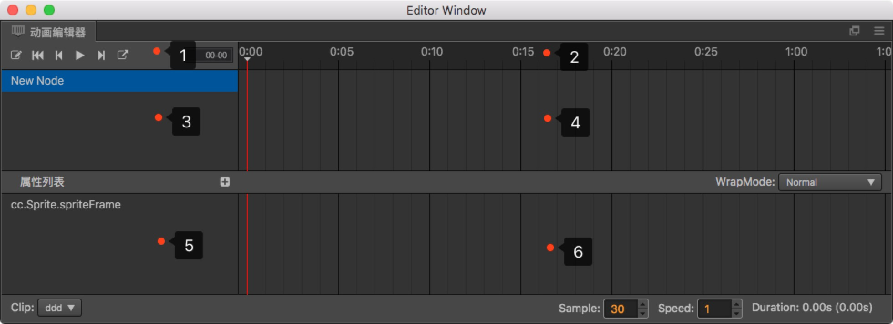

# 关于 Animation

## Animation 组件

之前我们了解了 Cocos Creator 是组件式的结构。那么 Animation 也不例外，它也是节点上的一个组件。

## Clip 动画剪辑

动画剪辑就是一份动画的声明数据，我们将它挂载到 Animation 组件上，就能够将这份动画数据应用到节点上。

### 节点数据的索引方式

数据中索引节点的方式是以挂载 Animation 组件的节点为根节点的相对路径。
所以在同个父节点下的同名节点，只能够产生一份动画数据，并且只能应用到第一个同名节点上。

### clip 文件的参数

**sample**：定义当前动画数据每秒的帧率，默认为 60，这个参数会影响时间轴上每两个整数秒刻度之间的帧数量（也就是两秒之内有多少格）。

**speed**：当前动画的播放速度，默认为 1

**duration**：当动画播放速度为 1 的时候，动画的持续时间

**real time**：动画从开始播放到结束，真正持续的时间

**wrap mode**：循环模式

## 动画编辑模式

动画在普通模式下是不允许编辑的，只有在动画编辑模式下，才能够编辑动画文件。但是在编辑模式下，无法对节点进行 **增加 / 删除 / 改名** 操作。

- 打开编辑模式：选中一个包含 Animation 组件，并且包含有一个以上 clip 文件的节点。然后在动画编辑器左上角点击唯一的按钮。

- 退出编辑模式：点击动画编辑器左上角的编辑按钮，或者点击场景编辑器左上角的 **关闭** 按钮

## 熟悉动画编辑器

动画编辑器一共可以划分为 6 个主要部分。

1. 常用按钮区域，这里负责显示一些常用功能按钮，从左到右依次为：开关录制状态、返回第一帧、上一帧、播放/暂停、下一帧、新建动画剪辑、插入动画事件。

2. 时间轴与事件，这里主要是显示时间轴，添加的自定义事件也会在这里显示。

3. 层级管理（节点树），当前动画剪辑可以影响到的节点数据。

4. 节点内关键帧的预览区域，这里主要是显示各个节点上的所有帧的预览时间轴。

5. 属性列表，显示当前选中的节点在选中的动画剪辑中已经包含了的属性列表。

6. 关键帧，每个属性相对应的帧都会显示在这里。

### 时间轴的刻度单位表示方式

时间轴上刻度的表示法是 `01-05`。该数值由两部分组成，冒号前面的是表示当前秒数，冒号后面的表示在当前这一秒里的第几帧。

`01-05` 表示该刻度在时间轴上位于从动画开始经过了 1 秒又 5 帧的时间。

因为帧率（sample）可以随时调整，因此同一个刻度表示的时间点也会随着帧率变化而有所不同。

- 当帧率为 30 时，`01-05` 表示动画开始后 1 + 5/30 = 1.1667 秒。
- 当帧率为 10 时，`01-05` 表示动画开始后 1 + 5/10 = 1.5 秒。

虽然当前刻度表示的时间点会随着帧率变化，但一旦在一个位置添加了关键帧，该关键帧所在的总帧数是不会改变的，假如我们在帧率 30 时向 `01-05` 刻度上添加了关键帧，该关键帧位于动画开始后总第 35 帧。之后把帧率修改为 10，该关键帧仍然处在动画开始后第 35 帧，而此时关键帧所在位置的刻度读数为 `03-05`。换算成时间以后正好是之前的 3 倍。

## 基本操作

### 更改时间轴缩放比例

在操作中如果觉得动画编辑器显示的范围太小，需要按比例缩小，让更多的关键帧显示到编辑器内怎么办？

- 在上图中 2、4、6 区域内滚动鼠标滚轮，可以放大，或者缩小时间轴的显示比例。

### 移动显示区域

如果想看动画编辑器右侧超出编辑器被隐藏的关键帧或是左侧被隐藏的关键帧，这时候就需要移动显示区域：

- 在图中 2、4、6 区域内按下鼠标中键/右键拖拽。

### 更改当前选中的时间轴节点

- 在时间轴（图 2 区域）区域内点击任意位置或者拖拽，都可以更改当前的时间节点。
- 在图 4 区域内拖拽标示的红线即可。

### 播放 / 暂停动画

- 在图 1 区域内点击播放按钮，按钮会自动变更为暂停，再次点击则是暂停。
- 播放状态下，保存场景等操作会终止播放。

### 修改 clip 属性

- 在插件底部，修改对应的属性，在输入框失去焦点的时候就会更新到实际的 clip 数据中。

## 快捷键

- left：向前移动一帧，如果已经在第 0 帧，则忽略当前操作

- right：向后移动一帧

- delete：删除当前所选中的关键帧

- k：正向的播放动画，抬起后停止

- j：反向播放动画，抬起后停止

- ctrl / cmd + left：跳转到第 0 帧

- ctrl / cmd + right：跳转到有效的最后一帧
