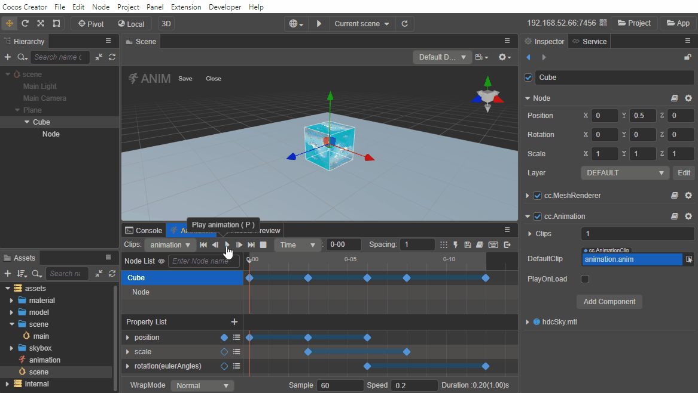
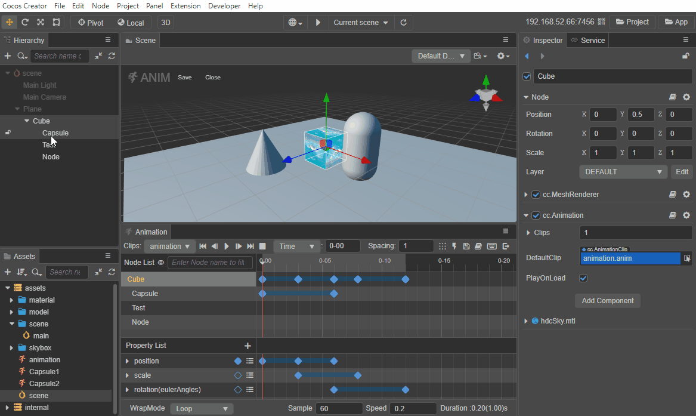
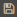

# 动画编辑器

Creator 支持在 **动画编辑器** 中直接创建、编辑和预览动画剪辑，除了可以对节点基本属性进行动画化，还支持对材质和部分组件的属性进行动画化，并且可以通过调用 [动画事件](animation-event.md) 的事件函数来充实动画剪辑。

在使用 **动画编辑器** 制作动画之前需要先为节点添加 **动画组件**，并为动画组件挂载 **动画剪辑** 后才可以进行编辑。详情请参考 [创建 Animation 组件和动画剪辑](animation-create.md)。

## 动画编辑模式

只有在 **动画编辑模式** 下才可以编辑动画剪辑中的动画数据。在动画编辑模式下，无法对节点进行添加/删除/重命名等操作，并且没有记录在动画关键帧内的属性修改，在退出动画编辑模式后也会被还原。

当处于动画编辑模式时，不参与动画数据编辑的节点在 **层级管理器** 中为置灰状态。在 **动画编辑器** 中选中节点时，**层级管理器** 中也会相应地跳转到对应的节点，反之亦然。

**打开编辑模式包括以下两种方式**：

- 在 **层级管理器** 中选中一个带有 Animation 组件，并且组件中包含一个以上 clip 文件的节点，然后在 **动画编辑器** 中点击 **进入动画编辑模式** 按钮。
- 快捷键 <kbd>Ctrl/Cmd + E</kbd>

**保存编辑后的动画数据包括以下三种方式**：

- 点击 **动画编辑器** 右上角的  保存按钮
- 点击 **场景编辑器** 左上角的 **保存** 按钮
- 快捷键 <kbd>Ctrl/Cmd + S</kbd>

**退出编辑模式包括以下三种方式**：

- 点击 **动画编辑器** 右上角的  退出按钮
- 点击 **场景编辑器** 左上角的 **关闭** 按钮
- 快捷键 <kbd>Ctrl/Cmd + E</kbd>
