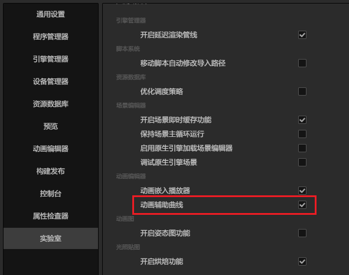
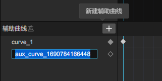
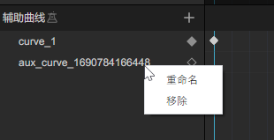

# 动画辅助曲线（实验性功能）

可以在动画编辑器中定义、编辑辅助曲线。这是一份可以独立使用的 `RealCurve` 曲线数据，用于配合动画状态机等模块使用。

> 在 3.8 版本中，该功能为实验性功能，开发者需要在 **偏好设置 -> 实验室** 中启用。
> 启用后可在动画编辑器中看到辅助曲线对应的编辑区域。
> 

## 轨道操作

> 在 3.8 版本中，仅支持在**骨骼动画**中定义辅助曲线。

选中支持的动画类型，即可展示出已定义的动画辅助曲线。对于同一个动画中的辅助曲线，其名称作为唯一标识，**不可重复**。

在 **曲线名称列表** 右侧点击 **+** 按钮，可直接添加一条新的辅助曲线。

在已有的辅助曲线上点击鼠标右键，可以 **重命名**、**删除** 该条曲线。

## 关键帧、曲线编辑

曲线名称列表右侧为关键帧、曲线编辑区域。该部分的具体操作方式可参考动画剪辑编辑的相关内容：

-   [关键帧编辑](animation-keyFrames.md)
-   [曲线编辑](animation-curve.md)
-   [曲线编辑器](curve-editor.md)
