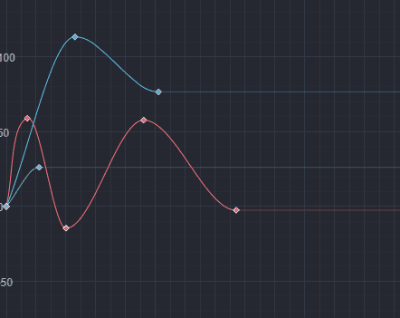
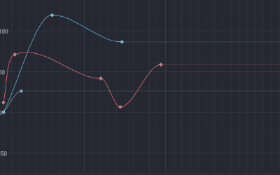
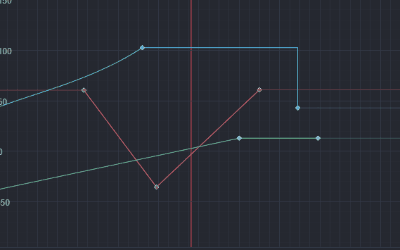
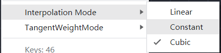
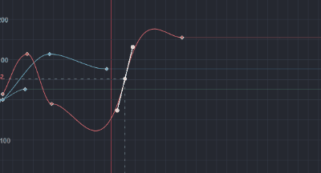
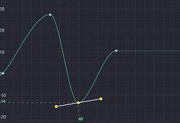
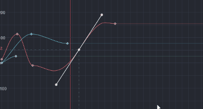
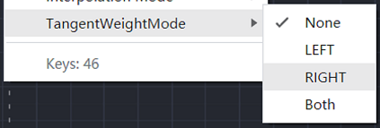

# 曲线编辑器

曲线编辑器主要用于编辑关键帧之间变化的曲线轨迹，在编辑器中的动画和粒子都使用了曲线编辑器来编辑关键帧曲线。每一条曲线上的关键点，**横坐标为关键帧时间/帧数，纵坐标为当前曲线属性在对应时间上的值**。曲线编辑器支持同时编辑多条曲线，在粒子的使用场景内目前只有单条的曲线编辑。

## 缩放移动曲线显示区域

- 直接在曲线显示区域内**滚动鼠标滚轮，即可同时放大或者缩小横纵时间轴的显示比例**。
- 按住鼠标右键不放拖动也可以直接平移当前的显示区域范围。

除此之外还可以结合快捷键来单独控制横纵时间轴的平移缩放：

- 按住 <kbd>Shift</kbd> 不放后滚动鼠标滚轮，可以向左或向右 **平移** 曲线视图区域;
- 按住 <kbd>Ctrl</kbd> + <kbd>Shift</kbd> 不放后滚动鼠标滚轮，可以向左或向右 **缩放** 曲线视图区域;
- 按住 <kbd>Alt</kbd> 不放后滚动鼠标滚轮，可以向上或向下 **平移** 曲线视图区域;
- 按住 <kbd>Ctrl</kbd> + <kbd>Alt</kbd> 不放后滚动鼠标滚轮，可以向上或向下 **缩放** 曲线视图区域;

## 编辑曲线轨迹

### 添加关键帧

1. 在已有的曲线片段上需要添加关键帧的位置右键点击，然后在弹出的菜单中选择 **在曲线上添加关键帧** 即可。
2. 当只显示一条曲线轨迹时，可以在任意空白处右键点击，然后在弹出的菜单中选择 **新建关键帧** 即可。

### 选择关键帧

直接点击关键帧，或者框选关键帧即可选中关键帧，被选中的关键帧将会显示为黄色。单独点选关键帧时，左右坐标轴上会显示当前关键帧的数值。

### 移动关键帧

在选中关键帧后直接拖动关键帧即可

### 缩放关键帧

框选多个关键帧后，拖动选中区域的边框可以整体缩放关键帧位置。

### 间隔排列关键帧

框选多个关键帧后，点击选中区域后，在弹出的菜单里选择 **间隔排列选中关键帧** 即可。

### 移除关键帧

选中关键帧后，直接按下 `Delete` 或者右键点击选中区域，在弹出的菜单中选择 `删除` 即可。

### 复制粘贴关键帧

- 复制关键帧
选中关键帧后，右键点击选中区域并选择 **复制**，或者按下 <kbd>Ctrl</kbd>/<kbd>Cmd</kbd> + <kbd>C</kbd> 即可。

- 粘贴关键帧
在任意空白处，点击选中区域右键并选择 **粘贴**，或者直接使用快捷键 <kbd>Ctrl</kbd>/<kbd>Cmd</kbd> + <kbd>V</kbd> 即可。

### 编辑关键帧数据

在曲线编辑器内，关键帧的数值已经用可视化的方式显示，直接上下左右拖动关键帧本身实际上就是在修改关键帧数据。在一些需要精确控制关键帧数值的情况时，可以直接右键点击关键帧，在弹出的菜单中选择 **编辑关键帧数据** 后，将会显示一块编辑区域，修改后点击空白处即可应用。

### 线性插值模式

右键点击关键帧，在弹出的菜单中选择 `线性插值模式` 的对应值即可。

线性插值模式包括以下几个选项值：

- **Linear**：线性变化关键帧之间的值，切线方向指向相邻的关键帧；

    

- **Constant**：当前关键帧到下一个关键帧之间的变化保持常量值；

    

- **Cubic**：自由曲线模式，只有在当前模式下，点选关键帧才会出现左右切线控制杆；

    

### 编辑关键帧切线

一个关键帧有左右两条切线，切线的长度和方向将会控制关键帧之间曲线的形状。`Cubic` 插值模式下，直接拖动右切线控制点编辑即可。在不同的切线插值模式下，切线控制杆的可操作范围不同，具体可以参考切线插值模式的介绍。

#### 切线插值模式

右键点击关键帧，即可看到线性插值模式的修改选项菜单，点击修改即可。仅在 `线性插值模式` 为 `Cubic` 的情况下，切线插值模式的值才会生效。

切线选项范围实际上主要是两种：

- **无权重模式**。关键帧之间的变化采用 Hermite 算法，曲线的走向根据关键帧的左右切线方向而定。因而此时，关键帧的左右切线控制杆只能更改切线方向。此时的切线控制点只是为了方便修改方向而绘制显示的，因而缩放此时的曲线视图区域，切线控制杆长度也不会发生变化。

- **权重模式**。关键帧之间的变化采用贝塞尔算法，曲线的走向也受关键帧左右切点控制点影响。左切线控制点可以任意移动调整控制杆长度，此时的左切线控制点是真实的坐标点，缩放曲线视图区域控制杆也会同步缩放。

    

关键帧有左右两切线，切线插值模式有以下选项值：

- `None`：左右切线均为无权重模式。
- `Left`：左切线为权重模式，右切线为无权重模式。
- `Right`：右切线为权重模式，左切线为无权重模式。
- `Both`：左右切线均为权重模式。

### 上下移动曲线

点选曲线后可以直接上下拖动整条曲线。
