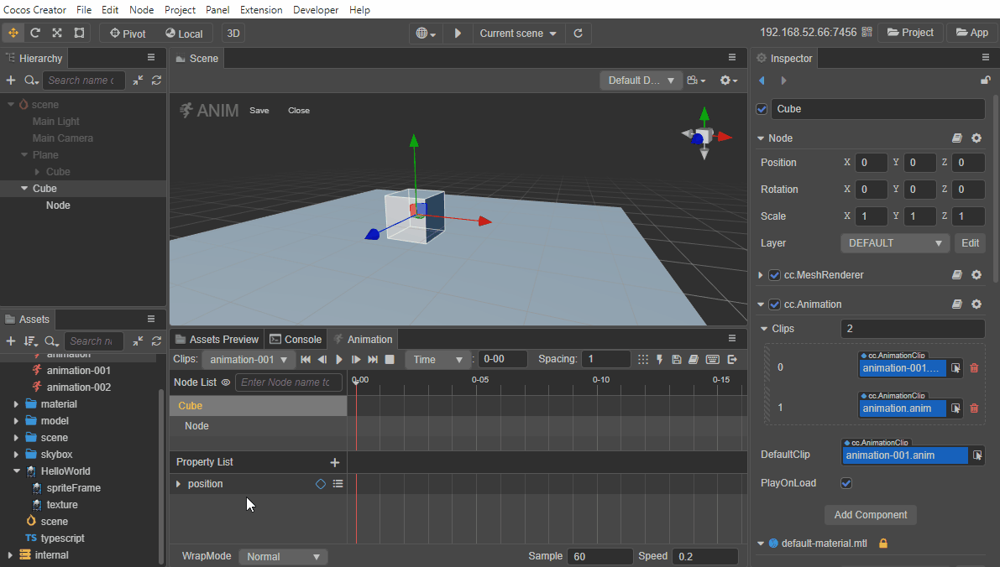
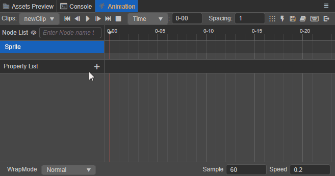
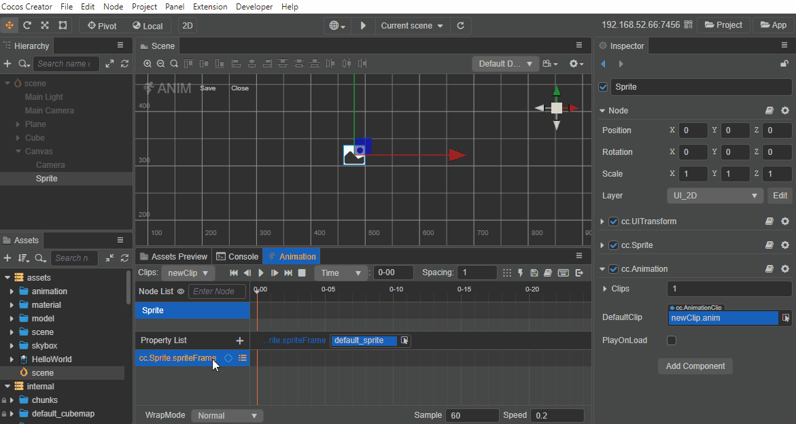
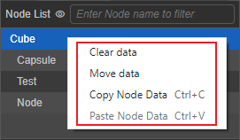
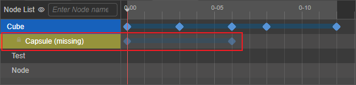
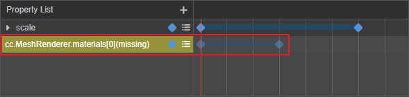

# 编辑动画剪辑

在节点的动画组件上挂载了动画剪辑后，点击 **进入动画编辑模式** 或者使用快捷键 <kbd>Ctrl</kbd>/<kbd>Cmd</kbd> + <kbd>E</kbd> 进入动画编辑模式，便可以在动画剪辑中添加关键帧数据，以此实现节点的动画化。在编辑动画剪辑之前请先 [熟悉动画编辑器](animation-editor.md)。

一个动画剪辑内可能包含了多个节点（节点及其子节点），每个节点上可挂载多个动画属性。通过对节点进行移动、旋转、缩放等操作，便会在当前选中节点相对应的动画属性上添加关键帧，动画属性上添加的所有关键帧在对应的动画属性中显示为线性轨迹的清单模式，我们可以称之为动画曲线。

## 创建动画曲线

在添加关键帧之前需要先了解一下动画属性，动画属性包括了节点自有的 `position`、`rotation`、`scale` 等属性，也包含了组件 Component 中自定义的属性。组件包含的属性前会加上组件的名字，比如 `cc.Sprite.spriteFrame`。

点击 **属性列表** 区域右上角的 **+** 按钮即可根据需要添加动画属性，根据节点类型的不同，可添加的动画属性也有所不同。已添加的动画属性则为置灰状态，不可重复添加。

添加了动画属性后便可以在右侧的属性轨道上添加关键帧了。当节点及其动画属性在列表中显示为蓝色时，表示确定该节点的属性为当前创建关键帧的目标对象。然后在 **动画编辑器** / **属性检查器** / **场景编辑器** 中修改对应属性时，便会在动画属性右侧时间轴的时间控制线所在位置上生成一个蓝色实心的菱形，便是关键帧。（也可以通过该方法修改选中的关键帧数据）

更多关于动画曲线的设计以及如何通过脚本代码控制，请参考 [使用动画曲线](use-animation-curve.md)。

### 编辑 Sprite 动画

接下来我们以创建 Sprite 动画为例，来看一下具体的操作流程。

1. 创建 Sprite 节点

    在 **层级管理器** 中创建一个 Sprite 节点。或者在节点上添加 Sprite 组件，选中节点后在 **属性检查器** 中点击 **添加组件** 按钮，选择 **2D -> Sprite** 即可。

2. 在节点上添加 Animation 组件，并挂载 Clip 文件，然后进入动画编辑模式。详情可参考 [创建 Animation 组件和动画剪辑](animation-create.md)。

3. 在属性列表中添加 `cc.Sprite.spriteFrame` 动画属性

    点击属性列表右上角的 **+** 按钮，然后选择 **cc.Sprite -> spriteFrame** 即可添加一个 `cc.Sprite.spriteFrame` 动画属性。

    

4. 添加关键帧

    从 **资源管理器** 中将 spriteFrame 资源拖拽到 `cc.Sprite.spriteFrame` 动画属性右侧的属性轨道上，再将下一关键帧需要显示的 spriteFrame 拖到指定位置，或者在属性轨道上方的属性框中选择所需的 spriteFrame。然后点击播放就可以预览刚刚创建的动画了。

    

## 关键帧常见操作

在编辑动画剪辑的过程中，经常会有一些对关键帧的操作处理，这里集合了动画编辑器中对关键帧的各种操作方法，了解这些方法技巧可以更快更方便地编辑动画剪辑。

### 选中关键帧

选中的关键帧会由蓝色变成白色，包括以下几种：

- 单击动画属性轨道上的关键帧即可选中
- 双击关键帧则会在选中关键帧的同时将时间控制线移动到当前关键帧所在位置
- 单击节点在动画时间轴中的关键帧，即可同时选中节点的各动画属性在同一位置上的所有关键帧。

  

同时也支持多选关键帧，包括以下几种方式：

- 按住 <kbd>Ctrl</kbd> 的同时点击多个关键帧

- 通过框选的方式选择多个连续的关键帧，方框左右两侧会分别显示首尾关键帧在动画时间轴中的帧数。

  

- **选中任一属性轨道** 后，按下 <kbd>Ctrl</kbd>/<kbd>Cmd</kbd> + <kbd>A</kbd> 即可全选当前动画属性轨道上的所有关键帧。

### 添加关键帧

除了 **创建动画曲线** 中介绍的通过修改属性的方式来添加关键帧，还可以通过以下几种方式添加：

1. 选中动画属性，使用快捷键 <kbd>K</kbd>，将会在在时间控制线所在位置添加关键帧，若没有选中动画属性则忽略。

2. 移动时间控制线到需要添加关键帧的位置，点击动画属性右侧的  按钮即可在当前动画属性轨道上添加关键帧。

3. 右键点击动画属性轨道中需要添加关键帧的位置，然后在弹出的菜单中选择 **添加关键帧** 即可，菜单上同时也会显示当前添加关键帧位置的帧数。

    

4. 将动画属性对应的资源批量从 **资源管理器** 拖拽到属性轨道上时，将会按照工具栏中  设置的数值为间隔大小，以资源被选中的顺序依次排列添加关键帧。

### 移除关键帧

1. 选中需要删除的关键帧（可多选），按下 <kbd>Delete</kbd> 键（Windows）或者 <kbd>Cmd</kbd> + <kbd>Backspace</kbd>（macOS）即可。

2. 选中需要删除的关键帧（可多选），然后点击右键，在弹出的菜单中选择 **移除关键帧** 即可。

3. 拖动时间控制线到需要移除的关键帧的位置或者直接 **双击** 关键帧，然后在动画属性列表中点击对应轨道右侧的  按钮即可。

### 移动关键帧

在选中关键帧的同时拖动，即可将关键帧移动到想要的位置。

- 当拖动单个关键帧时，关键帧下方会出现一个白色小方框，显示移动过程中的帧数以及移动的距离。
- 当拖动多个关键帧时，方框左右两侧会分别显示移动过程中首尾关键帧在动画时间轴中的帧数。

### 缩放关键帧

当选中多个关键帧时，首尾关键帧会显示两条控制辅助杆，拖动任意一个控制杆移动即可对选中的关键帧进行整体缩放。

### 间隔排列关键帧

选中多个关键帧后，点击上方菜单栏中的  间隔排列关键帧按钮，选中的关键帧便会以第一个关键帧为基准，以  输入框中设置的数值为间隔帧数依次排列。

### 复制/粘贴关键帧

关键帧数据的复制和粘贴，支持跨节点、跨 Clip 使用。包括以下两种使用方式：

- 选中关键帧后（可多选），使用快捷键 <kbd>Ctrl</kbd> + <kbd>C</kbd> 和 <kbd>Ctrl</kbd> + <kbd>V</kbd> 即可进行复制粘贴。需要注意的是快捷键粘贴的位置将会以当前时间控制线所在的位置为起点。
- 选中关键帧后（可多选），右键点击（任一）关键帧，在弹出的菜单中选择 **复制关键帧**，然后在目标动画属性轨道上点击右键，选择 **粘贴关键帧** 即可在当前动画属性轨道上粘贴关键帧。

以上两种粘贴方式在复制粘贴多个属性轨道数据时有所差异，区别主要在于：

- 使用快捷键粘贴关键帧数据时，将会在复制关键帧的动画属性轨道上按照复制的关键帧顺序一一粘贴。

  

- 在目标属性轨道上点击右键选择粘贴时，只有目标属性轨道上会被粘贴上复制的数据。

  

分量属性轨道（例如动画属性轨道 `position` 下的 `x`、`y`、`z` 属性轨道）作为单独的属性轨道也会遵循这个规则。如果在主轨道（例如动画属性轨道 `position`）上复制了关键帧数据后，在目标分量轨道上点击右键进行粘贴，那么只有目标分量轨道才会粘贴上关键帧数据。请务必根据实际需要粘贴的位置来复制对应数据，以免产生预期之外的结果。

## 节点数据常见操作

动画剪辑通过节点的名字定义动画数据的位置，本身忽略了根节点，其余的子节点通过与根节点的相对路径索引找到对应的数据。

目前支持在 **动画编辑器** 的 **节点列表** 区域右键点击节点来选择清空节点数据、迁移节点数据，以及复制粘贴节点数据。

### 清空节点数据

右键点击需要清空所有动画数据（关键帧）的节点，然后选择 **清空数据**，在弹出的窗口中点击 **清除** 即可。

### 迁移节点数据

右键点击需要迁移所有动画数据的节点，然后选择 **迁移数据**，节点便会显示动态的虚线外框，当鼠标移动到其他节点时，便会显示“迁移数据到该节点”的提示，单击后在弹出的窗口选择 **迁移** 即可，若不需要迁移则选择 **取消** 即可。

> **注意**：节点数据迁移默认会覆盖原节点上的数据

因为动画剪辑会记录所有参与动画数据编辑的节点路径信息，所以当节点信息发生变化（例如节点重命名/删除/移动位置），与原本保存在动画剪辑中的不一致时，**动画编辑器** 便会将其在节点列表中显示为黄色的不可编辑的丢失状态，关键帧也是置灰的不可编辑状态。此时便可以通过节点的 **迁移数据** 功能将丢失节点的动画数据迁移到其他节点上。

### 复制粘贴节点数据

节点动画数据的复制和粘贴，支持跨编辑器（v3.x）使用。

- **复制**：在节点列表中选中要复制数据的节点，点击右键并选择 **复制数据**，或者直接使用快捷键 <kbd>Ctrl</kbd>/<kbd>Cmd</kbd> + <kbd>C</kbd> 即可。
- **粘贴**：在节点列表中选中要粘贴动画数据的目标节点，点击右键并选择 **粘贴数据**，或者直接使用快捷键 <kbd>Ctrl</kbd>/<kbd>Cmd</kbd> + <kbd>V</kbd> 即可。

> **注意**：粘贴功能不支持自动创建动画属性，因此复制和粘贴的节点至少要有一个相同的动画属性，如果没有，请预先创建。当在同一个节点上粘贴多个节点的动画数据时，重叠部分的动画数据会被后者覆盖，差异部分则会互相融合。

### 编辑同名子节点数据

在父节点的动画剪辑中编辑动画数据时也可以对子节点进行动画编辑，动画数据都会保存到父节点的动画剪辑中，用于实现类似人物模型的手以不同的速度跟随身体一起移动等效果。但若父节点下同时包含多个同名子节点，只支持对第一个同名子节点进行编辑，其他的同名字节点会置灰为不可编辑状态。

但分别为同名子节点添加动画组件和动画剪辑并单独进行编辑是支持的。

## 动画属性数据常见操作

右键点击动画属性或者单击轨道右侧的  按钮即可选择 **移除当前属性轨道**、**清空关键帧**，或者 **复制粘贴当前属性轨道**。

- 移除当前动画属性：移除当前选中的动画属性，包括该轨道上的所有关键帧。或者也可以使用快捷键 <kbd>Delete</kbd> 键（Windows）或者 <kbd>Cmd</kbd> + <kbd>Backspace</kbd>（macOS）。

- 清空关键帧数据：删除当前选中的动画属性上的所有关键帧

- 复制/粘贴当前动画属性：复制当前选中的动画属性上的所有动画数据，并粘贴到目标动画属性上，支持使用快捷键 <kbd>Ctrl</kbd>/<kbd>Cmd</kbd> + <kbd>C</kbd> 和 <kbd>Ctrl</kbd>/<kbd>Cmd</kbd> + <kbd>V</kbd>。粘贴时，重叠部分的关键帧会被后者覆盖，差异部分则会互相融合。

  目前支持在不同编辑器（v3.x）之间复制/粘贴动画属性数据。动画数据的复制粘贴仅支持 `ccType` 同类型数据。

与节点一样，动画属性也存在丢失的可能。例如在 **属性检查器** 中移除了与动画属性对应的属性，则在动画属性列表中便会将其显示为黄色的不可编辑的丢失状态，关键帧也是置灰的不可编辑状态。在这种情况下可以退出编辑模式后为对应节点添加相关属性或是直接移除该丢失的属性轨道。

  

## 动画剪辑属性设置

当前动画剪辑在 **动画编辑器** 上可直接设置的属性包括：**WrapMode**、**Sample**、**Speed** 和 **Duration**。

- **WrapMode**：用于设置当前动画剪辑播放的循环模式，目前包括：
    - Default：效果与 Normal 一致
    - Normal：正向单次播放
    - Loop：循环正向播放
    - PingPong：以先正向播放再逆向播放的方式循环播放
    - Reverse：反向单次播放
    - LoopReverse：循环反向播放

    更多关于如何通过脚本代码设置循环模式，请参考 [循环模式](use-animation-curve.md#%E5%BE%AA%E7%8E%AF%E6%A8%A1%E5%BC%8F)。

- **Sample**：定义当前动画数据每秒的帧率，也就是一秒要划分为多少帧，默认为 60。详情请参考上文 **时间轴的刻度单位显示** 部分的内容。

- **Speed**：用于设置当前动画的播放速度，默认为 1，值越小播放速度越慢。

- **Duration**：前面的数字表示当动画播放速度为 1 的时候，动画的持续时间，根据最后一个关键帧所在位置决定。后面括号中的数字表示实际运行的持续时间，当调整 Speed 时，会随之变化。

动画剪辑是可以复用的，其状态保存在称为动画状态的对象中，通过动画状态的接口我们可以对动画进行播放、暂停、停止、变速等控制。详情请参考 [动画状态](animation-state.md)。
