# 嵌入播放器

嵌入播放器的作用是允许在动画剪辑的制作时，可以同时绑定粒子特效或其他动画等，用于满足在播放动画同时播放动效的功能。可以用于实现挥动武器会出现刀光，或者脚踩在地面上会出现烟尘等功能。

在动画窗口展开 **播放器轨道列表** 即可观察整个嵌套系统：

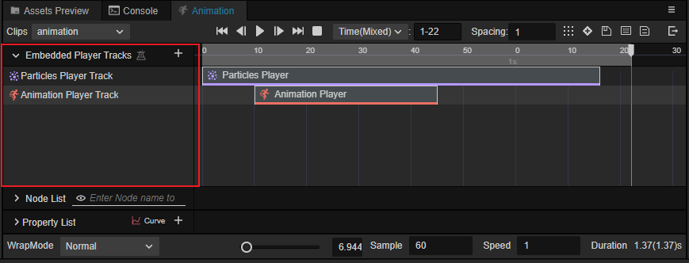

> **注意**：在 v3.6 中，该功能为实验性功能，开发者需要在 **偏好设置** -> **实验室中** 启用：
> 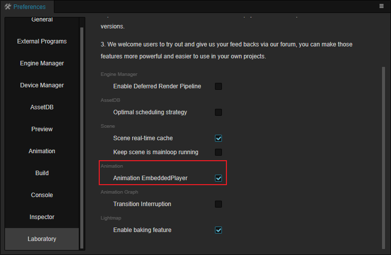

## 轨道操作

嵌入播放器支持 **动画播放器** 以及 **粒子播放器**。

在 **动画轨道列表** 的右侧点击 **+** 按钮即可添加不同的轨道：

在添加后的轨道上点击鼠标右键可以 **移除播放器轨道** 和 **清除数据**。

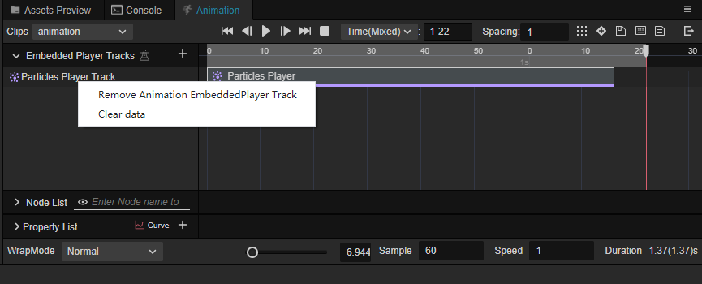

> **注意**：清空数据操作会清空整个轨道上的内容。

在轨道数据上点击鼠标右键可以下选择 **复制** 和 **删除** 操作。

删除操作仅删除当前选中的数据。

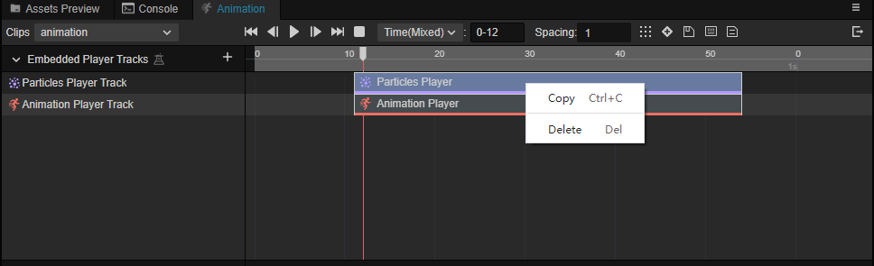

未选中任何数据时，可以选择 **创建**、**粘贴** 和 **清除数据**。

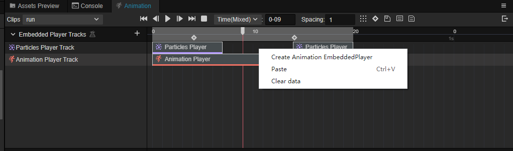

添加轨道完成后，可以调整轨道数据的位置以及时长：

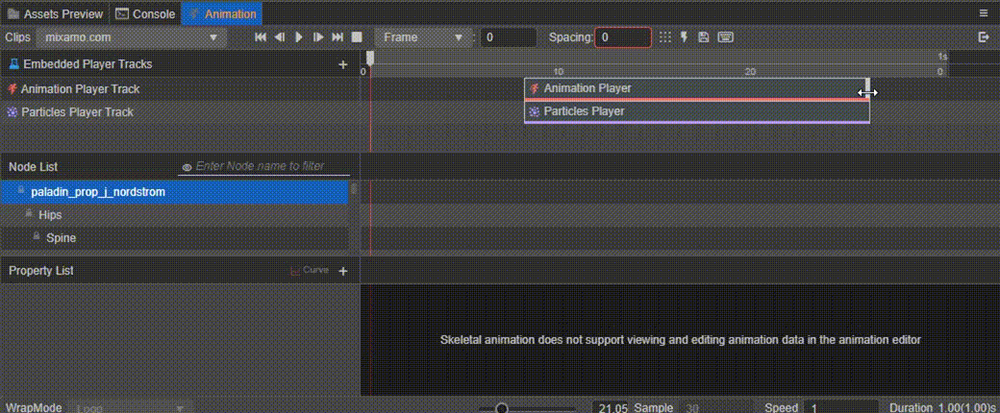

### 粒子播放器轨道

在 **动画轨道列表** 中选中左侧已添加的粒子播放器轨道，在 **属性检查器** 可以调整轨道的属性。

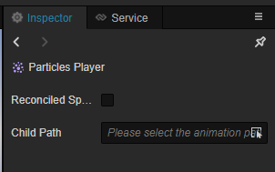

- **同步速度**：使嵌入粒子系统与当前动画剪辑保持一致的播放速率
- **子节点**：通过下拉框可以选择不同的子节点上的粒子系统：

    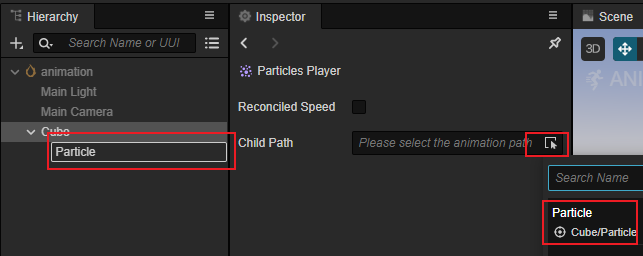

### 动画播放器轨道

在 **动画轨道列表** 中选中左侧已添加的动画播放器轨道，在 **属性检查器** 可以调整轨道的属性。

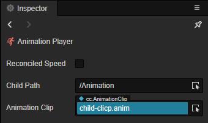

- **同步速度**：使嵌入动画与当前的动画剪辑保持一致的播放速率
- **子节点**：通过下拉框可以选择不同的子节点上的动画组件：

    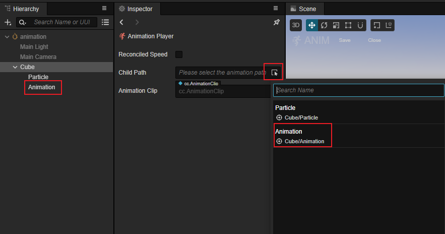

- **动画剪辑**：通过下拉菜单可以选择不同的动画剪辑：

    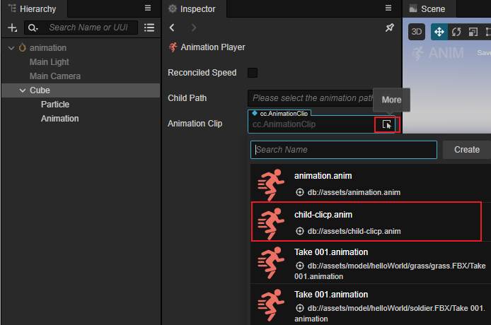

## 预览

通过上述操作即可在动画播放时嵌套不同的粒子播放器和动画播放器，展示效果如下：

## 添加帧事件

在嵌套栏点击鼠标右键也可以添加帧事件，其使用方式和 [添加动画事件](animation-event.md) 一致。

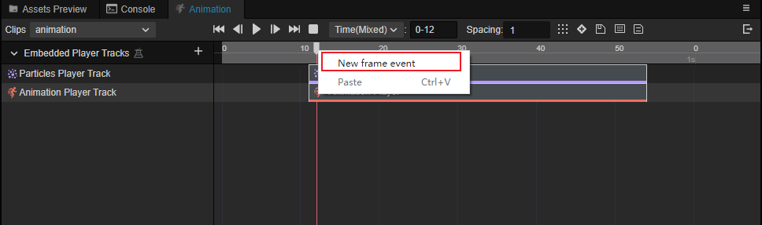
