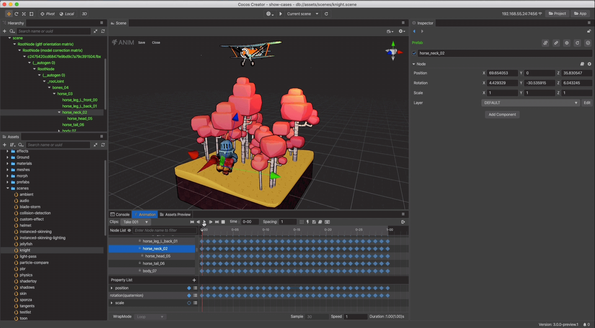

# 动画系统

Cocos Creator 内置了通用的动画系统用以实现基于关键帧的动画。除了支持标准的位移、旋转、缩放动画和帧动画之外，还支持任意组件属性和用户自定义属性的驱动，再加上可任意编辑的时间曲线和创新的移动轨迹编辑功能，能够让内容生产人员不写一行代码就制作出细腻的各种动态效果。

> **注意**：Cocos Creator 自带的动画编辑器适用于制作一些不太复杂的、需要与逻辑进行联动的动画，例如 UI 动画。如果要制作复杂的特效、角色动画、嵌套动画等，可以考虑改用 Spine、DragonBones 或者 3D 模型骨骼动画编辑器进行制作。

## 内容

- [动画剪辑](animation-clip.md)（Animation Clip）：包含了动画数据的资源，可复用。动画剪辑可以通过 **动画编辑器** 产出，或者通过某些已经包含了骨骼动画的外部资源导入。

- [动画组件参考](animation-comp.md)：动画组件可以以动画方式驱动所在节点和子节点上的节点/组件属性，包括用户自定义脚本中的属性。

- [使用动画编辑器](animation.md)：了解动画编辑器的使用，通过动画编辑器创建/修改/生成动画剪辑资源。

- [骨骼动画](skeletal-animation.md)：常见但类型特殊的动画，本篇主要对其进行介绍及说明用法。

- [使用脚本控制动画](animation-component.md)：动画组件管理了一组动画状态，用于控制各动画的播放、暂停、继续、停止、切换等。

    - [动画状态](animation-state.md)（Animation State）：动画剪辑的状态保存在称为动画状态的对象中，动画状态可以控制需要在对象上使用的动画剪辑。动画状态提供了更多动画控制接口，通过这些接口可以对动画进行播放、停止、变速、设置循环模式等更为细致的控制。

- [Marionette 动画系统](./marionette/index.md)：v3.4 新增，实现了由状态机控制的自动化且可复用的骨骼动画流程。

具体的动画实现根据不同的动画需求，操作步骤以及代码实现都不同，可参考官方范例 **animation**（[GitHub](https://github.com/cocos/cocos-test-projects/tree/v3.5/assets/cases/animation) | [Gitee](https://gitee.com/mirrors_cocos-creator/test-cases-3d/tree/v3.5/assets/cases/animation)），主要介绍一些常见的编辑操作方法以及代码范例，以供参考。
