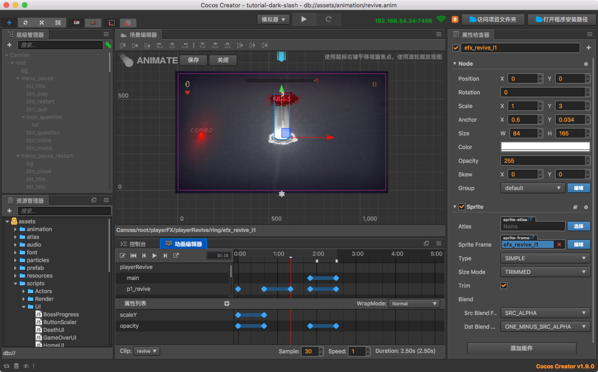

# 动画系统

本章将介绍 Cocos Creator 的动画系统，除了标准的位移、旋转、缩放动画和序列帧动画以外，这套动画系统还支持任意组件属性和用户自定义属性的驱动，再加上可任意编辑的时间曲线和创新的移动轨迹编辑功能，能够让内容生产人员不写一行代码就制作出复杂而细腻的各种动态效果。

- [关于 Animation](animation.md)
- [创建 Animation 组件和动画剪辑](animation-clip.md)
- [编辑动画曲线](animation-curve.md)
- [编辑序列帧动画](sprite-animation.md)
- [编辑时间曲线](time-curve.md)
- [添加动画事件](animation-event.md)
- [使用脚本控制动画](scripting-animation.md)

从[关于 Animation](animation.md)开始了解。