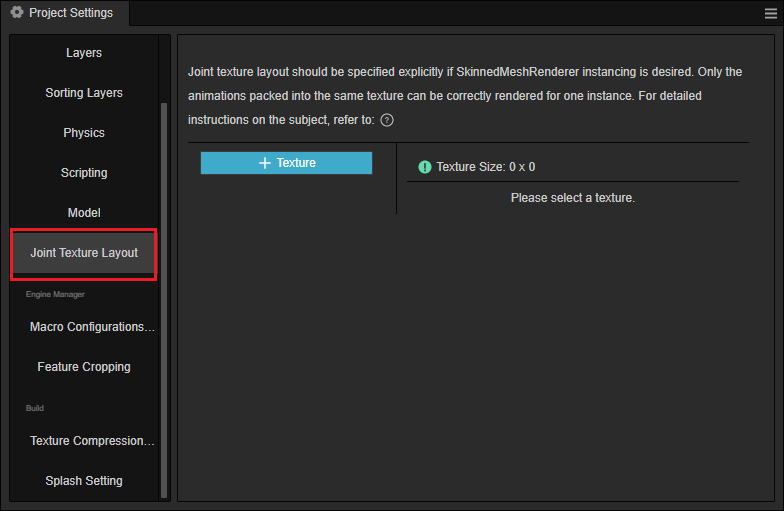
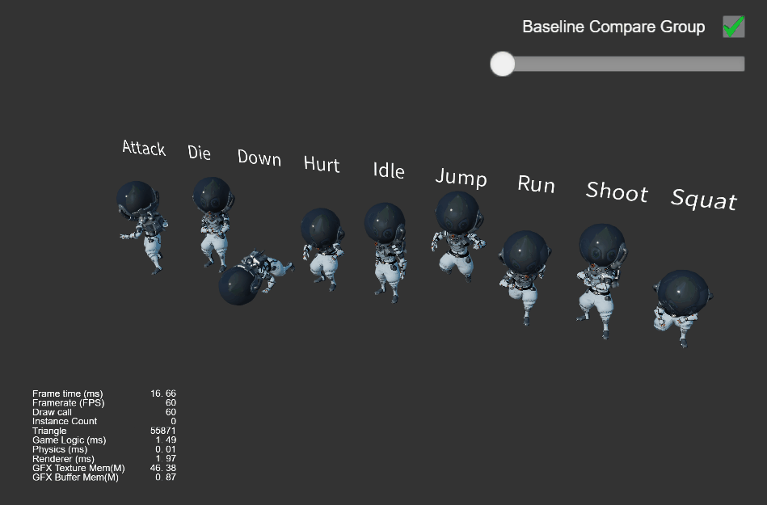
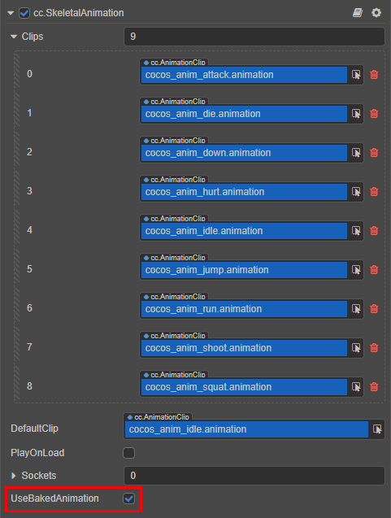
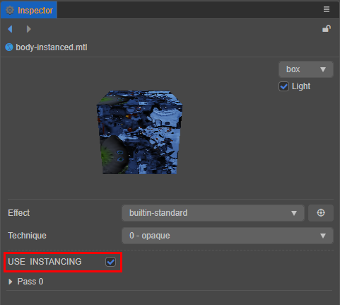
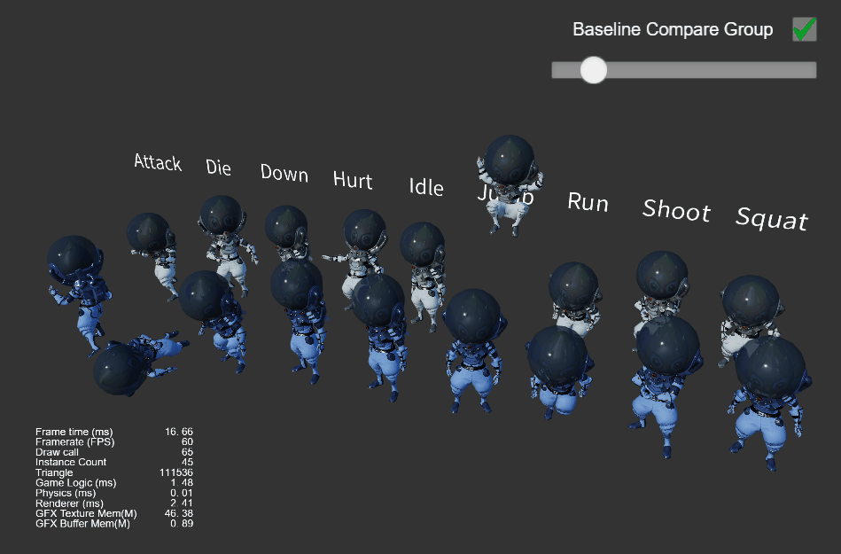
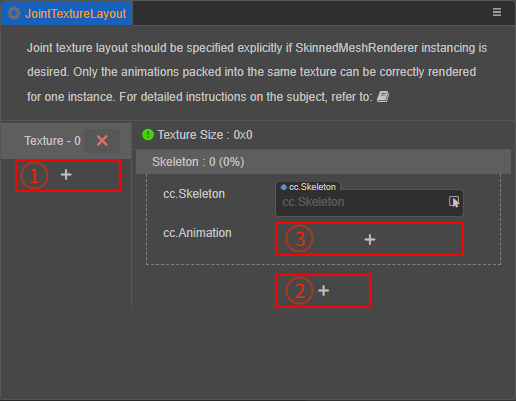
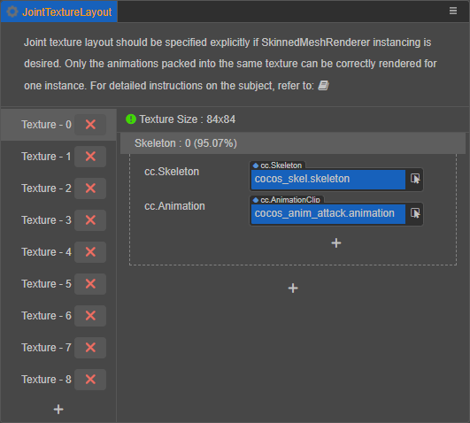
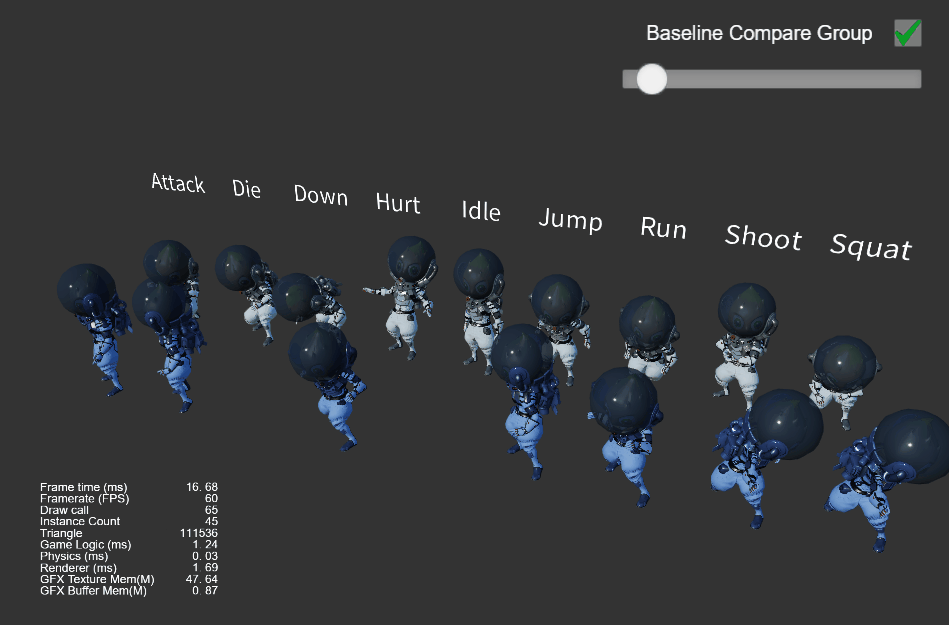
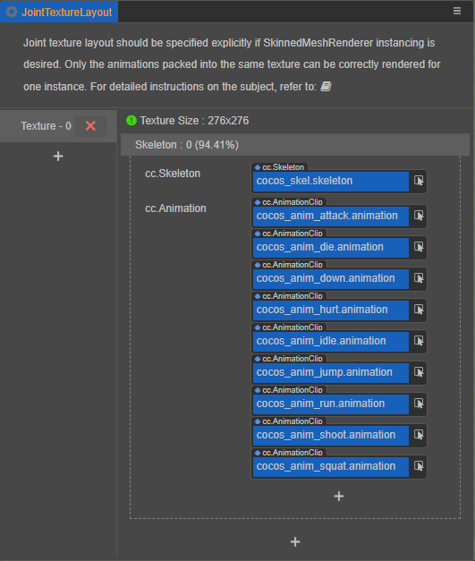
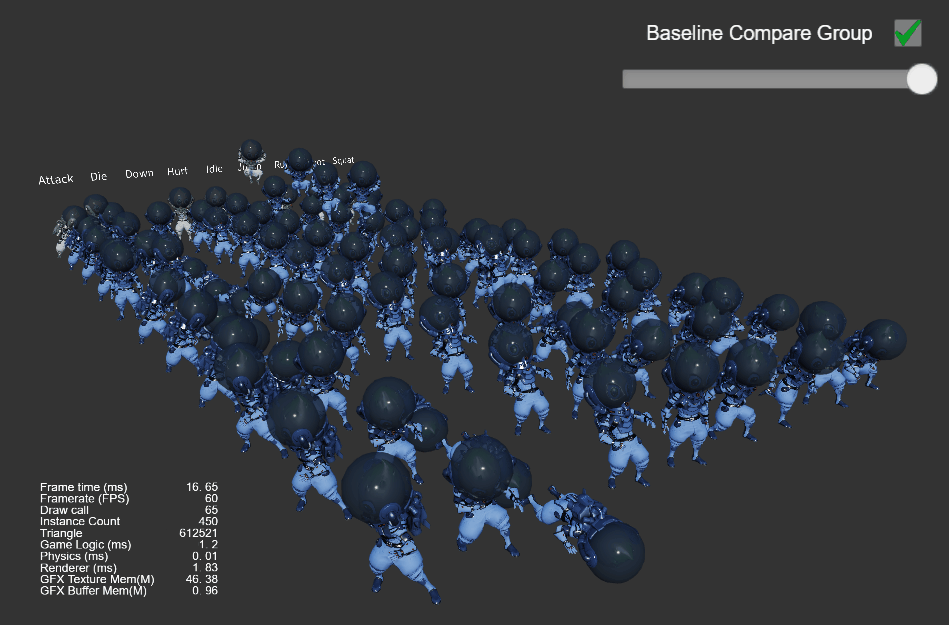

# 骨骼贴图布局设置

要确保 [骨骼动画](./skeletal-animation.md) 也能够完全正确地参与 [动态 Instancing](../engine/renderable/model-component.md#instancing-%E5%90%88%E6%89%B9)，需要用户手动指定每张骨骼贴图的数据分配方式。

比如一个场景中要绘制大量相同的人物角色，每个角色可能在走/跳/攻击。如果希望一个 Drawcall 就能够正确完成所有角色的绘制，一个重要的前提条件是 **这三个动画（走、跳、攻击）的数据都储存在同一张骨骼贴图内**。

目前在默认的 [预烘焙骨骼动画模式](./skeletal-animation.md#%E9%A2%84%E7%83%98%E7%84%99%E9%AA%A8%E9%AA%BC%E5%8A%A8%E7%94%BB%E7%B3%BB%E7%BB%9F) 下，骨骼贴图已经做到全局自动复用，但每张贴图的大小和它们各储存哪些动画是不可预知的。如果不做任何处理直接开启蒙皮模型的 instancing 的话，最终的运行时效果可能会出现有的动画效果正确，有的动画效果完全错乱，并且完全无法预测。

因此我们在编辑器菜单栏 **面板 -> 动画** 中增加了 **骨骼贴图布局设置** 面板，用于手动指定每张骨骼贴图中要存储哪些骨骼的哪些动画信息。

> **注意**：骨骼贴图布局设置面板提供的，本质上是运行时的 **内存分配指导规则**。对于指定的骨骼和动画资源，会保证按照指定规则分配。但如果运行时用到了并未指定规则的资源，还是会回到全局复用的自动分配模式上去。

## 骨骼贴图布局设置

下面我们以范例工程 **show-cases** 中的 **instanced-skinning** 场景（[GitHub](https://github.com/cocos-creator/example-3d/tree/v3.0/show-cases/assets/scenes) | [Gitee](https://gitee.com/mirrors_cocos-creator/example-3d/tree/v3.0/show-cases/assets/scenes)）为例，来看一下骨骼贴图布局具体的设置流程以及实际效果。

下图中展示了一个示例场景，有多个来自同一模型的实例，同时播放完全不同的动画。这些模型使用实时计算动画模式，并没有开启 instancing。可以看到，当前场景加上 UI，总 Drawcall 为 60，instance 计数为 0。这个状态将作为后面改动的基础，以对照使用。

要创建开启 instancing 版本的模型，需要以下步骤：

1. 在 **属性检查器** 中，勾选骨骼动画组件 (SkeletalAnimation) 中的 `UseBakedAnimation` 属性（使用预烘焙动画模式）

    

2. 对所有蒙皮模型 (SkinningModel) 使用的材质，勾选 `USE INSTANCING`

    

在我们的示例场景中实际是制作了两套 Prefab，并在开启 instancing 的版本中将材质漫反射颜色设为蓝色，以便同时观察和区分两套系统的表现。可以看到效果已完全正确，并且只用了 5 个 Drawcall（每个模型分为 5 个部分），instance 数量为 45。

> **注意**：这里能够正确渲染所有模型的原因是，动画数据量相对还比较小，通用的骨骼贴图全局复用逻辑就已经把所有动画数据写入了同一张贴图，因此效果是正确的。但随时可能加入的新动画如果超出了默认骨骼贴图的大小（360 * 360），动画效果就一定会出问题，这也就是为什么骨骼贴图布局面板必须存在的原因。

## 骨骼贴图布局效果

出于展示目的，我们可以在 **骨骼贴图布局设置** 面板故意将每个动画都单独放到一张贴图上，看看最后的渲染效果。

首先，打开 **骨骼贴图布局设置** 面板：

面板中三个 **+** 的用法如下：

- ① — 用于增加 Texture 单元，一个 Texture 单元由多个 Skeleton 单元组成。
- ② — 用于增加 Skeleton 单元，一个 Skeleton 单元由一个 Skeleton 资源和一至多个 AnimationClip 资源组成。
- ③ — 用于增加 AnimationClip 资源槽。

这里我们将 9 个不同的动画分开放在 9 个 Texture 单元内：

重新运行场景，效果变为：

可以看到此时动画效果出现了问题，所有动画都变成了执行 attack 动作，并且不时地出现模型消失的问题。这背后的原因可以精确地分析清楚：

- 每个 Drawcall 绘制 9 个实例，分别在播 9 个不同的动画。
- 但骨骼动画贴图每个 Drawcall 只能用一张，这里明显使用了 Texture 单元 0，只有一个 attack 动画。
- 而不同动画片段的长度不同，有些长度超过 attack 片段，那么在最后一段时间便会读到 Texture 单元 0 的有效区域之外，这里的数据并未定义（一般是默认全 0），不是有效的骨骼变换数据，自然无法正确渲染了。

> **注意**：这里的 9 张贴图上都只有同一个骨骼的动画信息，所以最终效果哪怕贴图已经错了，渲染出来也只是动作错了而已；但如果一张贴图内有多个骨骼的动画信息，同时出现贴图不匹配情况的话，渲染效果就会完全错乱。

对于上面的示例场景，因为这个模型的确需要同时同屏播放这 9 个动画片段，所以正确的骨骼贴图布局设置应该为：

这样就能够 **保证** 正确渲染了。观察面板上相关数据的变化：

- Texture 单元 0 总大小为 276 x 276（由算法自动生成的，足够存放指定的所有动画数据的最小尺寸）。
- 指定的 9 组动画数据占了这张贴图的 94.41%，有 5.59% 的多余空间（这部分空间在运行时并不会参与全局复用）。

另外，贴图尺寸旁的图标颜色表示当前贴图的设备适配情况：

- 绿色（边长 1024 以下）：所有设备都确保有效。
- 黄色（边长 1024 ~ 2048）：某些不支持浮点贴图的移动设备或小游戏平台可能会不支持。
- 红色（边长 2048 以上）：许多移动设备上都不支持。

> **注意**：这里只是在一张贴图上放了一套骨骼的 9 个动画，但只要总大小没有超过设备上限，每张贴图上便可以放 **任意多套骨骼** 的任意数量动画。通常一张贴图放多套骨骼是更为常见的情况，比如对于 [蒙皮模型的平面阴影](./skeletal-animation.md#%E5%85%B3%E4%BA%8E%E5%8A%A8%E6%80%81-instancing)。

我们继续在场景中增加更多的实例数量，可以看到 Drawcall 数量并不会改变，只有 instance 数量的增加：

