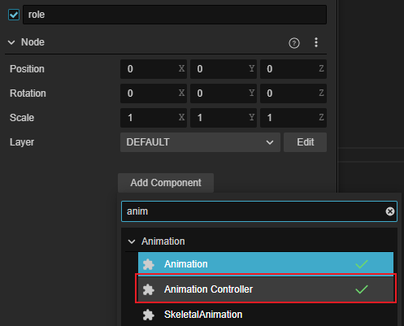

# 动画控制器（Animation Controller）组件参考

动画控制器组件用于将 [动画图资源](animation-graph.md) 应用到对象上。

在 **层级管理器** 中选中需要应用动画图的节点，然后在 **属性检查器** 中点击下方的 **添加组件 -> Animation -> Animation Controller**，即可添加一个动画控制器组件到节点上。



> **注意**：因为 Marionette 动画系统与旧式动画系统不可同时使用，因此 **动画控制器组件也不能和动画组件或者骨骼动画组件挂载在同一个节点上**。

## 属性


| 属性  | 说明          |
| :---- | :----------- |
| Graph | 添加的 [动画图资源](animation-graph-layer)，默认为空 |

## 程序化控制动画图

动画控制器组件提供了一些方法用于在运行时控制动画图的 [动画状态机](animation-graph-basics.md)：

| 方法                      | 说明                     |
| :----------------------- | :----------------------- |
| `getVariables`           | 获取所有的变量及变量名/类型/值等相关信息。|
| `setValue`               | 设置变量的值。             |
| `getValue`               | 获取变量的值。             |
| `getCurrentStateStatus`  | 获取当前状态的信息。       |
| `getCurrentClipStatuses` | 获取当前的动画剪辑的状态。  |
| `getCurrentTransition`   | 获取当前的状态过渡。       |
| `getNextStateStatus`     | 获取下一个状态的信息。     |
| `getNextClipStatuses`    | 获取下一个动画剪辑的状态。  |
| `setLayerWeight`         | 设置某个 [动画图层级](animation-graph-layer.md) 的权重。|

- **变量** 控制

    例如我们在 [动画图面板](./animation-graph-panel.md#%E5%8F%98%E9%87%8F%EF%BC%88variables%EF%BC%89) 添加了多个变量，通过代码可以获取和修改变量的值，代码示例如下：

    ```ts
    // 获取动画控制器组件
    let animationController:AnimationController = this.node.getComponent(AnimationController);

    // 获取所有的变量
    let variables= animationController.getVariables();

    // 获取名为 ‘vertical’ 的变量的值
    let vertical: Number = animationController.getValue("vertical");

    // 修改名为 ‘vertical’ 的变量的值为 1.0。修改后，将会在下一帧 update 的时候计算条件过渡
    animationController.setValue("vertical", 1.0)
    ```

    > **注意**：动画状态机的变量目前只能在 [动画图面板](animation-graph-panel.md#%E5%8F%98%E9%87%8F%EF%BC%88variables%EF%BC%89) 进行添加和删除。

- 获取当前 **状态**

    获取第 0 层级状态机当前 **状态** 的名称以及进度，代码示例如下：

    ```ts
    let states: animation.MotionStateStatus = animationController.getCurrentStateStatus(0)
    console.log(states.__DEBUG_ID__, states.progress)
    ```

- 获取当前 **过渡**

    获取第 0 层级状态机即将发生的 **过渡** 的相关信息：

    ```ts
    let transition: animation.TransitionStatus = animationController.getCurrentTransition(0)
    console.log(transition.duration, transition.time)
    ```
