# 动画状态机

我们把对象所处的播放某种特定动画的动作，例如待机、移动、奔跑、攻击等，称为 **状态**。<br>
一般情况下，一个对象拥有多个状态，并按照一定的逻辑顺序在状态之间切换，以执行不同的动作，这种切换在动画图中称为 [过渡](state-transition.md)。发生过渡时需要满足的条件称为 **过渡条件**。

而动画状态机则是用于管理和控制对象上各个状态及状态之间的过渡，类似于流程图，我们可以直接在 [动画图面板](animation-graph-panel.md) 中对其进行可视化编辑。目前一个动画图包含一个状态机，当状态机位于动画图中的某个状态时，便会播放该状态对应的动画。那么按照事先搭建好的动画流程图，通过状态机便可自动控制骨骼动画的播放和切换等。

## 状态基础

状态机中的状态除了用于控制动画播放的状态，还包括了 **入口**、**出口**、**任意**、**子状态机** 这几个特殊的状态，因为其本身并不承载动画，只是为了标志状态机开始、结束等特殊用途，因此为了与状态区分我们暂且称之为“伪状态”。

[子状态机](#%E5%AD%90%E7%8A%B6%E6%80%81%E6%9C%BA) 是嵌套在状态机中的，用于降解复杂的动画逻辑，具体可查看下文 **子状态机** 部分的内容。一般我们将动画图最上层的状态机称为 **顶层状态机**，类似于场景中的根节点。

**入口**（Entry）、**出口**（Exit）、**任意**（Any）则是默认存在于状态机中的固定单元，不可删除。在打开动画图编辑状态机时便可在网格布局区域中看到，需要注意的是 **出口** 只存在于 **子状态机** 中。

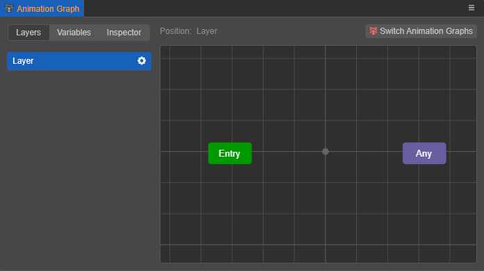

- **入口**：标志着状态机的进入。**入口** 只能作为状态过渡发生的源头，无法作为过渡的目标。

- **出口**：当状态过渡到 **出口** 后，退出状态机。**出口** 只能作为状态过渡的目标，无法作为过渡的源头。

    **出口仅存在于子状态机中**，因为退出子状态机后，需要返回到父状态机继续执行下一个过渡；若退出顶层状态机，则动画流程终止，角色静止不动，而在一般情况下，角色是在持续做运动的。<br>若需要让角色完全静止不动，可以通过关闭当前动画图所在的动画控制器组件来实现。

- **任意**：可指代状态机中其它任何状态，但不包括“伪状态”。**任意** 只能作为状态过渡的源头，无法作为过渡的目标。

    从 **任意** 中引出过渡等价于从所有状态都引出了该过渡，也就是说，状态机中所有状态在满足某个条件时都会切换到另一个状态，就可以使用 **任意**。例如角色在走、跑、跳等状态下触发攻击条件，都需要切换到攻击状态。

    > **注意**：**任意** 是可以继承的，若在父状态机中设置了从 **任意** 中引出状态过渡，则其子状态机中所有的状态若满足条件都会执行该过渡。

## 创建状态

状态机由状态和状态之间的过渡组成，但首先我们需要先创建基础单元 — **状态**。

右键点击 [动画图面板](animation-graph-panel.md) 的网格布局区域，即可在菜单中选择添加状态：

- **动画剪辑**：用于播放指定的动画剪辑，默认名为 `Clip Motion`；
- **一维/二维混合**：用于播放指定的一维/二维动画混合，默认名为 `Blend 1D`/`Blend 2D`。动画混合是由多个动画混合而得到的新动画，详情请参考下文的 **动画混合**。
- **子状态机**：用于播放子状态机中的动画内容，默认名为 `State Machine`。详情请参考下文的 **子状态机**。

这些状态都以蓝色图形显示在网格区域中。

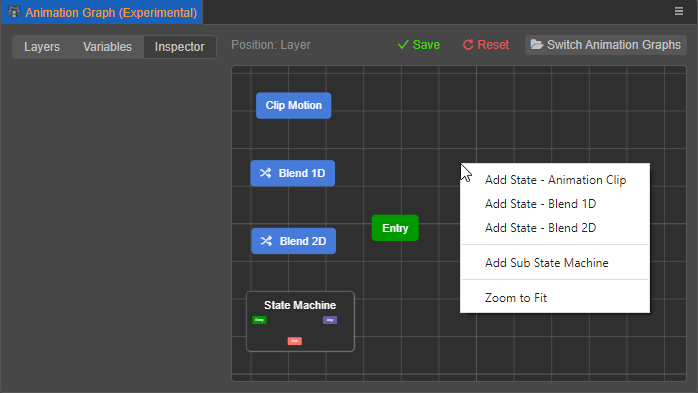

### 设置状态属性

选中创建的动画状态，蓝色图形外框会显示高亮，并且 **属性检查器** 中也会显示可设置的状态属性：

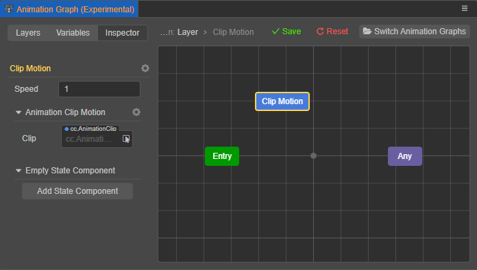

> 这里是以状态为例展开介绍，动画混合和子状态机可设置的属性会有所差异，具体请参考下文相应的内容介绍。

- 当前选中状态的名称会显示在 **属性检查器** 上，例如上图中的 `Clip Motion`，点击右侧的齿轮图标按钮可 **重命名** 或 **删除此状态**。

- **速度（Speed）**：用于设置当前状态上挂载的动画剪辑的播放速度，默认为 1，值越小播放速度越慢。
- **速度乘数**：启用后，可为速度指定一个乘积因子。速度乘积因子会与速度相乘来控制动画状态的速度。

    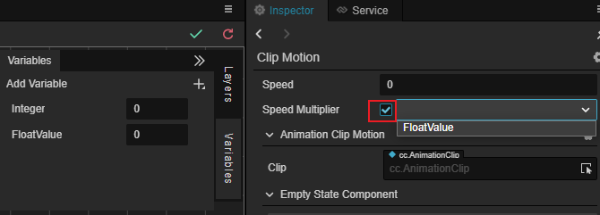

- **动画剪辑内容**：用于指定当前状态上挂载的动画剪辑。可直接从 **资源管理器** 中将动画剪辑拖拽到 **Clip** 属性框中，也可以直接点击 **Clip** 属性框后面的箭头按钮选择。设置了动画剪辑后，当前状态将会播放指定的动画剪辑内容，并且状态名称也会随之更换为动画剪辑名称。

  > **注意**：若未指定动画剪辑，将会导致问题。

  点击右侧的齿轮图标菜单，可删除当前动画剪辑。点击 **添加动画** 便可根据需要重新选择添加动画剪辑内容/一维动画混合/二维动画混合。

  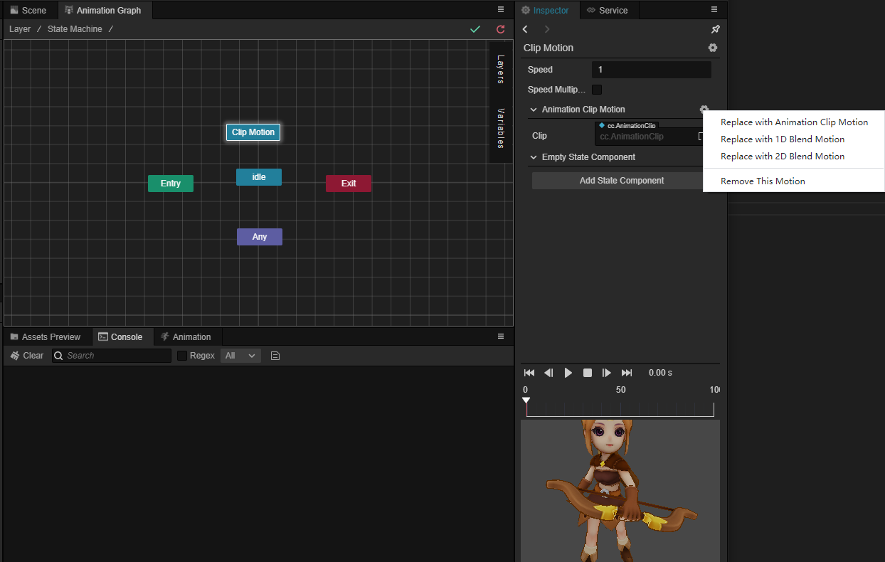

- **状态组件**：用于添加动画状态组件。动画状态组件的基类中提供了一些方法，表示状态机的一些特定事件，用于在状态进入、离开时添加一些业务逻辑。详情请参考下文 **动画状态组件** 部分的内容。同样的，点击右侧的齿轮图标按钮，即可删除当前动画状态组件并根据需要重新选择；点击右上方的齿轮图标按钮可同时添加多个状态组件。

- 点击状态名右侧的齿轮图标菜单，支持 **删除此状态**/**重命名**

  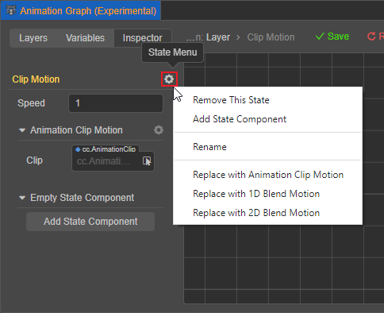

- 动画剪辑右方的齿轮支持 **替换为动画剪辑**/**替换为一维动画混合**/**替换为二维动画混合**/**删除此动画**

  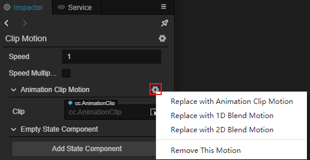

- 点击下方的 **添加状态组件** 按钮可状态组件脚本，详情请参考下方 **动画状态组件**

## 动画混合

动画混合可以根据输入参数和预设的一些参数将多个动画进行混合，用于实现类似根据速度混合走和跳的效果，建议参加混合的动画尽量相似，使混合后的运动尽量合理。根据输入参数的不同可将动画混合分为以下几种混合方式：

- **一维混合**：根据 **一个输入参数** 通过 **线性插值算法** 对多个动画进行混合。

- **二维混合**：根据 **两个输入参数** 通过 **重心坐标插值混合算法** 对多个动画进行混合。

动画混合跟 [状态过渡](state-transition.md) 的区别在于：

- 过渡是在给定的周期内从一个状态平滑过渡到其他状态。

- 混合是通过混合参数在不同的程度下合并多个动画，使其平滑混合。

### 添加动画混合

右键点击动画图面板的网格布局区域即可选择添加 **一维动画混合** 或者 **二维动画混合**。创建完成后在 **属性检查器** 中即可设置属性，除了动画混合设置项，其他项与上文 **设置状态属性** 中的一致。

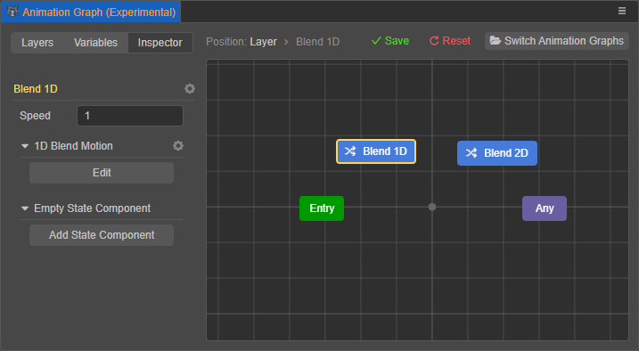

进入动画混合的编辑页面可以设置相关参数及参与混合的动画，进入方式包括以下三种：

- 点击动画混合设置项中的 **编辑**
- 双击网格布局中的混合状态
- 右键点击网格布局中的混合状态，然后选择 **编辑**

退出动画混合的编辑页面，包括以下两种方式：

- 右键点击网格布局区域，然后选择 **返回上层编辑**
- 网格布局区域左上方的 **位置** 表示当前所处位置，点击层级即可返回相应位置

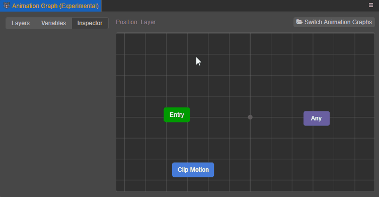

### 一维动画混合

**一维动画混合** 是根据 **一个输入参数** 通过 **线性插值算法** 混合多个动画，每个动画都可配置一个阈值。

- 当输入参数恰好位于某个阈值上，就使用该阈值上的动画
- 当输入参数位于两个阈值之间，将根据输入参数在阈值区间上的比例 **线性** 混合这两个动画。线性公式为 **A * (1 - t) + B * t**，其中 A、B 表示阈值，t 表示输入参数值在此阈值区间上的比率。

进入动画混合编辑页面，在网格布局区域点击右键，即可根据需要添加参与混合的动画，支持添加 **动画剪辑**、**一维动画混合**、**二维动画混合**。

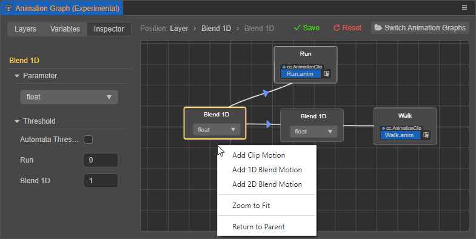

- **入参**：该项用于选择动画混合的输入参数。输入参数及参数值可在动画图面板的 **属性检查器** 中创建，目前支持使用 **浮点型** 变量，详情请参考 [动画图面板 — 变量](animation-graph-panel.md)。<br>输入参数也可以直接在网格布局区域的动画混合中选择。

- **阈值**：当动画混合上添加了动画后该项才可见。每添加一个动画，下方便会新增一个相对应的阈值，可根据需要手动设置每个阈值大小；也可以勾选 **自动调整阈值** 自动均分各个阈值，二者选其一。所有的阈值按从小到大的顺序从上到下排列。

- 可直接在网格布局区域的动画上挂载动画剪辑，也可以选中动画后在 **属性检查器** 中指定动画剪辑。

  > **注意**：若未指定动画剪辑，将会导致问题。

  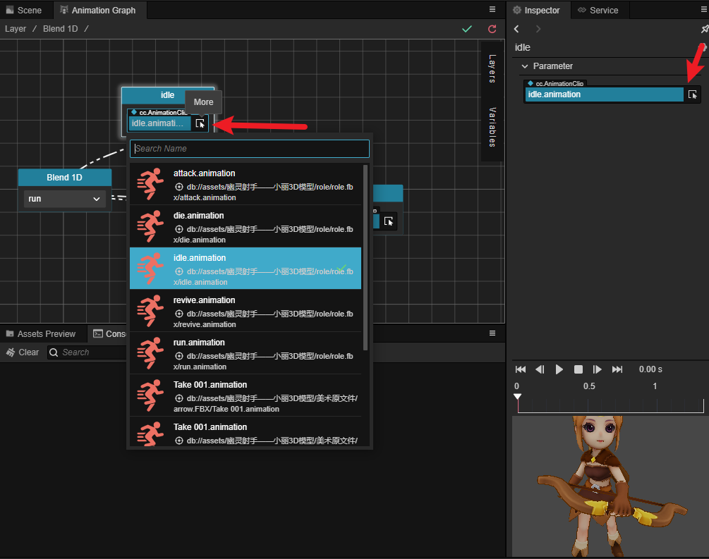

  若需要移除动画，则直接在网格布局区域中右键点击动画以删除，也可以选中动画后在 **属性检查器** 中点击齿轮图标按钮以删除。

例如要实现根据角色速率来均匀混合待机、走、跑的动画，可设置如下图：

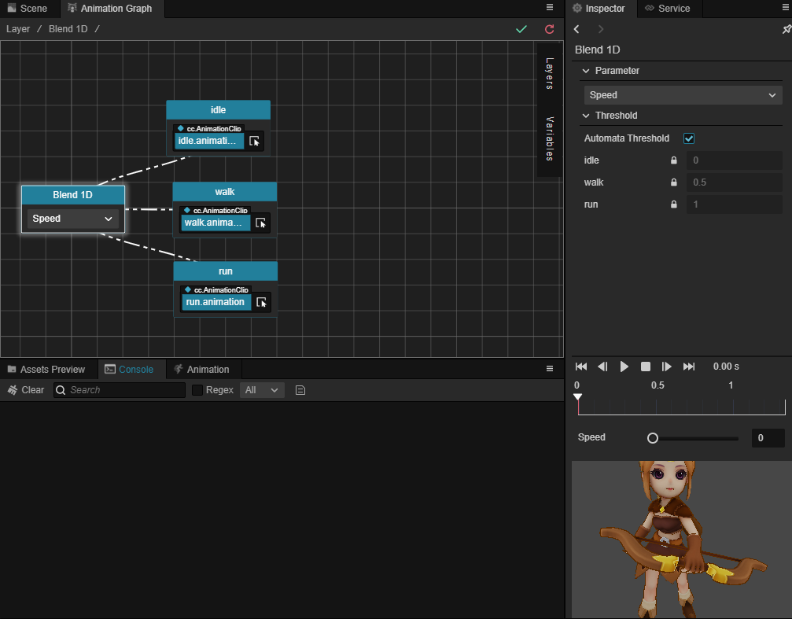

### 二维动画混合

**二维动画混合** 是根据 **两个输入参数** 通过 **重心坐标插值算法** 混合多个动画，每个动画都可配置一个阈值。

二维动画混合的基本操作与一维动画混合基本一致，区别在于：
- 二维动画混合在 **属性检查器** 上的 **入参** 有两个；
- 阈值是以 `[x, y]` 表示，按照动画的添加顺序自上而下排列。并且没有 **自动调整阈值** 选项。
- 第一个输入参数的值对应的是下方阈值 `X` 的区间，第二个输入参数的值对应的是下方阈值 `Y` 的区间。

二维动画混合经常用于插值混合不同方向上的移动动画，例如：

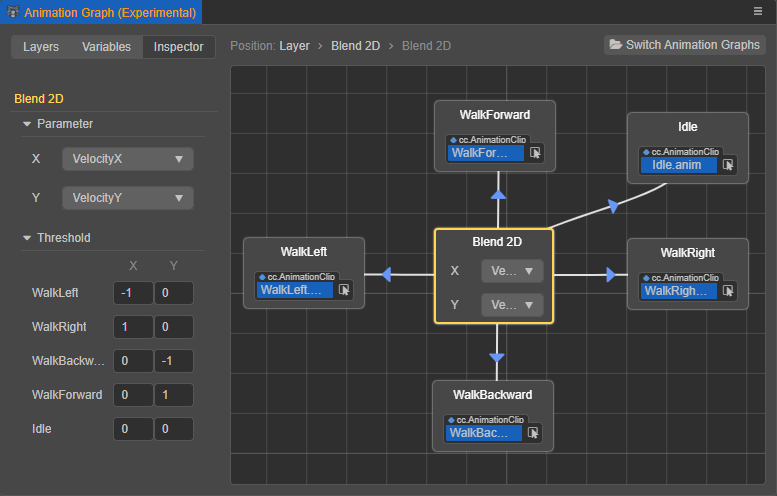

上图中第一个输入参数的范围是 `[-1, 1]`，第二个输入参数的范围也是 `[-1, 1]`。

## 子状态机

因为对象一般会有多个阶段的复杂动作组合，为了降解复杂的逻辑，还可以在状态机中（递归地）嵌套 **子状态机**。一般我们将动画图最上层的状态机称为 **顶层状态机**，类似于场景中的根节点。

右键点击网格布局区域，然后选择 **添加子状态机** 即可创建。创建完成后在网格布局区域会生成一个默认名为 `State Machine` 的子状态机：

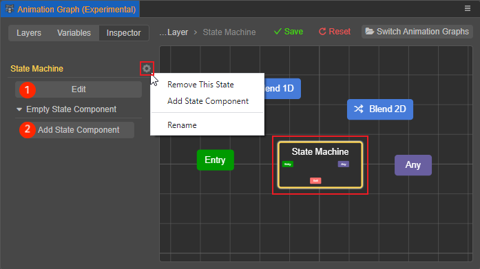

- 双击子状态机可以进入编辑页面；
- ① 号按钮用于添加状态组件，详情请参考下文 **动画状态组件** 部分的内容；
- 点击齿轮图标按钮，展开的菜单中包括 **重命名**/**删除此状态**。

### 编辑子状态机

进入子状态机编辑页面后，界面如下图所示。子状态机的编辑与顶层状态机基本一致，主要的区别在于，子状态机中默认包含 **出口** 伪状态，当状态过渡到 **出口** 后，退出子状态机，返回到父状态机继续执行下一个过渡，直到回到顶层状态机继续下一个过渡。详情可参考上文 **状态机基础** 部分的内容。

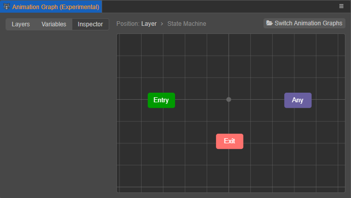

点击界面上方的 **位置** 便可根据需要跳转到任一个上层状态机。右键点击网格布局区域，然后选择 **返回上层编辑** 便可返回父状态机。

<!-- 子状态机编辑完成后，在父状态机中会显示子状态机中具体结构的缩略图：

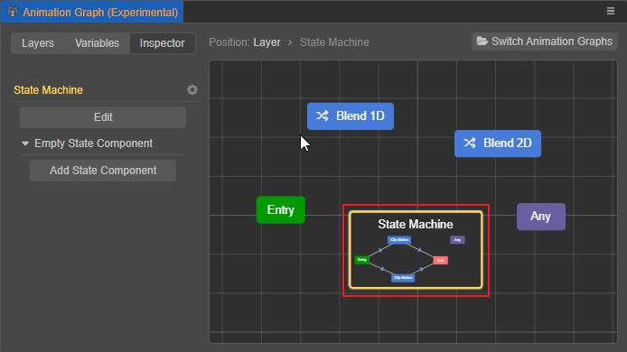 -->

## 动画状态组件（Animation Graph Script）

状态和子状态机都可以挂载动画状态组件。动画状态组件可直接在 **资源管理器** 中创建，右键点击 **资源管理器** 左上方的 **+** 按钮，然后选择 **动画状态组件** 即可：

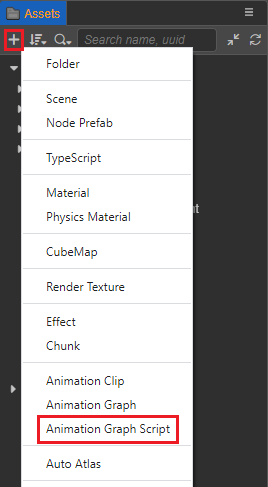

创建完成后会生成一个默认名为 **AnimationGraphComponent** 的组件：

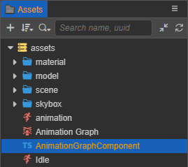

创建好动画状态组件后，在动画图面板右侧的网格布局区域中选中状态，状态上点击鼠标右键的弹出菜单或在 **属性检查器** 中点击 **添加状态组件** 即可将组件挂载到当前状态。支持添加多个。

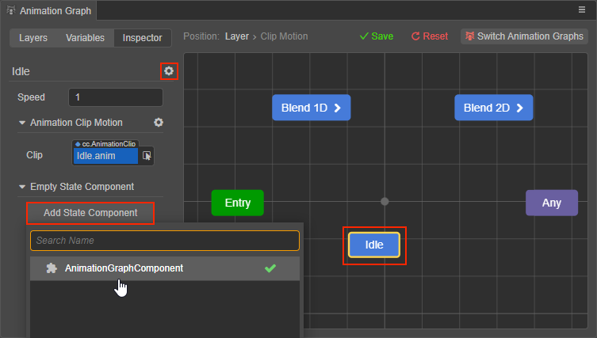

点击添加的状态组件右侧的齿轮图标按钮，即可删除当前状态组件：

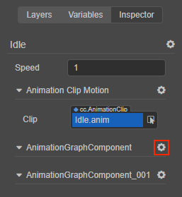

### 方法

动画状态组件类继承自 `animation.StateMachineComponent`，其基类中提供了一些方法，表示状态机的一些特定事件。子类可以覆写这些方法，以便在状态进入、离开时添加一些业务逻辑。

| 方法名 | 说明 |
| :-- | :-- |
| `onMotionStateEnter`  | 在进入状态时调用    |
| `onMotionStateExit`   | 在完全退出状态时调用 |
| `onMotionStateUpdate` | 在状态更新时调用    |
| `onStateMachineEnter` | 在进入子状态机时调用 |
| `onStateMachineExit`  | 在退出子状态机时调用 |

以上表格中的方法可能接受以下参数：

- `controller: animation.AnimationController`：表示运行此动画图的动画控制器组件。上述所有方法都会接受此参数。

- `motionStateStatus: animation.MotionStateStatus`：表示事件主体动作状态的运作状态。仅状态（伪状态除外）相关的方法（`onMotionStateEnter`、`onMotionStateExit`）可接受此参数。

### 示例：进入状态时播放特效

```ts
import { _decorator, animation, PhysicsSystem, ParticleSystem } from "cc";
const { ccclass, property } = _decorator;

@ccclass("AnimationGraphComponent")
export class AnimationGraphComponent extends animation.StateMachineComponent {
    /**
     * Called when a motion state right after it entered.
     * @param controller The animation controller it within.
     * @param stateStatus The status of the motion.
     */
    public onMotionStateEnter (controller: animation.AnimationController, stateStatus: Readonly<animation.MotionStateStatus>): void {
        // 播放动画控制器组件所在节点上的所有粒子特效
        for (const particleSystem of controller.node.getComponents(ParticleSystem)) {
            particleSystem.play();
        }
    }
}
```

## 预览

### 预览动画剪辑

选中任意状态或混合后，在 **属性检查器** 内可以进行预览。

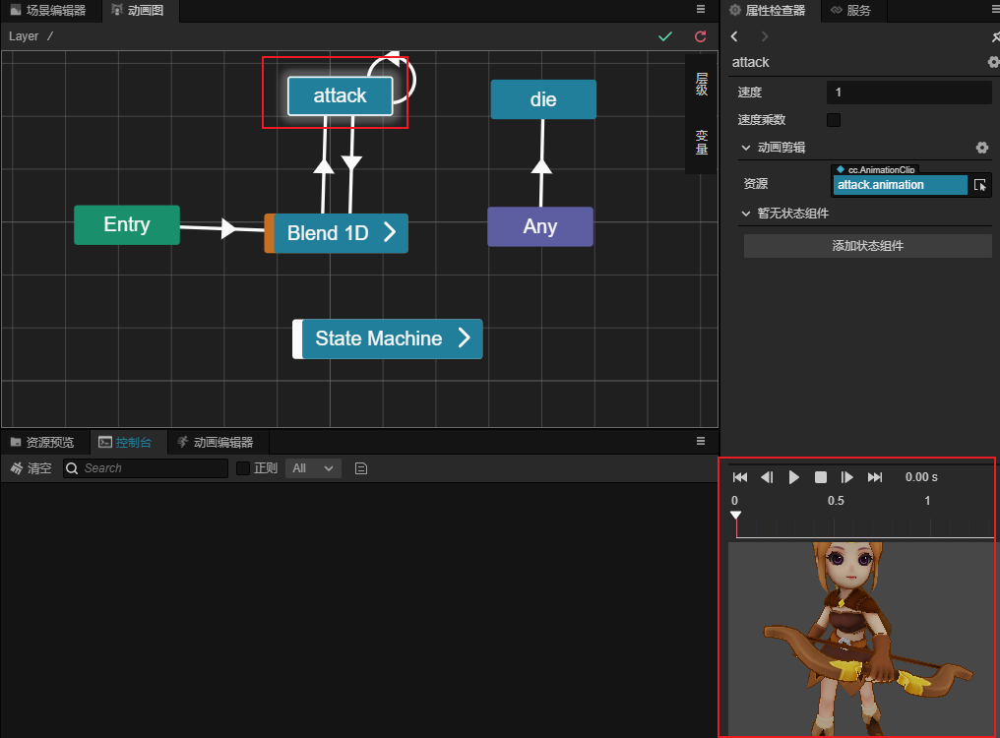

预览时，用户可以通过下列按钮进行操作：

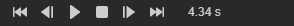

其属性与描述如下：

- 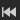 跳转至第一帧
- 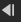 预览前一帧
- / 开始/暂停播放
-  停止播放
- 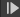 跳转至后一帧
- 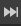 跳转至最后一帧

### 预览混合

混合在预览时，除上述操作外，也可以通过调整混合的变量值来进行预览，此处的修改并不会保存。

- 一维混合：

  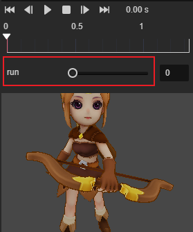

- 二维混合：

  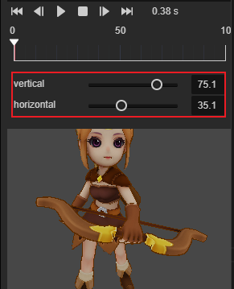
