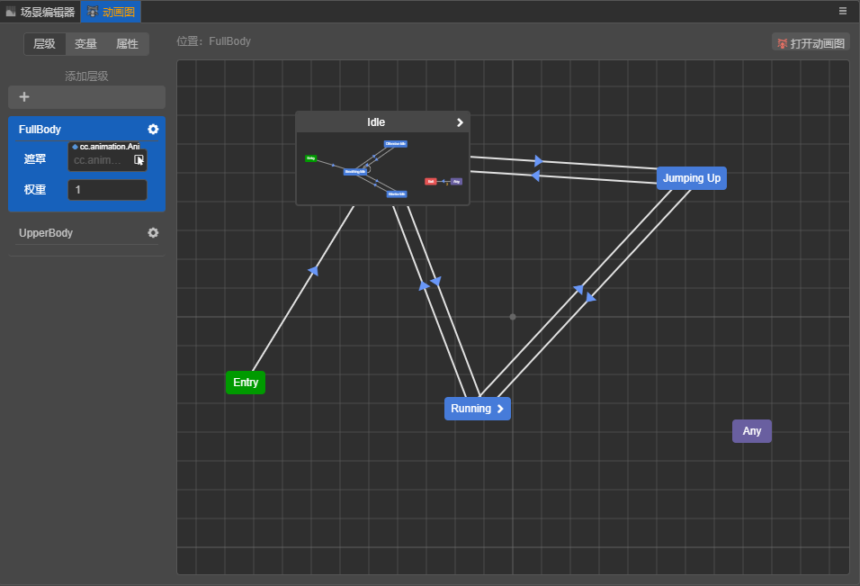
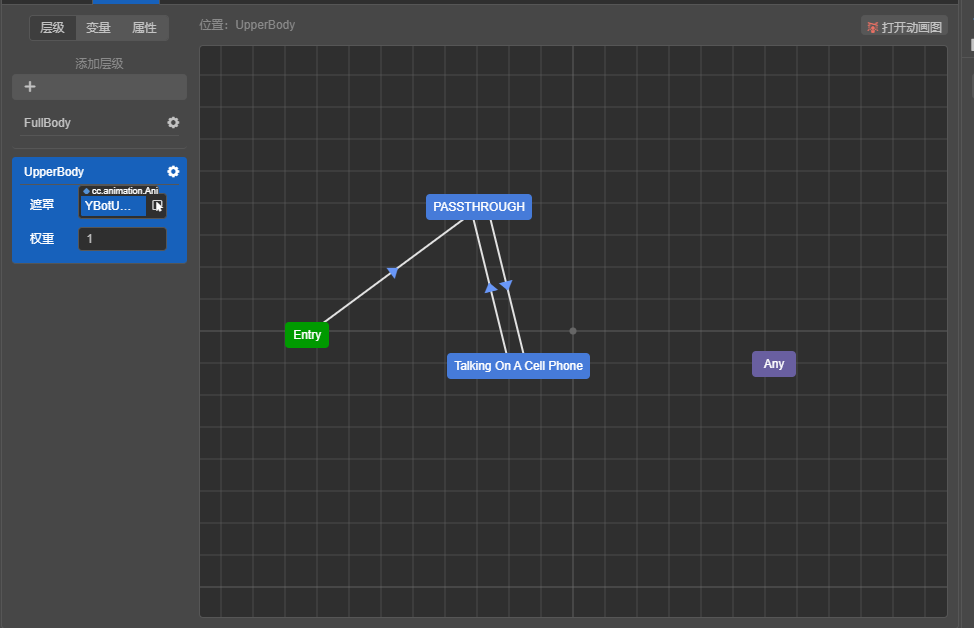

# 动画图层级

动画图可以有多个层级，层级之间同时运行，其上播放的动画效果可以根据层级的配置进行混合。

## 创建层级

TODO

## 层级属性

### 动画遮罩

可以向动画层级指定一个 [动画遮罩](animation-mask.md) 资源。指定后，该层级上的所有动画效果都受到该遮罩的影响。
例如，可以向层级指定一个仅保留上半身骨骼、下半身骨骼都被禁用的动画遮罩，则该层级的动画效果将仅作用于上半身。

### 层级权重

每一层级的动画效果将以一定比例与前面层级的动画效果进行混合，该混合的比例由层级的权重属性指定。
`0` 代表完全使用前面层级的动画效果，`1` 代表该层级完全覆盖前面层级的动画效果，当处于 `(0-1)` 时则进行适当的混合。

层级的混合仅会混合那些未被动画遮罩禁用的骨骼。例如，若层级 1 启用了某骨骼，但其后的层级 2 利用动画遮罩禁用了该骨骼，则
无论层级 2 权重指定为多少，该骨骼都仅全量播放层级 1 的动画效果。

## PASSTHROUGH 状态

很多情况下，一种需求是：仅在特定情况下，启用某一层级；其它情况下都使此层级不生效。

对于这种需求，可以使用 PASSTHROUGH 状态。 PASSTHROUGH 可以看作是一种动画，它的动画效果就是前面层级的动画效果。

从 PASSTHROUGH 状态引出的过渡，就相当于前面层级的动画效果逐渐过渡到目标动画。此过渡上可以指定过渡条件、过渡周期。
但过渡周期仅可指定为绝对的（以秒为单位）。

引出到 PASSTHROUGH 状态的过渡，就相当于源头动画的动画效果在不断衰减，直到过渡完成，相当于当前层级被禁用。

