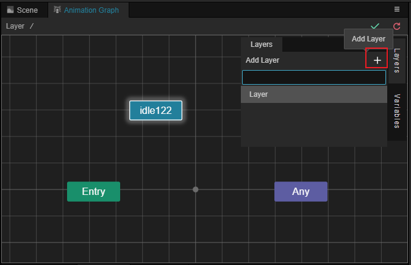
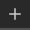
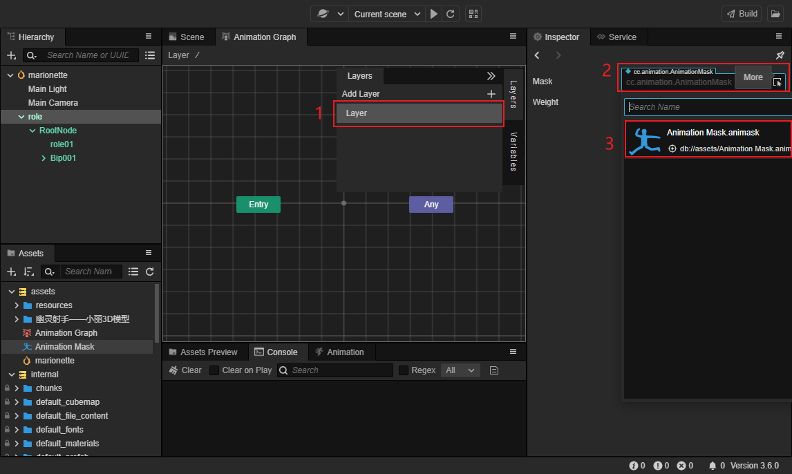
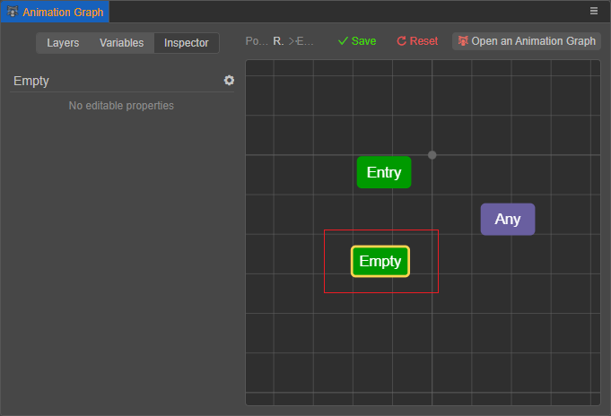
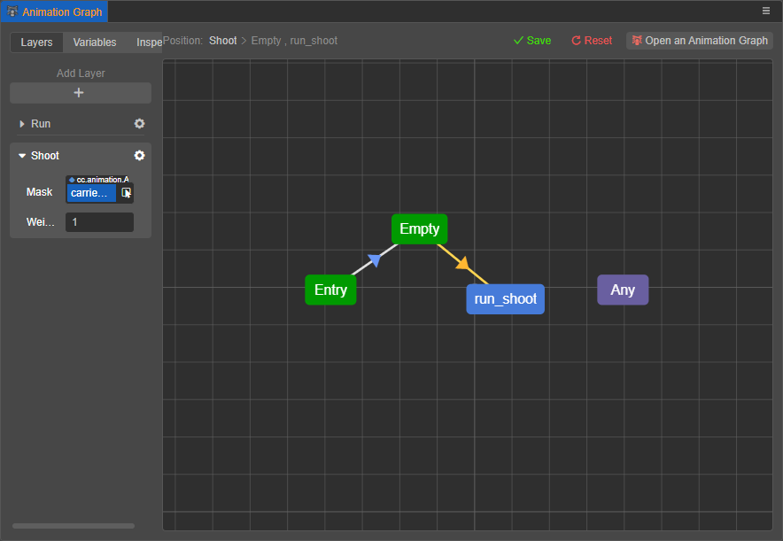
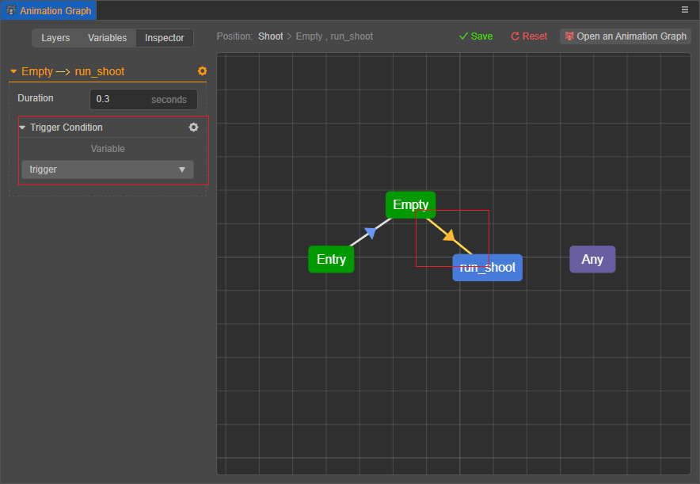

# 动画图层级

动画图可以有多个层级，层级之间同时运行，其上播放的动画效果可以根据层级的配置进行混合。

## 创建层级

在动画图中点击 **层级（Layers）** 按钮，点击  按钮可以创建新的层级。

## 层级菜单

点击层级右侧的齿轮图标用于显示层级菜单。 点击 **重命名（Rename）** 按钮可对动画图层进行重命名，点击 **删除层级（Remove Layer）** 可以删除当前层级。动画图最少需要一个层级。

## 层级属性

| 属性 | 说明 |
| :-- | :-- |
| **Mask** | [动画遮罩](animation-mask.md) |
| **Weight** | 层级权重，用于指定当前层级在和其他层级进行混合时的权重，取值范围为 [0, 1] |

### 动画遮罩

从 **资源管理器** 拖拽动画遮罩到动画图窗口的 **遮罩（Mask）** 属性或者在层级中选中 **遮罩（Mask）** 属性都可以将遮罩赋予该层级。

指定后，该层级上的所有动画效果都受到该遮罩的影响。

例如，可以向层级指定一个仅保留上半身骨骼、下半身骨骼都被禁用的动画遮罩，则该层级的动画效果将仅作用于上半身。

### 层级权重

每一层级的动画效果将以一定比例与前面层级的动画效果进行混合，该混合的比例由层级的权重属性指定。

0 代表完全使用前面层级的动画效果，1 代表该层级完全覆盖前面层级的动画效果，当处于 [0,1] 时则进行适当的混合。

层级的混合仅会混合那些未被动画遮罩禁用的骨骼。例如，若层级 1 启用了某骨骼，但其后的层级 2 利用动画遮罩禁用了该骨骼，则
无论层级 2 权重指定为多少，该骨骼都仅全量播放层级 1 的动画效果。

也可以在代码中通过 `AnimationController.prototype.setLayerWeight` 动态修改层级权重。

## 网格布局操作

在网格内点击空白处点击鼠标右键可以打开层级菜单。

菜单中可以添加 **子状态、子状态机、混合以及空状态**。

- **子状态、子状态机** 和 **混合** 的使用方式请参考 [动画状态机](animation-graph-basics.md)。

- **添加空状态**：该菜单会在层级上创建一个默认名为 Empty 的空状态，请参考下文 **空状态** 部分获取更多信息。

  

- **返回中心视角**：该菜单会将层级的视角返回到层级的中心。

- 按住鼠标右键或滚轮，可以移动层级网格；使用滚动可以对层级进行缩放。

## 空状态

很多情况下，一种需求是：仅在特定情况下，启用某一层级；其它情况下都使此层级不生效。

对于这种需求，可以使用 **空状态**。 **空状态** 可以看作是一种动画，它的动画效果就是前面层级的动画效果。

从 **空状态** 状态引出的过渡，就相当于前面层级的动画效果逐渐过渡到目标动画。此过渡上可以指定过渡条件、过渡周期。
但过渡周期仅可指定为绝对的（以秒为单位）。

引出到 **空状态** 状态的过渡，就相当于源头动画的动画效果在不断衰减，直到过渡完成，相当于当前层级被禁用。

如在下图的示例中，当 **Empty** 仅在触发器 **trigger** 被触发后才会过渡到 **run_shoot** 状态，而在 **Empty** 的情况下，该层级不会影响到前面层级的动画效果。

