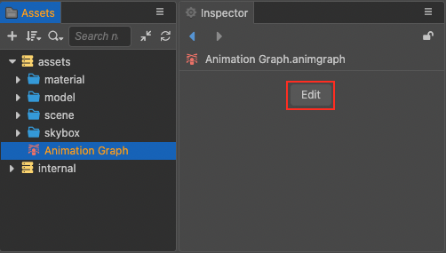
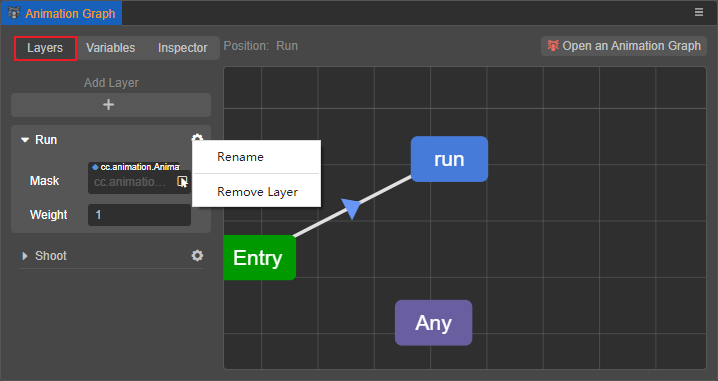
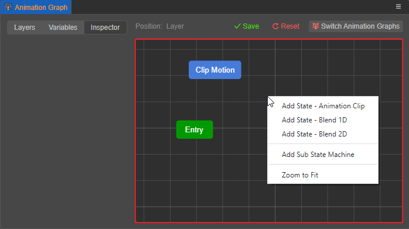
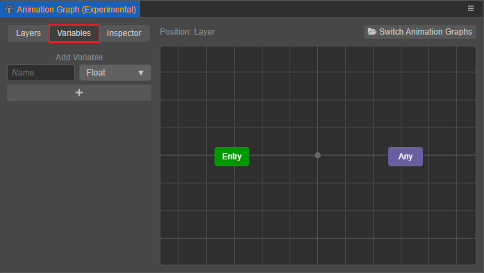
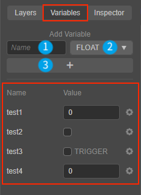
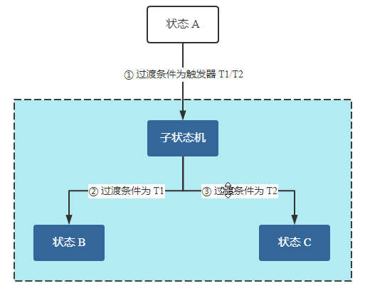
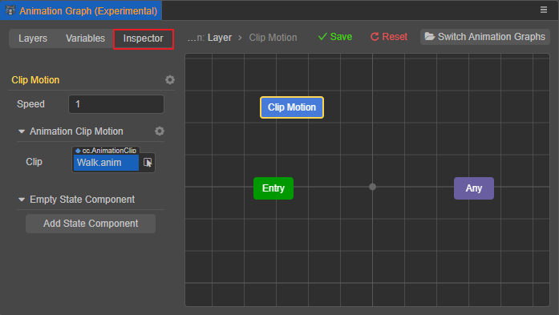

# 动画图面板

动画图面板用于查看和编辑动画图资源。当准备好对象所需的骨骼动画后，便可在 **动画图面板** 中将其组装结合成完整的动画流程。

## 打开面板

在 **资源管理器** 中选中动画图资源，然后在 **属性检查器** 中点击 **编辑**：

即可打开动画图面板，可以看到动画图面板主要由左侧的 **层级**、**变量**、**属性** 分页，以及右侧的网格布局区域构成：

当存在多个动画图资源时，也可以点击面板右上角的 **编辑其他动画图** 按钮切换其他需要编辑的动画图。

## 层级（Layers）

该分页主要用于创建、查看和编辑动画图的层级，每个层级分别由一个状态机控制，但目前仅支持一个动画图层。点击层级右侧的齿轮图标按钮可对动画图层进行重命名：

## 网格布局区域

该区域主要展示了 **层级** 分页中所选的层级对应的状态机，用户可以可视化地创建、编辑、排列状态机中各个状态，以及设置状态之间的过渡。在区域内点击右键即可根据需要创建各类状态：

当编辑完成后可根据需要在右上角点击 **保存** 或者 **重置**（重置到上一次保存时）。更多操作请参考 [动画状态机](animation-graph-basics.md)。

## 变量（Variables）

该分页主要用于创建、查看和编辑当前动画图层中状态机的变量，用户可在动画图中通过自定义的 **变量** 来操控动画图表达的流程，作用如下：

- 作为状态之间过渡的 **过渡条件**

- 作为混合动画状态的 **输入参数** 来混合不同的动画剪辑

### 创建变量

以下图为例，操作步骤为：
- 在 **名称** 输入框中填写变量名
- 在 **类型** 下拉框中选择变量类型。支持的变量类型包括 **浮点型**、**布尔类型**、**触发器类型** 和 **整型**，具体说明请查看下文 **变量类型** 部分的内容。
- 最后点击下方的 **添加** 按钮即可创建变量，创建好的变量会依次显示在分页下方。

每个创建好的变量右侧会有一个齿轮图标按钮，点击即可删除对应变量。设置完成后请不要忘记点击动画图面板右上角的 **保存** 按钮以保存设置。

### 变量类型

目前支持创建的变量类型包括：

- **浮点型**：变量的值可以是任意实数

- **布尔类型**：变量的值可以为真/假

- **整型**：变量的值可以是任意整数

- **触发器类型**：变量为触发器，若勾选则表示值为触发。触发器用于一次性的条件判断，当触发条件满足时，发生状态过渡，过渡完成后，所引用到的所有触发器都会被重置为 **未触发状态**。

  > **注意**：仅当过渡到状态时，触发器才会被重置，若是过渡到“伪状态”，触发器不会被重置。

  例如下图，只要在 ① 中设置触发器 T1 或 T2 一次，状态 A 就能达到子状态机中的状态 B 或者 C，不需要再次设置 ② 和 ③ 中的触发器：

  

  <!--
  这些图都是用 ProcessOn 进行编辑的，源文件以 POS 格式保存在 zh/animation/marionette 目录下，可将其导入到 ProcessOn 再次编辑。
  -->

## 属性（Inspector）

该分页主要用于设置状态机中各类状态的属性和过渡条件，详情请参考 [动画状态机](animation-graph-basics.md)。

