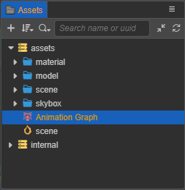
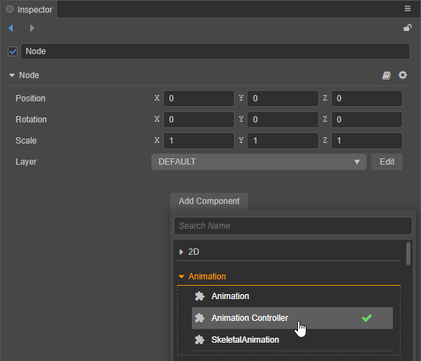
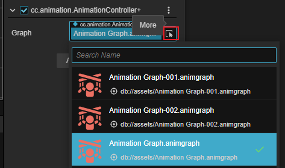

# 动画图资源

动画图资源用于存储对象的整个动画流程数据，通过状态机描述动画的流程，目前一个动画图只支持一个状态机。

## 创建

在 **资源管理器** 点击左上方的 **+** 按钮，然后选择 **动画图（Animation Graph）**：

即可创建一个默认名为 `Animation Graph` 的动画图资源：

## 编辑

动画图创建完成后即可在动画图面板中进行编辑，详情请参考 [动画图面板](animation-graph-panel.md)。

## 应用

动画图资源需要依赖于动画控制器组件（Animation Controller）才能应用到对象上。

在 **属性检查器** 中点击下方的 **添加组件 -> Animation -> Animation Controller**，添加动画控制器组件到节点上。

> **注意**：因为 Marionette 动画系统与旧式动画系统不可同时使用，因此动画控制器组件也不能和动画组件或者骨骼动画组件挂载在同一个节点上。

然后点击动画控制器组件的 **Graph** 属性框后面的箭头图标按钮选择动画图资源：

或者直接将 **资源管理器** 中的动画图资源拖拽到动画控制器组件的 **Graph** 属性框中即可：

