# 动画图

动画图描述了动画流程。

我们把对象所处的一种播放特定动画的逻辑，例如待机、移动、攻击等，称为 **状态**。一般地，对象具有多个状态，并会按照一定的逻辑在状态之间迁移，这种迁移在动画图中称为 **过渡**。状态以及它们之间的过渡就构成了 **状态机**。<!-- TODO：未来实现多个层级时，可能不止有一个状态机 -->动画图包含了一个状态机。

> 注意，此处对状态的定义仅为引出状态机的概念。大多数状态都会播放动画，但不全是。见下。

在外界看来，动画是自我驱动的，外界通过设置动画图暴露出的 **变量** 来操控动画图表达的流程，例如：

- 状态可根据对变量的判断来选择过渡至不同的状态。

- 可以将变量可以作为参数混合不同的动画剪辑。

- 通过变量操纵动画的播放速度等。

## 状态

在状态机中，播放动画的状态称为 **动作状态（Motion State）**。除动作状态之外，还存在以下几种具有特殊含义状态：

- **入口状态**

  标志着状态机的进入。

- **出口状态**

  过渡到此状态后，退出状态机。

- **任意状态**

  代表任意动作状态。

这几种特殊状态都是伴随状态机而生，并不可移除。

为了降解复杂的逻辑，还可以在状态机中嵌套 **子状态机**。有时，我们将动画图顶层的状态机称为 **顶级状态机**。

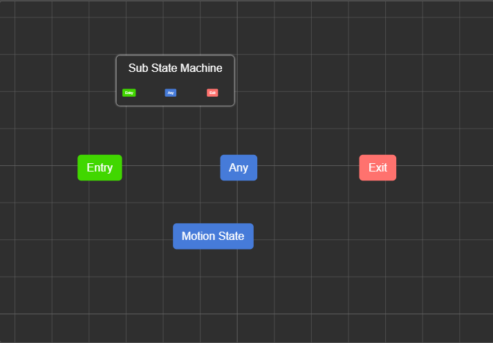

### 动作状态

当过渡至动作状态时，播放指定的动画剪辑或动画混合。

### 入口状态

入口状态标志着状态机的进入。每当进入状态机时，都将步入子状态机。

> 因此，当动画图运作时，首先步入顶级状态机的入口状态。

入口状态只能作为过渡的源头，无法作为过渡的目标。

### 出口状态

当过渡至出口状态机时，状态机退出。退出状态机意味着：

- 返回父状态机，并开始挑选下一个过渡。

- 若顶级状态机退出，则动画流程终止。

出口状态只能作为过渡的目标，无法作为过渡的源头。

### 任意状态

任意状态代表状态机中其它任何动作状态。从任意状态引出过渡等价于从所有动作状态都引出了该过渡。

注意，任意状态只代表动作状态，不包括特殊状态和子状态机本身。但任意状态是继承的，子状态机中的状态会继承父状态机中的任意状态。这意味着若从任意状态引出过渡，其所有子状态机中的动作状态都会含有此过渡。

任意状态只能作为过渡的源头，无法作为过渡的目标。

## 过渡

过渡代表两个状态之间的转换。当过渡的源头为动作状态或任意状态时，此过渡又称为 **动画过渡**。动画过渡可以控制过渡周期使得动画进行平滑切换。

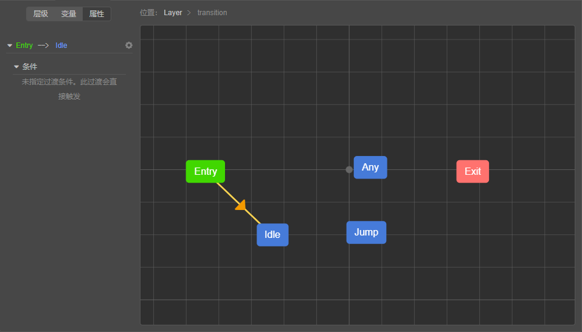

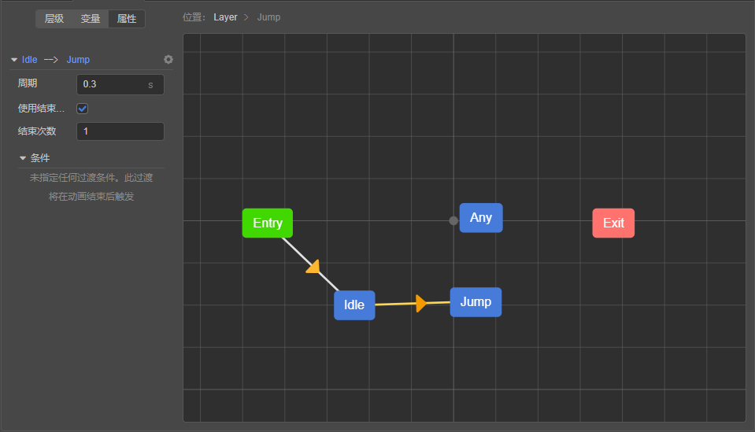

两个状态之间允许存在多个同向过渡，某一状态也可存在到不同状态（包括自身）的过渡。

### 过渡条件

有些过渡需要满足某些条件时才触发，该条件被称为 **过渡条件**，简称 **条件**。

条件分为：

- 布尔条件

  判断布尔类型的变量是否为真或者为假。

  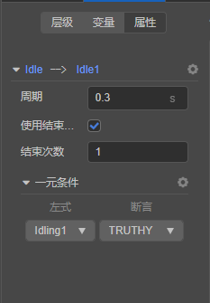

- 数值条件

  判断数值类型的变量与另一固定数值的逻辑关系，有等于、不等于、大于、小于、大于等于、小于等于等关系。当等式（不等式）成立时条件满足。变量的类型与固定数值的类型是匹配的：它们要么都为整型，要么都为浮点型。

  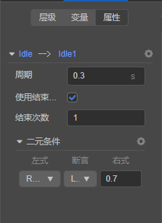

- 触发器条件

  当触发器变量触发时条件满足。

  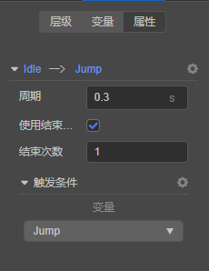

可以为过渡指定多个条件，当切仅当所有条件都满足时过渡才会发生。

### 特殊条件：播放次数

一种常见的需求是动画播放到指定时间后过渡到另一状态。这种情况下可以设置启用过渡的播放次数。播放次数作为一种特殊的条件，当启用播放次数后，仅当播放次数条件和过渡条件都满足时，过渡才会发生。

播放次数的单位是“遍”，例如，`1` 代表过渡源头动画播放完一遍后，此条件成立；`2` 代表播放完两边后，此条件成立；`2.5` 代表播放完两次半后，此条件成立。

仅可在动画过渡上指定播放次数条件。播放次数条件默认开启且默认播放次数为 `1`。

### 无条件过渡

严谨地说，过渡允许不指定任何条件，例如，很多时候入口状态需要无条件地过渡至其它状态。但对于动画过渡来说，既未指定过渡条件、也未指定播放次数条件的过渡是无意义的。因此，若 **动画过渡** 未指定过渡条件和播放次数，Creator 将忽略此过渡。

### 过渡周期

动画过渡上可设置周期，使得动画时间平滑切换。过渡周期可以设置绝对的秒数，或基于转换源头周期的“遍”数。

以秒为单位：

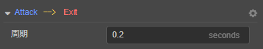

以遍为单位：

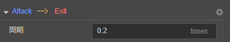

> 例：当希望快播放完一遍动画后切换到别的状态，并在切换完刚好完成此动画的播放时，可以使用遍为单位，使得周期和播放次数之和为 `1.0`。当然，也可以通过设置此动画的循环模式来实现。

### 优先级

当状态上存在多条同时满足的过渡时，将优先使用排在过渡列表前方的过渡。

> Creator 不建议依赖这种优先级，最好尽可能地使用条件来过滤过渡。

### 一种边缘情况

有些情况下会导致状态机停留在入口、出口结点上：

- 过渡到了子状态机的入口，但在子状态机中并没有能满足的的过渡。

- 过渡到了子状态机的出口，但在父状态机中，该子状态机并没有其它能满足的过渡。

我们把这种情况称为状态机悬停了。我们目前规定悬停的状态机具有以下行为：状态机一旦悬停，会直接中断更新，直到后续能过渡至动作状态，这时候的表现就是动画被暂停了。

我们不建议依赖这种行为，并且保留后续对这种行为的更改。

## 动作状态

动作状态上可指定一个动画剪辑或动画混合，我们将其统称为 **动作（Motion）**。在状态机可视化界面的空白处右键弹出创建动作状态的菜单：

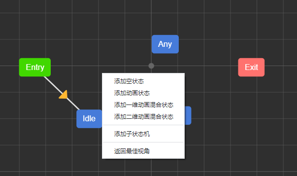

TODO：将动画剪辑资源拖入动画图编辑器时也将在当前状态机中创建动作状态，并使用拖入的动画剪辑作为动画内容。

### 速度

可指定动画的速度。默认为 `1`。

## 动画混合

动作可以指定为动画混合。

动画混合根据输入参数和预设的一些参数来混合其它的动作。有以下几种混合方式：

- 一维混合：根据一个输入参数来进行混合。

- 二维混合：根据两个输入参数来进行混合。


### 一维混合

一维混合根据一个输入参数混合一系列动作。每个动作都可配置一个阈值。当输入参数恰好位于阈值上时，就使用该阈值上的动作。否则，输入参数位于两个阈值之间，将根据输入参数在该阈值区间上的比例 **线性** 混合这两个动作。

一个最常见的例子是根据角色速率来混合待机、走、跑的动作：

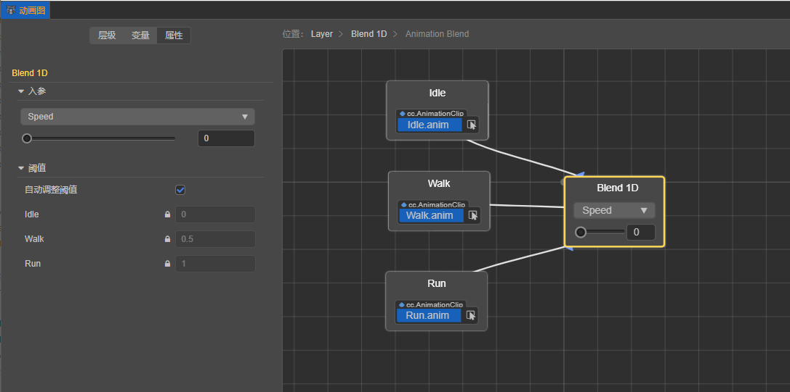

### 二维混合

二维混合根据两个输入参数混合一系列动作。二维混合使用重心坐标插值算法。

二维混合经常用于插值不同方向的移动动作：

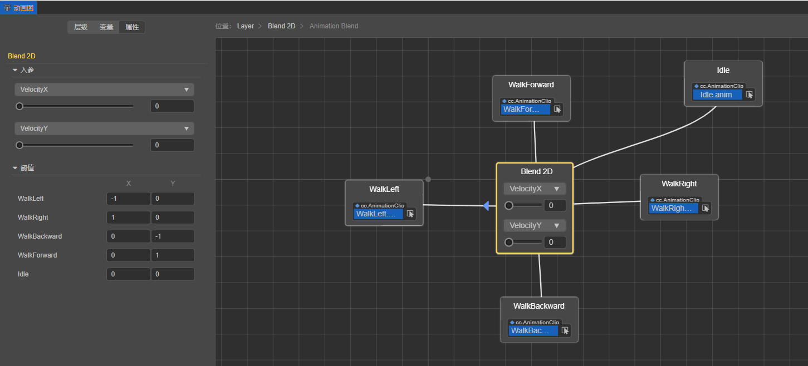

## 状态机组件

动作状态和子状态机都可以添加所谓的状态机组件。

状态机组件类继承自 `animation.StateMachineComponent`，可以在资源创建菜单中创建一个包含了状态机组件的模块：

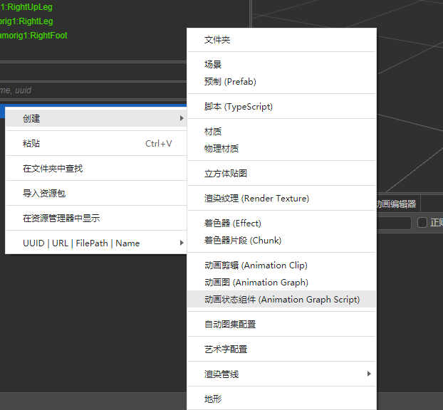

状态机组件基类中提供了一些方法，表示状态机的一些特定事件。子类可以覆写这些方法，以在状态进入、离开时添加一些业务逻辑。

|方法名|说明|
|--|--|
|`onMotionStateEnter`|在进入动作状态时调用。|
|`onMotionStateExit`|在完全退出动作状态时调用。|
|`onMotionStateUpdate`|在动作状态更新时调用。|
|`onStateMachineEnter`|在进入子状态机时调用。|
|`onStateMachineExit`|在进入子状态机时调用。|

这些方法可能接受以下参数：

- `controller: animation.AnimationController`：上述所有方法都会接受此参数。表示运行此动画图的动画控制器组件。

- `motionStateStatus: animation.MotionStateStatus`：仅动作状态相关的方法（`onMotionStateEnter`、`onMotionStateExit`）接受此参数。表示事件主体动作状态的运作状态。

创建好状态机组件类后，在状态的属性检查面板上选择添加组件即可将组件附加至该状态：

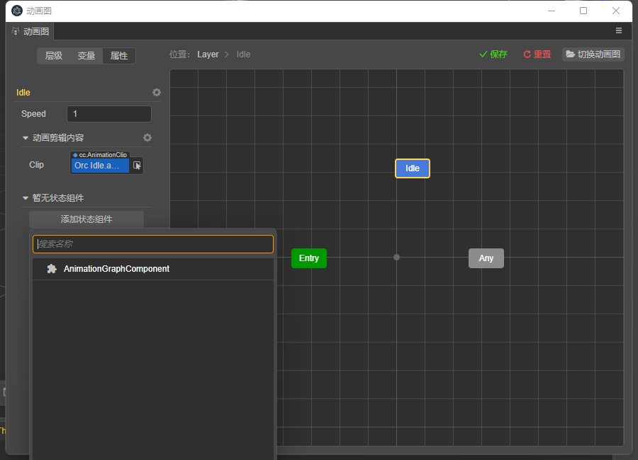

### 示例：在进入状态时播放特效

```ts
import { _decorator, animation, PhysicsSystem, ParticleSystem } from "cc";
const { ccclass, property } = _decorator;

@ccclass("AnimationGraphComponent")
export class AnimationGraphComponent extends animation.StateMachineComponent {
    /**
     * Called when a motion state right after it entered.
     * @param controller The animation controller it within.
     * @param stateStatus The status of the motion.
     */
    public onMotionStateEnter (controller: animation.AnimationController, stateStatus: Readonly<animation.MotionStateStatus>): void {
        // 播放动画控制器所在节点上的所有例子特效
        for (const particleSystem of controller.node.getComponents(ParticleSystem)) {
            particleSystem.play();
        }
    }
}

```

## 变量

动画图通过暴露变量使外界控制自我流程。

按类型不同，变量分为：

- 整型

  变量的值可以是任意整数。

- 浮点型

  变量的值可以是任意实数。

- 布尔类型

  变量的值可以为真或者假。

- 触发器类型

  变量为触发器，值可以为触发或者未触发。当过渡发生时，过渡引用的所有触发器变量将被重置为未触发状态；但过渡到出口状态时不会被重置。

触发器用于一次性的条件判断：当触发器触发时，条件成立；若过渡发生了，则此触发器会被重置为未触发状态。值得一提的是，仅当过渡到动作状态时，触发器才会被重置。这意味着，对于如下的过渡逻辑：

```
动作状态 A -> 子状态机（条件：触发器 T1 或触发器 T2）

子状态机入口 -> 子状态机中的动作状态 B（条件：触发器 T1）

子状态机入口 -> 子状态机中的动作状态 C（条件：触发器 T2）
```

只要设置触发器 T1 或 T2 一次，就都能达到子状态机中的动作状态 B 或者 C，而不是需要设置两次触发器。

