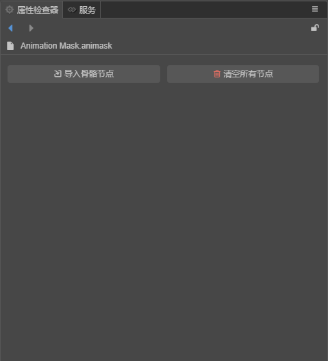
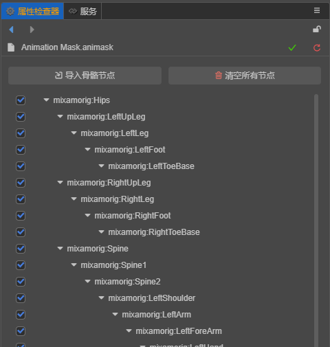

# 动画遮罩资源

动画遮罩用于屏蔽指定骨骼上的动画效果。

## 创建

在 **资源管理器** 点击左上方的 **+** 按钮，然后选择 **动画遮罩（Animation Mask**：

即可创建一个默认名为 `Animation Mask` 的动画遮罩资源：

## 编辑

选中动画遮罩资源后，可在属性检查器中对动画遮罩资源进行编辑。

### 骨骼导入

在一切开始前，需要确定选择骨骼遮罩影响的所有骨骼。

在属性检查器上，点击 `导入骨骼结点`，在弹出的预制体选择对话框中，我们选择骨骼层次所在的预制体。一般情况下，他就是目标模型所在模型文件（FBX、glTF）中导入的预制体，且通常只有一个。

。

选定后，预制体中所包含的所有骨骼将列入到骨骼遮罩资源中：

。

也可以通过“情况所有节点”来清楚已导入的所有骨骼。

### 骨骼启用与禁用

当希望某骨骼上的动画效果被禁用时，确保其前方的勾选框保持未勾选状态即可。

注意，子骨骼和父级骨骼直接的启用/禁用关系是互不影响的。也就是说，即使父级骨骼被禁用，子骨骼依然可以生效。

可以通过按住 Alt 键来递归地启用/禁用指定骨骼和和它所有的子骨骼。

## 应用

动画遮罩资源应用于动画图中，见 [动画图层级](animation-graph-layer.md)。