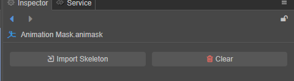
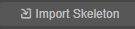
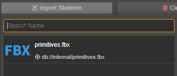
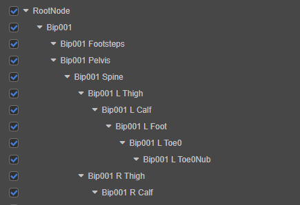
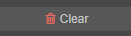
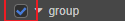
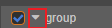
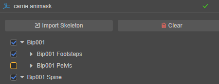

# 动画遮罩资源

动画遮罩是一种资源（Asset），用在动画图层级中，用于屏蔽指定骨骼上的动画效果。

常见的应用场景如上下半身分开播放动画，假如要制作一个在射击时行走的动画，可以通过动画遮罩对射击动画的上半身和行走动画的下半身进行混合来实现。

## 创建

在 **资源管理器** 点击左上方的 **+** 按钮，然后选择 **动画遮罩（Animation Mask）**：

即可创建一个默认名为 **Animation Mask** 的动画遮罩资源：

## 编辑遮罩

在 **资源管理器** 中选中动画遮罩资源后，可在 **属性检查器** 中对动画遮罩资源进行编辑。

### 骨骼导入

在一切开始前，需要确定选择骨骼遮罩影响的所有骨骼。

在 **属性检查器** 上，点击  按钮，在弹出的预制体选择对话框中，我们选择骨骼层次所在的预制体。一般情况下，我们选择目标模型所在模型文件（FBX、glTF）中导入的预制体，且通常只有一个。

选定后，预制体中所包含的所有骨骼将列入到骨骼遮罩资源中：

。

也可以通过点击  来清除已导入的所有骨骼。

### 骨骼启用与禁用

当希望某骨骼上的动画效果被禁用时，确保其前方的勾选框保持未勾选状态即可。

操作方式为在导入的骨骼中可以通过点击骨骼名字旁边的单选框  。

通过点击  可以展开/隐藏子骨骼。

按住 <kbd>Alt</kbd> 并点击  单选框可以同时选中/取消当前骨骼以及其子骨骼。

> **注意**：子骨骼和父级骨骼直接的启用/禁用关系是互不影响的。也就是说，即使父级骨骼被禁用，子骨骼依然可以生效。

遮罩所在层级的动画，如其骨骼未被选中，则所有跟该骨骼有关的动画不会播放。在下图中，**Bip001 Pelvis** 未被选中，则该层级的所有动画都无法影响到该骨骼。

## 示例

完整示例请参考（[GitHub](https://github.com/cocos-creator/MarionetteDemo)|[Gitee](https://gitee.com/mirrors_cocos-creator/MarionetteDemo)）。
