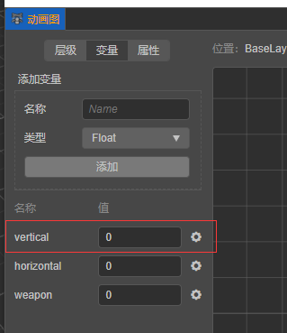

# 在脚本中使用动画控制器

## 读写控制变量

假设在[动画图面板](animation-graph-panel.md)中添加了代表角色 Y 方向移动的变量 `vertical`。



下列代码演示了如何对动画状态图的变量进行读写：

```

//获取动画控制器组件：
let animationController:AnimationController = this.node.getComponent(AnimationController);

//写入变量的值：
animationController.setValue("vertical", 1.0)

//读取变量的值：
let vertical: Number = aniamtionController.getValue("vertical");

```

写入完成后，若满足状态过渡条件，则会进行[状态过渡](state-transition.md)。

## 获取当前状态

下列代码演示了如何获取第 0 层级的当前 `状态` 的名称以及进度：
```
let states: animation.MotionStateStatus = aniamtionController.getCurrentStateStatus(0)
console.log(states.__DEBUG_ID__, states.progress)
```

## 获取当前过渡

下列代码演示了如何获取第 0 层级即将发生的 `状态过渡` 的相关信息：

```
let transition: animation.TransitionStatus = aniamtionController.getCurrentTransition(0)
console.log(transition.duration, transition.time)
```