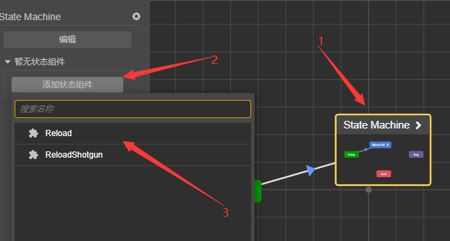
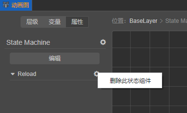

# 状态组件

状态组件是供动画状态图使用的脚本组件，它监听 ```动画状态机```、```动画混合```、```状态``` 的状态变化。

动画状态机需继承自 ```animation.StateMachineComponent ``` 。

## 创建状态组件

下列代码演示了如何创建空的状态组件：

```
import { _decorator, animation } from 'cc';
const { ccclass, property } = _decorator;

@ccclass('Reload')
export class Reload extends animation.StateMachineComponent {
    /**
     * Called when a motion state right after it entered.
     * @param controller The animation controller it within.
     * @param motionStateStatus The status of the motion.
     */
    onMotionStateEnter(controller: animation.AnimationController, motionStateStatus: Readonly<animation.MotionStateStatus>): void {

    }
    /**
     * Called when a motion state is going to be exited.
     * @param controller The animation controller it within.
     * @param motionStateStatus The status of the motion.
     */
    onMotionStateExit(controller: animation.AnimationController, motionStateStatus: Readonly<animation.MotionStateStatus>): void {

    }
    /**
     * Called when a motion state updated except for the first and last frame.
     * @param controller The animation controller it within.
     * @param motionStateStatus The status of the motion.
     */
    onMotionStateUpdate(controller: animation.AnimationController, motionStateStatus: Readonly<animation.MotionStateStatus>): void {

    }
    /**
     * Called when a state machine right after it entered.
     * @param controller The animation controller it within.
     */
    onStateMachineEnter(controller: animation.AnimationController): void {

    }

    /**
     * Called when a state machine right after it entered.
     * @param controller The animation controller it within.
     */
    onStateMachineExit(controller: animation.AnimationController): void {

    }
}
```

## 状态组件方法及说明

| 方法名              | 说明                                             |
| :------------------ | :----------------------------------------------- |
| onMotionStateEnter  | 状态进入时调用。                                 |
| onMotionStateExit   | 状态退出时调用。                                 |
| onMotionStateUpdate | 除去第一帧和最后一帧，每当状态更新时会进行调用。 |
| onStateMachineEnter | 动画状态机进入时调用。                           |
| onStateMachineExit  | 动画状态机退出时调用。                           |

## 添加状态组件
对于任何 **状态，动画状态机，动画混合** 都可以添加状态组件。

添加步骤：
1. 选中任意 ```动画状态机``` 、 ```动画混合``` 或 ```状态```。
2. 在左边的 ```属性``` 栏内点击 ``` 添加状态组件 ``` 按钮。
3. 在弹出的**下拉框内**选择提前制作好的状态组件。



也可以通过点击右侧的小齿轮进行添加：


## 添加多个状态组件

如若当前状态已持有至少一个状态组件，则可以通过点击右边的小齿轮来添加更多的状态组件：


按下 ``` 添加状态组件 ``` 按钮后，会弹出下拉选择框：


单击想要添加的状态组件即可。

## 删除状态组件

点击任意已添加的状态组件右侧的小齿轮则可以删除状态组件：




