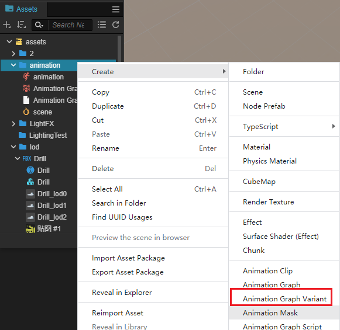
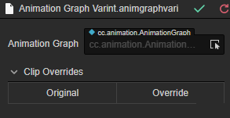
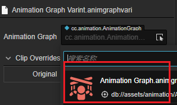
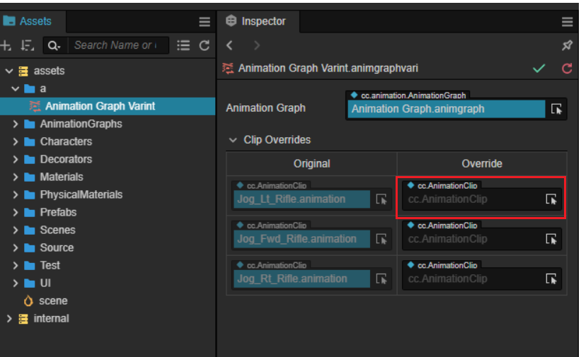
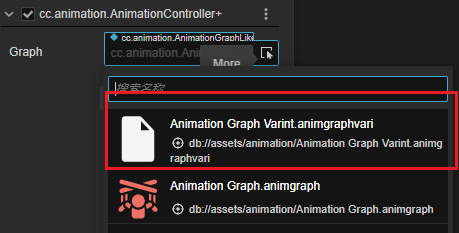

# 动画图变体

如果两个动画图他们的动画逻辑相同但对应的动画剪辑不同，重新制作一个动画图会带来额外的维护负担。通过使用动画图变体，可以更好的解决此问题。

动画图变体是一种资源，在 **资源管理器** 内右键创建一个新的动画图变体资源：

创建后的变体如下图所示：

## 属性

| 属性 | 说明 |
| :-- | :-- |
| **Animation Graph** | 需要变体的动画图，通过下拉或者从 **资源管理器** 内选择   |
| **Clip Overrides** | 需要覆盖的动画剪辑      通过右侧 Overrides 列，从 **资源管理器** 内选择需要替换的动画剪辑 |

## 使用变体

在 Animation Controller 组件上下拉其 **Animation Graph** 属性即可选择不同的变体。

