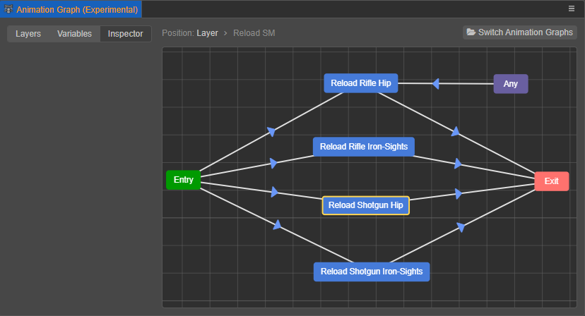

# Marionette 动画系统

Cocos Creator 3.4 引入了一个全新的 Marionette 动画系统，通过状态机控制对象的骨骼动画，实现了自动化、可复用的动画流程。

为了跟 v3.4 之前的动画系统区分，我们将新的动画系统称为木偶（Marionette）动画系统，称 v3.4 之前使用的动画系统为旧式动画系统。两种动画系统都可以正常使用，但不支持同时使用。主要的区别在于：

- 旧式动画系统：以动画组件、动画状态为核心，手动简单控制动画剪辑的播放暂停等。动画剪辑支持使用通过编辑器创建的 Animation Clip 和外部导入的骨骼动画（`.fbx` 、 `.gltf` 和 `.glb`）。

- Marionette 动画系统：以动画控制器组件、动画图为核心，按照事先搭建好的动画图，通过状态机自动控制动画剪辑的播放和切换等。动画剪辑只支持外部导入的骨骼动画（`.fbx` 、 `.gltf` 和 `.glb`）。

## 内容

Marionette 动画系统主要内容包括：

- [动画图资源](animation-graph.md)
- [动画控制器组件参考](animation-controller.md)
- [动画图面板](animation-graph-panel.md)
- [动画图层级](animation-graph-layer.md)
- [动画状态机](animation-graph-basics.md)
- [状态过渡](state-transition.md)
- [动画遮罩资源](animation-mask.md)

## 名词解释

Marionette 动画系统相关功能名词的说明如下：

| 功能名词 | 说明 |
| :----- | :--- |
| 动画图资源    | 用于存储对象的整个动画流程数据，可直接在 **资源管理器** 面板创建。详情请参考 [动画图资源](animation-graph.md)。 |
| 动画控制器组件 | 引用动画图资源并将其应用于对象。详情请参考 [动画控制器组件参考](animation-controller.md)。 |
| 动画图面板    | 当准备好对象所需的骨骼动画后，便可通过动画图面板将其组合成完整的动画流程。具体的操作请参考 [动画图面板](animation-graph-panel.md)。|
| 状态         | 对象所处的一种播放特定动画剪辑的动作，例如待机、行走、移动、攻击等。 该状态与旧式动画系统中，动画组件为每一个动画剪辑创建的 [动画状态](../animation-state.md) 不同。|
| 状态过渡      | 大多数情况下，一个对象会拥有多个状态，并按照一定的需求逻辑在各个状态之间切换，这种切换便称为 [状态过渡](state-transition.md)。例如角色在行走时触发了死亡条件，行走状态便会切换到死亡状态。 |
| 动画状态机    | 用于可视化地管理控制某个对象上各个状态及状态之间的过渡，可视为一个流程图。详情请参考 [动画状态机](animation-graph-basics.md)。|

状态及状态过渡在动画图面板中是以图形的方式显示，例如下图，方块表示状态，箭头表示状态之间的过渡：

## 范例参考

Creator 提供了 **Ms.Amoy**（[GitHub](https://github.com/cocos-creator/MarionetteDemo)|[Gitee](https://gitee.com/mirrors_cocos-creator/MarionetteDemo)）范例，演示了 Marionette 动画系统的使用方式，用户可根据需要下载参考使用。
