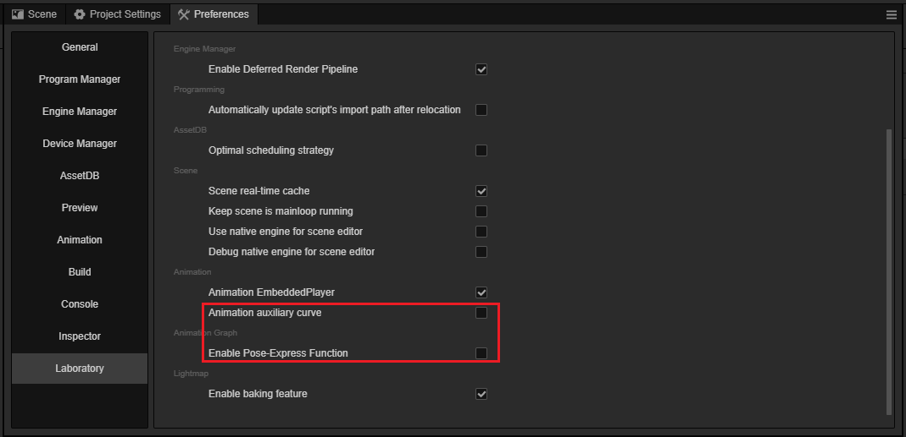
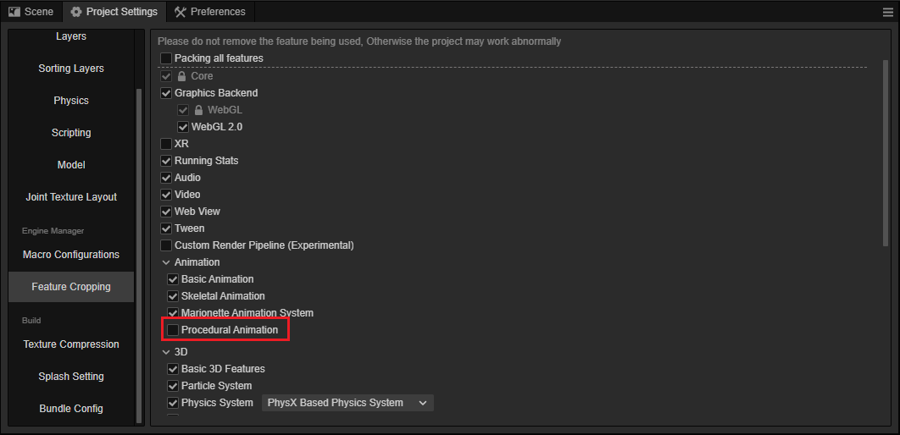

# 启用程序式动画功能

程序式动画目前为实验性功能，如要启用，请在 **偏好设置** 中找到 **实验室** 功能并开启下列选项：

- 动画辅助曲线（**Animation auxiliary curve**）
- 开启姿态图功能（**Enable Pose-Express Function**）

在 **项目** 菜单打开 **项目设置** 面板，导航到 **功能剪裁** 分页并启用 **程式化动画**。

之后重启编辑器或者使用 <kbd>Ctrl + R</kbd> 刷新即可。
