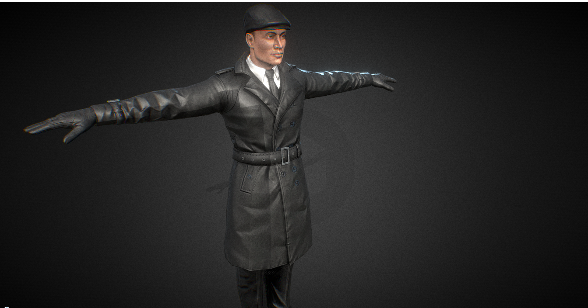
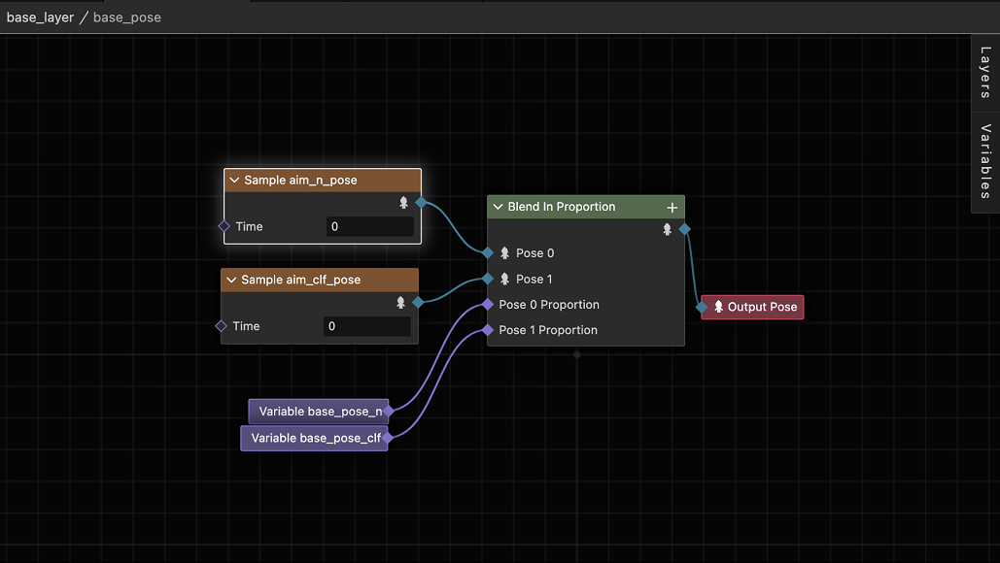

# 程序式动画简介

在了解程序化动画之前，我们需要先了解动画中所指的 “姿势（Pose）”，相信下面的图中的姿势您都有见过：

> 图片来自 [https://sketchfab.com](https://sketchfab.com/3d-models/man-in-coat-character-human-riged-model-758a855697be47a1be0d707623e3907e)

这就是动画制作中的 T-Pose，整个人形伸直双手做出和 T 一样的形状。

不知道您有没有考虑过为什么会有 T-Pose 这样的 “怪异” 的姿势。

最初的原因可能已无法考证，但就现在来说 T-Pose 是最适合动画师制作动画的起始动画，动画师会从 T-Pose 开始制作角色的动画。因此 T-Pose 就这么作为动画工作流的一部分保留了下来。

我们可以从一个数学概念上去理解 T-Pose，如果正向 X 轴的起始位置 0，那么动画的起始姿态就是 T-Pose。

理解到这一点，我们就可以理解到角色的 “姿态”。我们可以理解为角色在某个时刻所体现出外观，这些外观由它的动画信息内所提供的变换（位置，旋转等）以及蒙皮等要素决定。也就是说当我们将数轴上的“光标”移动到某个时刻，从而得出数轴上当前的值是多少。同理我们在时间轴上移动动画，那么当时间轴停在某个时刻时，角色所处的样子，就称为他的一个姿态。

在引擎中，角色的 **姿态**，是指角色的所有骨骼在某一时刻的所有变换（位置、旋转）信息。求值动画图将产生姿态，而后，姿态被写入到场景中，配合蒙皮渲染实现骨骼动画。

程序式动画，是指以类似流程图的形式表达姿态的生成和变化。

如上图就是一个典型的程序式动画。

程序式动画和普通的动画差别在于，普通的动画通常来说开发者不能介入动画的采样行为，而程序式动画提供额外的能力可以供开发者在动画采样时，提取某些动画、混合或者姿态的信息于当前的动画进行加权混合等操作。

程序化动画系统提供了对动画剪辑、混合以及姿态的操作功能，这些功能可以使得开发者在运行时动态的根据需求来调整动画的采样过程，并产生输出，而输出既可以作为最终的输出输出到屏幕上，也可以作为其他动画采样的输入，从而形成复杂的动画系统。

我们以一个简单例子来说明程序化动画。

比如角色行走在不平的地面上，通常在制作动画剪辑时并不会考量这一点，因为美术资产的制作者并不清楚角色的脚可能处于什么高度，因此会制作角色平地行走的动画，而在运行时，由于地面的高低起伏，因此需要动态的计算出脚应该所在的高度，并将角色的脚 “移动” 到对应的高度，这里通常是采用逆向动力学（IK，Inverse Kinematic）的算法。

使用程序化动画，我们只需在姿势图内添加和 IK 相关的节点，并在运行时将计算 IK 所需要的信息传递给姿态图系统，通过 IK 解算器的运算即可得到正确的结果。

可以看到程序化动画通过提供可视化视图，从而使复杂动画的制作更易操作和理解。

## 何时需要程序式动画

简单来说，当你需要动态修改骨骼，尤其需要根据环境来调整骨骼时，你应该考虑使用程序式动画能力。例如，当人形角色去触碰开关时，你需要将手部骨骼移动至开关位置，并且同时保证手臂做出相应调整。
