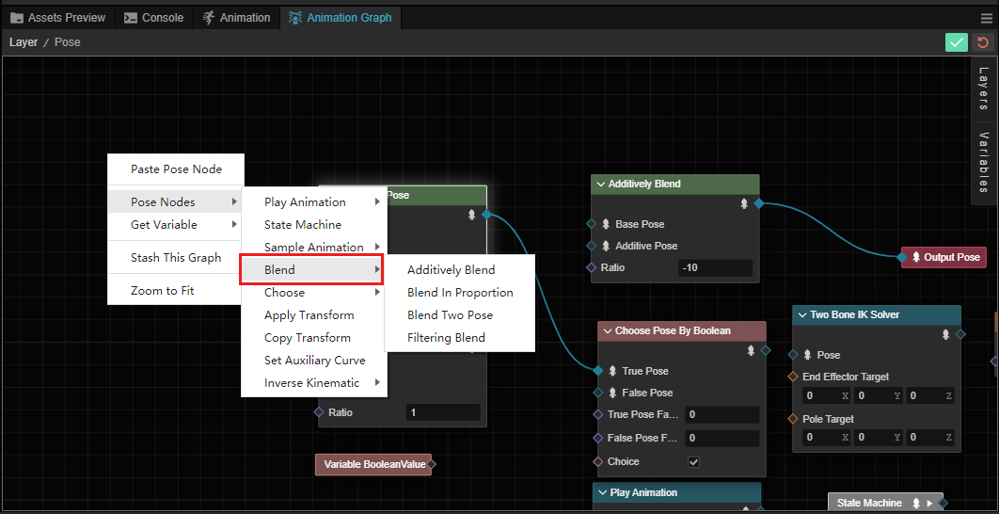
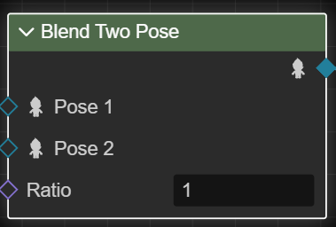
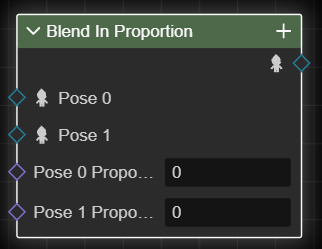
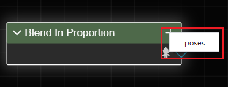
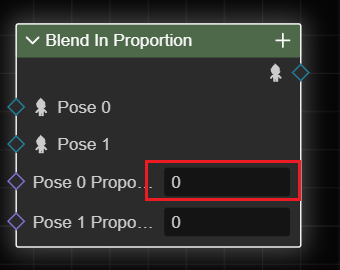
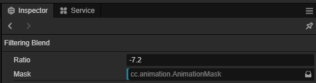
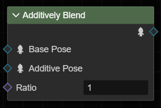

# 混合姿态

姿态图提供了几种用于混合姿态的结点。

> 这些结点的混合都在本地空间中进行。

混合姿态可以在姿态图中点击鼠标右键选择 **姿态节点** -> **混合** 来创建。

## 混合双姿态

**混合双姿态结点** 按指定的比例混合两个姿态。

| 输入       | 类型   | 含义                                                                    |
| ---------- | ------ | ----------------------------------------------------------------------- |
| **姿态 1** | 姿态   | 参与混合的姿态。                                                        |
| **姿态 2** | 姿态   | 参与混合的姿态。                                                        |
| **比例**   | 浮点数 | 混合比例。例如，0.2 表示最终姿态中将包含 80% 的姿态 1 和 20% 的姿态 2。 |

## 混合多姿态

**按占比混合结点** 按每个姿态的占比混合多个姿态。

| 输入       | 类型   | 含义                                                    |
| ---------- | ------ | ------------------------------------------------------- |
| **姿态 N** | 姿态   | 参与混合的姿态。                                        |
| **占比 N** | 浮点数 | 姿态占比。例如，0.2 表示最终姿态中将包含 20% 的姿态 N。 |

点击右侧的 “+” 号按钮并选择 **poses** 菜单可以添加更多的姿态。

添加后在输入框内输入比例可以设置该姿态在最终姿态中的占比.

## 过滤混合

**过滤混合结点** 按指定的比例，将姿态的一部分混合到另一姿态中。

| 输入       | 类型   | 含义                                                                    |
| ---------- | ------ | ----------------------------------------------------------------------- |
| **姿态 1** | 姿态   | 参与混合的姿态。                                                        |
| **姿态 2** | 姿态   | 参与混合的姿态。                                                        |
| **比例**   | 浮点数 | 混合比例。例如，0.2 表示最终姿态中将包含 80% 的姿态 1 和 20% 的姿态 2。 |

| 对象属性 | 含义                                                                     |
| -------- | ------------------------------------------------------------------------ |
| **遮罩** | 在混合时使用的动画遮罩。姿态 2 中只有被遮罩限定的部分会混合到姿态 1 中。 |

## 叠加混合

**叠加混合结点** 按指定的比例，将一个叠加姿态叠加到基础姿态中。

| 输入         | 类型   | 含义                                                            |
| ------------ | ------ | --------------------------------------------------------------- |
| **基础姿态** | 姿态   | 基础姿态。                                                      |
| **叠加姿态** | 姿态   | 叠加姿态。                                                      |
| **比例**     | 浮点数 | 混合比例。例如，0.2 表示仅有 20% 的叠加姿态会被混合到基础姿态。 |
