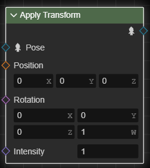
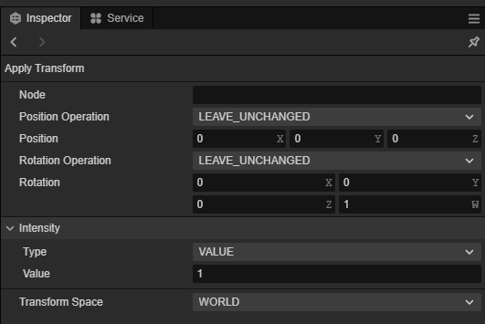
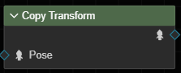
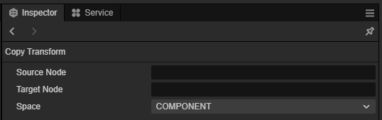
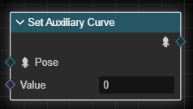
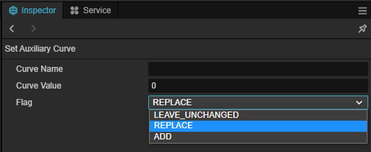
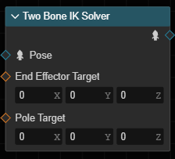
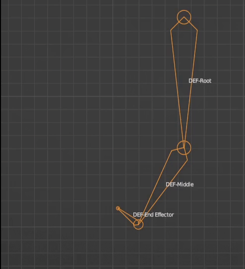
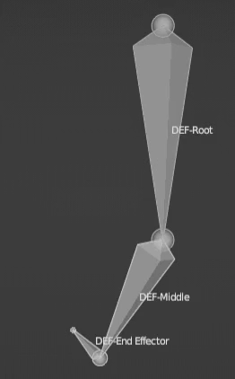
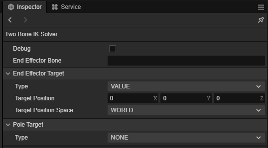

# 修改姿态

姿态图提供了几种用于修改姿态的结点。这些结点都接受一个输入姿态，并输出修改后的姿态。

|输入|类型|含义|
|--|--|--|
|`姿态`|姿态|要修改的姿态。|

姿态节点的操作请参考 [姿态图节点视图](./node-operation.md)。

## 应用变换

**应用变换结点** 应用变换（位移和旋转）到输入姿态的指定结点。

|输入|类型|含义|
|--|--|--|
|`位置`|三维向量|对位置的修改量。|
|`旋转`|四元数|对旋转的修改量。|
|`强度值`|浮点数|修改的应用强度，在 [0, 1] 范围内。0 表示完全不应用修改，1 表示完全应用修改。|

|对象属性|含义|
|--|--|
|`结点`|要修改的结点的名称。|
|`位置操作`| 指定如何修改位置。见 [变换操作选项](#变换操作选项) |
|`旋转操作`|指定如何修改旋转。见 [变换操作选项](#变换操作选项)|
|`空间`|修改发生的空间；也即指定的 `位置` 输入 和 `旋转`输入所处的空间。 |

### 变换操作选项

变换操作选项指定了应用变换结点如何修改位置或旋转。选项如下：

|选项|含义|
|--|--|
|LEAVE_UNCHANGED|不修改。|
|REPLACE|作为位置的应用选项时，将 `位置` 输入直接用作结点的新位置；作为旋转的应用选项时，将 `旋转` 输入直接用作结点的新旋转。|
|ADD|作为位置的应用选项时，将 `位置` 输入加到结点目前的位置上；作为旋转的应用选项时，将 `旋转` 输入加到结点目前的旋转上。|

## 拷贝变换

**拷贝变换结点** 拷贝输入姿态中一个结点的变换至另一结点上。

|对象属性|含义|
|--|--|
|`源结点`|要拷贝的结点的名称。|
|`目标结点`|拷贝到的结点的名称。|
|`空间`|指定拷贝发生的空间。当为 `COMPONENT` 时表示在组件空间中进行拷贝；当为 `LOCAL` 时表示在本地空间中进行拷贝。|

## 设置辅助曲线

**设置辅助曲线结点** 修改输入姿势中指定辅助曲线的当前值。

|输入|类型|含义|
|--|--|--|
|`曲线值`|浮点值|对辅助曲线的修改量。|

|对象属性|含义|
|--|--|
|`曲线名`|要修改的辅助曲线的名称。|
|`标志`|指定如何修改辅助曲线。当为 `LEAVE_UNCHANGED` 时不修改；当为 `REPLACE` 时表示将 `曲线值` 输入作为辅助曲线的当前值；当为 `ADD` 时表示将 `曲线值` 输入加到辅助曲线的当前值上。|

## 双骨骼 IK

IK 解算往往用于移动或旋转骨骼到目标位置，并且带动父级骨骼，使之保持与父级骨骼之间的距离不变（或在可接受的范围内）。例如，在移动脚时，膝盖骨骼和大腿骨骼应该相应弯曲。

**双骨骼 IK 解算器结点** 为输入姿势解算两段（三根）骨骼构成的 IK 问题。这三根骨骼构成直接父子关系，即 “子级 - 父级 - 父级的父级”。其中，“子级” 称为 **末端执行器** 或 **末端骨骼**，“父级的父级” 称为 （在此 IK 问题中的）**根骨骼**，“父级” 称为 **中间骨骼**。

> 因此，“双骨骼 IK” 中的 “双” 应该理解为 “两段” 而非 “两根”。

求值时，解算器将变换末端骨骼和中间骨骼，并旋转根骨骼，以使末端骨骼到达指定位置；并且在此过程中，保持父子级之间的距离不变、保持根骨骼的位置不变。

对于固定的末端骨骼和根骨骼位置，在解算时，中间骨骼存在无穷多个解。如图：

解算器会尝试找到“最佳”的解，但这样的解可能仍然不止一个，且可能并不是期望的。

因此，为了明确指定中间骨骼的方位，解算器还允许指定一个 **极向目标** 来确定骨骼链的弯曲方向。

|输入|类型|含义|
|--|--|--|
|`末端执行器目标`|三维向量|末端执行器的目标位置。|
|`极向目标`|三维向量|极向目标的位置。|

|对象属性|含义|
|--|--|
|`末端执行器结点`|末端执行器结点的名称。|
|`末端执行器目标`|末端执行器的目标设置。|
|`极向目标`|极向目标设置。|

### 目标设置

目标设置用于描述末端执行器目标或极向目标。选项如下：

|对象属性|含义|
|--|--|
|`类型`|目标类型。当为 `VALUE` 时，表示以指定（三维向量）值的形式表示目标位置；当为 `BONE` 时，表示以另一骨骼的位置作为目标位置；当为 `NONE` 时，表示以当前位置作为目标位置，也即不对该目标进行解算。|
|`目标骨骼`| 当目标类型为 `BONE` 时，目标骨骼的名称。|
|`目标位置空间`| 当目标类型为 `VALUE` 时，目标位置的空间。|
