# 姿态图节点视图

## 创建节点

创建节点前需要先在动画图中创建一个姿势图，之后通过鼠标双击进入到姿势图的可视化编辑界面内。

在姿势图内点击鼠标右键，在弹出菜单中的姿势图节点（Post Nodes）单击鼠标既可以创建姿势图节点。

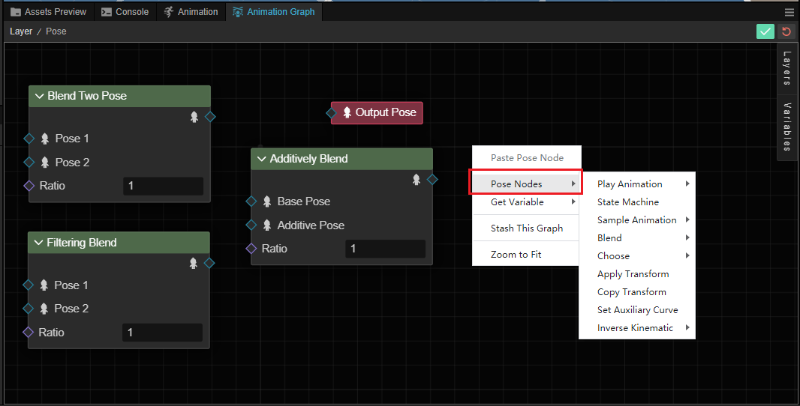

| 菜单 | 说明 |
| :-- | :-- |
| **播放动画** | 请参考 [播放或采样动画](./play-or-sample-motion.md)
| **状态机** | 请参考 [状态机](./state-machine.md)
| **采样动画**  |请参考  [播放或采样动画](./play-or-sample-motion.md)
|  **混合** | 请参考[混合姿态](./blend-poses.md)
| **选择** | 开发者可以通过不同的类型的数据对姿势和动画进行选择，包含布尔值和索引 |
| **应用变换** | 请参考 [应用变换](./modify-pose.md#%E5%BA%94%E7%94%A8%E5%8F%98%E6%8D%A2)|
| **拷贝变换** | 请参考 [拷贝变换](./modify-pose.md#%E6%8B%B7%E8%B4%9D%E5%8F%98%E6%8D%A2)|
| **设置辅助曲线** | 请参考 [辅助曲线](../../auxiliary-curve/index.md)|
| **反向动力学** | 通过反向动力学验算器计算反向计算骨骼，目前支持 [双骨骼 IK](./modify-pose.md#%E5%8F%8C%E9%AA%A8%E9%AA%BC-ik) |

创建完成后，将在姿态图中以不同颜色的矩形框显示

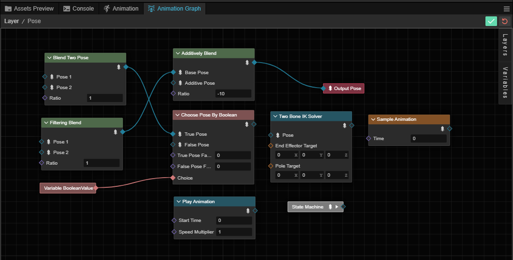

我们以 **混合** 节点为例说明节点的结构，其他类型的节点可以参考。

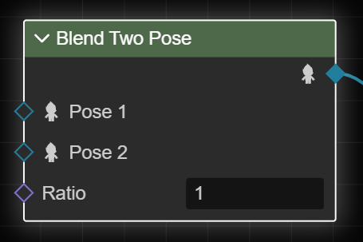

可以看到节点有几个部分构成：

- 类型：在最上方显示的节点的类型
- 展开/收起：点击部分节点左上方的箭头符号可以展开/收起节点以保持更清爽的视图

    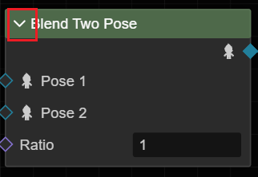

- 输入：通常在节点的左侧，表示节点的输入，以不同颜色空心（未连接）/实心（已连接）的菱形表示，可以将其他节点的输出作为输入，部分节点也可以直接在姿态图内输入在右侧 **属性检查器** 面板内输入。不同的节点类型输入不同，详情请参考不同类型的节点文档。

    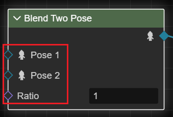

    部分节点类型如变量节点，没有输入只有输出。

- 输出：输出部分通常在节点的右侧，以空心（未连接）/实心（已连接）的菱形表示，可以通过鼠标左键按下并拖拽形成连接。

    

    通常来说节点的输入只能使用在另一个节点的输入，并且只能使用一次，这意味加入该输出已被使用，那么再次通过该输入连接到其他节点时会断开之前的连接

## 节点操作

在任意节点上点击鼠标右键会弹出节点操作菜单。

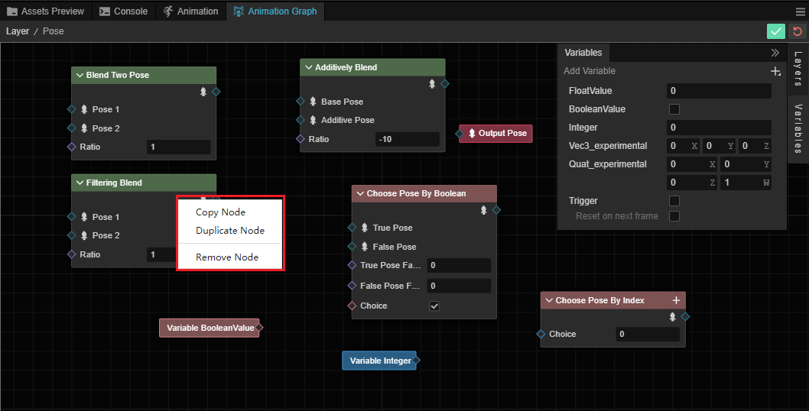

- 复制此节点：复制操作会将当前选中的节点复制以供他用
- 克隆此节点：在当前姿势图内克隆选中的节点
- 删除此节点：会将选中的节点从姿势图中删除

## 菜单

在姿势图的空白内点击鼠标右键会弹出姿势图的菜单。

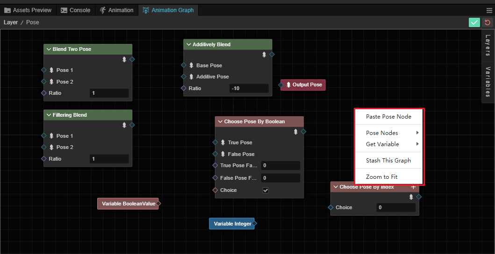

- 删帖姿态图节点：将通过上面复制此节点操作的节点复制道此处
- 姿态节点：创建新的姿态节点，请参考上文 **创建节点** 部分
- 获取变量：此菜单可以获取到动画图内创建的变量，在动画图内配置的非触发器变量都可以在此处获取

    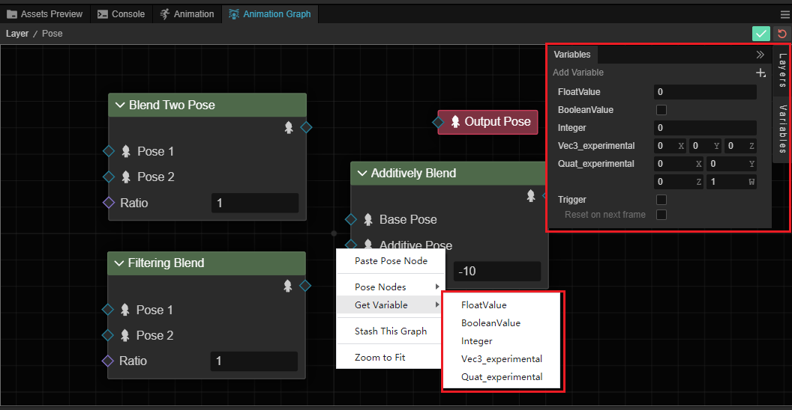

- 暂存此图：会将当前的姿态图转储为新的姿态图
- 返回中心视角：视图将自动以合适的视角返回到中心视角

## 创建连接

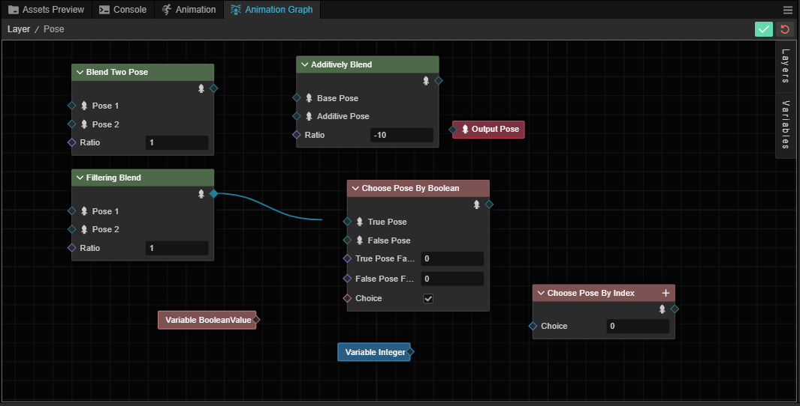

连接意味着将一个节点的输出，作为输入参数传递给另一个节点。

对于不同节点间，可以通过拖拽节点的输出去连接另一个节点的输入，当然前提是另一个节点接受该输出类型。

通过拖拽节点输出端，到另一个节点的输入端。

链接成功后，节点上会以实心的菱形表示：

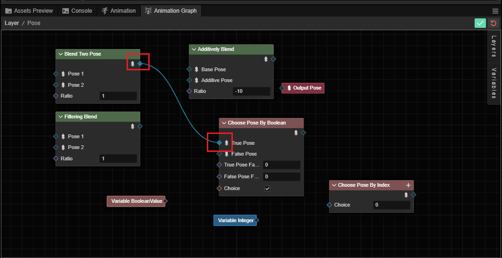

## 删除连接

在已连接的线上点击鼠标右键可以删除连接，选中的连线的周边会显示蓝色的高亮泛光。

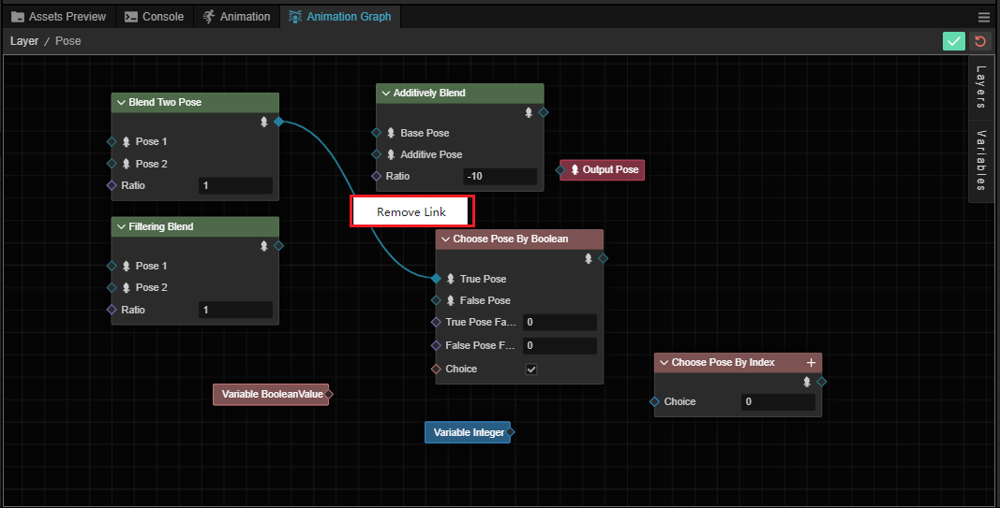