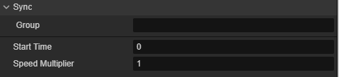
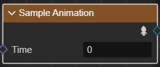
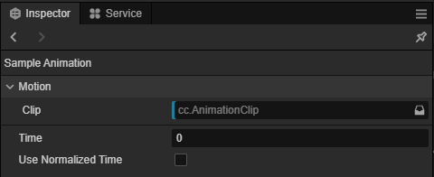

# 播放或采样动画

姿态图提供了两种从动画中读取姿态的结点：播放动画结点和采样动画结点。

在下文，“动作”是指动画剪辑或动画混合。

## 播放动画

**播放动画结点** 播放指定动作，每一帧对其进行更新，并获取动画当帧的姿态作为输出。

| 输入       | 含义                                             |
|------------|--------------------------------------------------|
| `起始时间` | 每当重入此结点时，从何时开始播放动作。单位为秒。 |
| `速度乘数` | 动作的播放速率。                                 |

| 对象属性 | 含义           |
|----------|----------------|
| `动作`     | 要采样的动作。 |

### 同步

同步属性的作用是用于动画间的同步。

| 属性 | 说明 |
| :-- | :--- |
| 组 |  输入一个整形的数值作为动画的组 |
| Start Time | 起始时间 |
| Speed Multiplier | 速度乘数 |

## 采样动画

**采样动画结点** 采样指定动作某一时刻的姿态作为输出。

|输入|含义|
|--|--|
|`时刻`|要采样的时刻。|

|对象属性|含义|
|--|--|
|`动作`|要采样的动作。|
|`使用标准化时间`|结点输入`时刻`是否指定的是标准化时间。标准化时间是指在 [0, 1] 范围内的动作进度。例如 1 表示动作的最后一帧， 0.5 表示 50% 的动作进度。|
