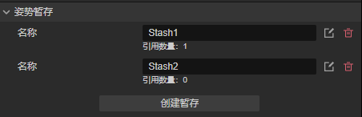
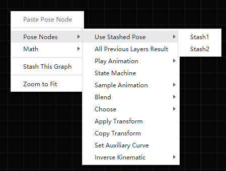
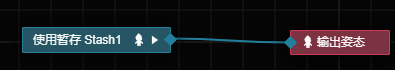
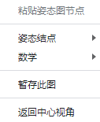
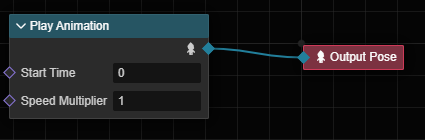
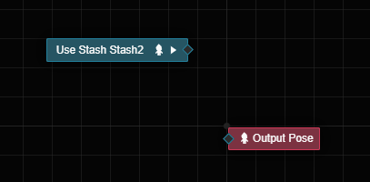

# 姿态暂存

姿态图中无法将一个姿态结点的输出连接至多个结点，当你试图连接姿态结点至新的结点时，旧的连接将被断开。若需要在多处复用一个姿态，需要用到姿态暂存。

## 概念

**姿态暂存** 是指将一张姿态图的结果存储起来，并在其它姿态图中使用该图产生的姿态的机制。**姿态暂存对象**（下称姿态暂存或暂存）是实现这样机制的手段，它关联了一张姿态图。

> 一个形象但不完全的理解是将姿态暂存视为保存了姿态对象的缓存变量。

姿态暂存归属于动画图层级。每个层级都可以创建多项暂存，创建后，可以在该层级中的任何姿态图中通过 **使用暂存姿态** 结点来引用该暂存。

> 我们可以理解为将某些已经编辑好的姿态节点，保存为某种蓝图或者资源，以供在其他地方使用。只是这个蓝图有限定范围，只能在此动画图中的特定层级中。
> 也就意味着我们可以将暂存当做某些特殊的姿态节点，和普通的姿态节点一样使用。

姿态暂存允许被引用多次，其所关联的姿态图每帧仅会被更新、求值一次。

## 编辑姿态暂存

在选定动画图层级的 **属性检查器** 上可以查看、创建、编辑该层级的所有姿态暂存。

点击动画图中的层级，在 **属性检查器** 中找到 **姿势暂存（Layer Stashes）** 属性。

点击  按钮开始编辑选定暂存所关联的姿态图。点击  删除暂存。删除后不可恢复，请谨慎操作。

下方的本文信息会说明该暂存的引用次数，如果大于 0 则表示该暂存已被引用。

点击 **创建暂存** 按钮可以创建新的暂存。

## 使用暂存的姿态

在任意姿态图中，创建结点的菜单里列举了所有可以使用的暂存。点选后将创建 **使用暂存姿态** 结点。

**使用暂存姿态** 结点输出指定暂存所产生的姿态；该结点没有额外输入。

双击 **使用暂存姿态** 结点，可进入该结点所关联的暂存的编辑界面。

## 暂存此图

很多时候并不是设计之初就能想到要暂存哪些姿态；更多的情况是在已经开发了一张图，才发现需要将这张图复用在多处。
为此，可在任意姿态图中单击右键进入上下文菜单，并单击执行菜单项 **暂存此图（Stash This Graph）**：

执行后，当前图中原本的内容将被移动到一项新建的姿态暂存中，并且会在当前图中生成一个 **使用暂存姿态** 结点来引用新建的姿态暂存。

点击 **暂存此姿态**，会创建出新的姿态暂存。

这里以播放动画剪辑的姿态为例。

点击 **暂存此姿态** 菜单，此时可通过下图观察到变化：

可以观察到之前的姿态节点 **播放动画剪辑** 节点已不存在，取而代之的是名为 **Use Stash StashX**（X 为编号，暂存的名称可以在**属性检查器**内修改） 的节点。该节点即为新建的 **姿态暂存**。
