# 状态过渡

**过渡** 代表着两个状态之间的转换，根据过渡发生源头的不同，我们可以将其分为：

- **普通过渡**：过渡发生的源头为伪状态 **入口** 或者 **子状态机**。

  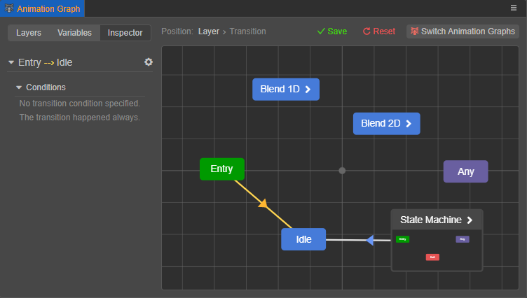

- **动画过渡**：过渡发生的源头为 **状态** 或者伪状态 **任意**。与普通过渡相比，动画过渡还可以控制过渡周期使得动画进行平滑切换。

  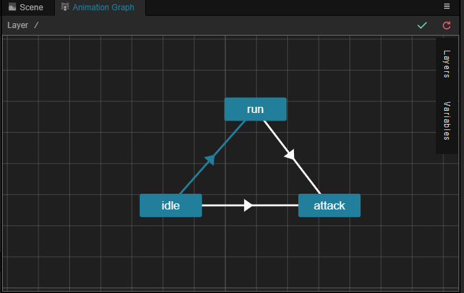

## 创建过渡

在网格布局区域中右键选中作为过渡源头的状态，然后选择 **添加过渡**，当鼠标离开当前状态，会产生一条箭头，此时选中作为过渡目标的状态，即可在两者之间产生过渡：

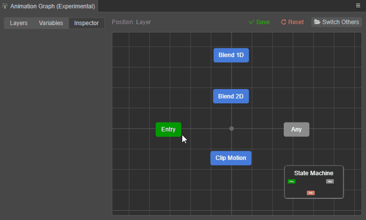

两个状态之间允许存在多个同向/反向过渡，有几个同向/反向过渡便会在箭头上标相应的数字，配置项也都会展示在 **属性查看器** 中。 
当状态上存在多条同时满足的过渡时，将优先使用排在过渡列表上方的过渡。但 Creator 并不建议依赖这种优先级排序，最好尽可能地使用下文中介绍的 **过滤条件** 来过滤过渡。

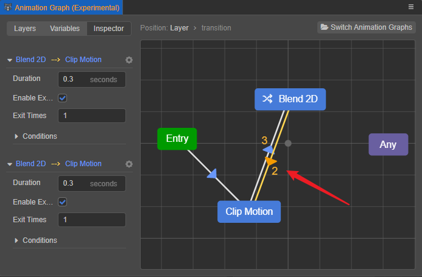

状态也允许过渡到自身：

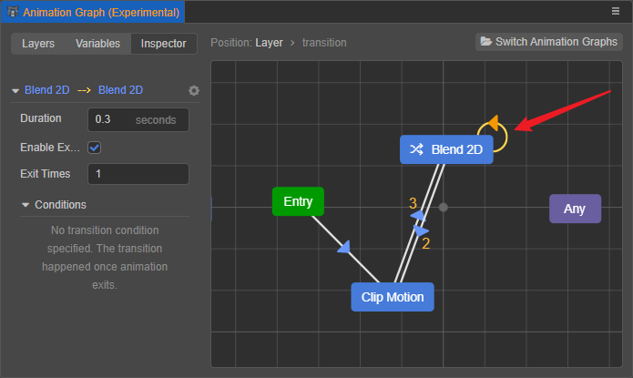

## 设置过渡

在网格布局区域选中过渡后，**属性检查器** 可设置过渡的相关触发条件，包括 **周期**、**使用结束次数**、**结束次数**、**条件**。

> **注意**：**普通过渡** 仅能指定 **条件**，普通过渡更像是一个选择器。

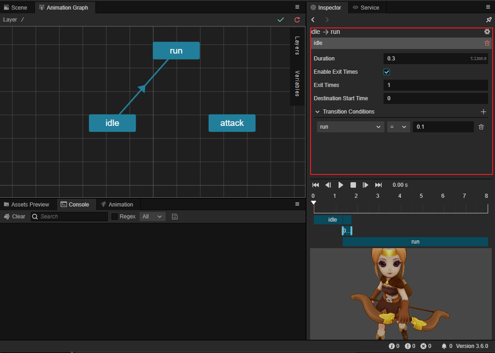

- **周期**：设置完成当前过渡的周期，使动画平滑切换。单位为 **秒** 或者 **遍**，默认为 0.3 秒，可点击输入框后面的单位进行切换。

    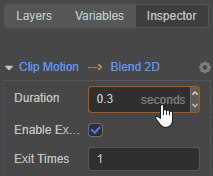

    - 当设置为 **秒**（默认）时：表示状态过渡在设定的秒数内完成

    - 当设置为 **遍** 时：表示状态过渡的周期是基于过渡源头状态的播放次数。例如过渡源头状态的动画时长为 3 s，当 **周期** 设置为 0.9 遍时，表示过渡周期为 0.9 ✖️ 3s = 2.7s。

- **使用结束次数**：表示是否将过渡源头状态结束播放作为过渡条件之一。若勾选，过渡的发生需要满足下方设置的 **结束次数** 条件。播放次数作为一种特殊的条件，当启用播放次数后，仅当播放次数条件和过渡条件都满足时，过渡才会发生。

- **结束次数**：设置过渡源头状态在开始过渡之前的动画播放总时长（总时长 = 结束次数 ✖️ 动画时长），默认为 1 次，仅在勾选 **使用结束次数** 时生效。需要注意的是动画若是不循环动画，会在第一次播放完成后停止，等待剩余次数播放完成后开始过渡。若需要根据次数自动循环播放动画，请事先在骨骼动画资源中设置好循环模式。例如：

    - 若过渡源头的动画是 **不循环动画**，播放时长为 3 s，**结束次数** 设置为 1.4，那么过渡源头的动画会在播放 3s 后，继续在最后一帧停留 1.2s（3s × 0.4），才开始过渡。

      

    - 若过渡源头的动画是 **循环动画**，播放时长为 3 s，**结束次数** 设置为 1.4，那么过渡源头的动画会在播放 3s 后，继续循环播放动画到 1.2s（3s × 0.4），才开始过渡。

      

- **终点起始时间**：指定当过渡发生时，终点状态的动画会从哪里开始播放。可以以秒为单位指定，也可以以相对单位指定。当使用相对单位时，该时间是相对于终点状态的周期的。例如，在过渡终点周期为 2 秒的情况下，若指定为 0.5，则表示终点状态的动画从 50% （即 1 秒处）开始播放。

- **条件**：设置状态之间发生过渡时需要满足的某些条件，具体内容请参考下文说明。

在不使用其他过渡条件的情况下，若希望过渡源头状态的动画在快播放完一遍时便逐渐切换到其他状态，并且在切换完成时源头状态的动画刚好完成播放，那么我们可以通过设置 **周期** 和 **结束次数** 来实现，推荐将 **周期** 的单位设置为 **遍**，然后令 **周期** 和 **结束次数** 之和为 **1** 即可。

例如，过渡源头状态的动画时长为 3 秒，将 **周期** 设置为 0.3 遍，则 **结束次数** 设置为 0.7 即可；若 **周期** 设置为 0.3 秒相对比较麻烦，**结束次数** 需要将秒换算为遍：（3 - 0.3）/ 3 = 0.9 遍。

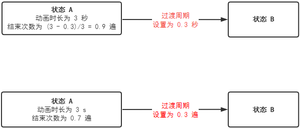

### 过渡条件

有些状态之间的过渡需要满足某些条件时才能触发，这样的条件被称为 **过渡条件**，简称 **条件**。若过渡没有设置条件，则会直接触发。条件可在动画图面板的 [变量](animation-graph-panel.md) 分页进行创建。

在网格布局区域选中过渡后，即可点击 **属性查看器** 上 **添加条件** 栏后面的 **+** 号键，通过下拉菜单选择不同的过渡条件。

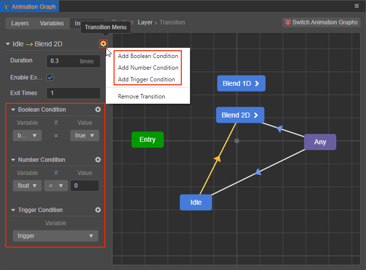

目前支持的过渡条件包括以下三种：

- **布尔条件**：判断布尔类型的变量为真/假。点击右侧的齿轮图标按钮可删除当前条件。

  

- **数值条件**：判断数值类型的变量与另一固定数值的逻辑关系，包括 **等于**、**不等于**、**大于**、**小于**、**大于等于**、**小于等于**。当等式（不等式）成立时条件满足。变量的类型与数值的类型是匹配的，若变量选择浮点型，则数值类型也是浮点型。

  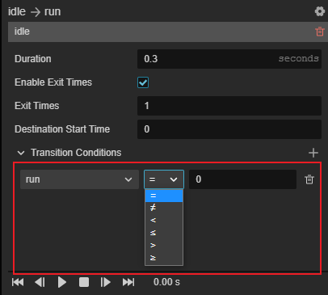

- **触发条件**：当触发器变量触发时条件满足。

  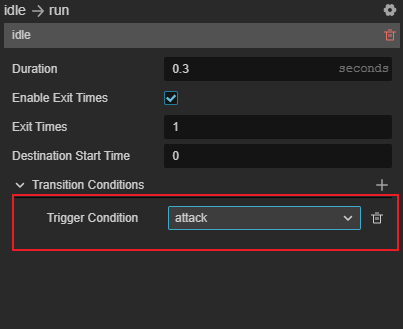

**过渡支持同时指定多个过渡条件，当且仅当所有条件都满足时过渡才会发生。**

### 无条件过渡

对于 **普通过渡** 来说，允许不指定任何过渡条件，例如，很多时候 **入口** 需要无条件地过渡到其它的状态。

但对于 **动画过渡** 来说，既未指定 **条件**，也未指定 **结束次数** 条件的过渡是没有意义的，Creator 将直接忽略该过渡。

## 一种边缘情况

有些情况下会导致状态机停留在 **入口** 或者 **出口** 上，例如：

- 过渡到了子状态机的 **入口**，但在子状态机中并没有能满足条件的过渡。

- 过渡到了子状态机的 **出口**，但在父状态机中，并没有能满足该子状态机的过渡。

我们把这种情况称为 **状态机悬停**。

当发生状态机悬停时，会直接中断更新，直到后续能过渡至状态，此时的表现为动画被暂停。

> **注意**：我们不建议依赖这种行为，并且后续可能会对这种行为做出调整。

## 预览

选中任意转移后，在 **属性检查器** 内可以对当前转移进行预览。

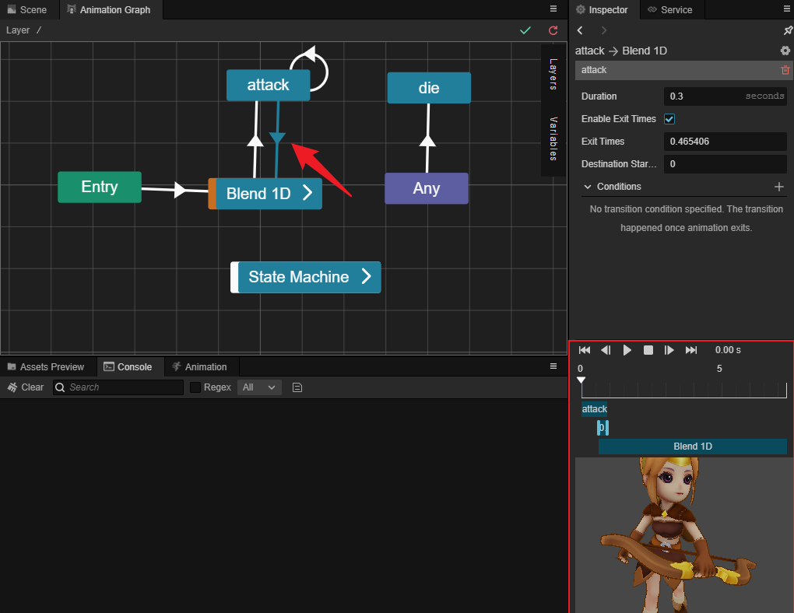

预览时，用户可以通过下列按钮进行操作：

其属性与描述如下：

-  跳转至第一帧
-  预览前一帧
- / 开始/暂停播放
-  停止播放
-  跳转至后一帧
-  跳转至最后一帧
- 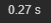 显示当前的时间

也可以通过进度条进行快速预览和调整转移的时长：

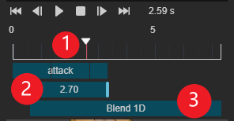

- 在 ① 号处点击或拖拽拉杆可快速预览转移
- 在 ② 号通过鼠标拖拽边缘可以调整 **周期**

  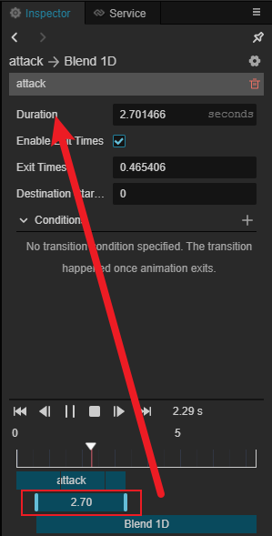

- 在 ③ 号处通过鼠标左键拖拽可以调整转移的 **终点起始时间**

  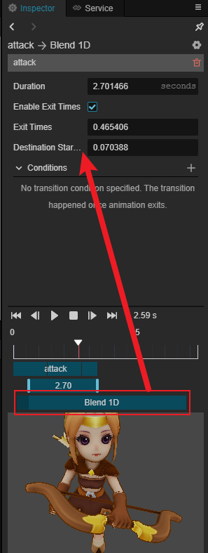

点击播放后，既可在预览视图进行预览：

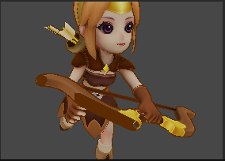

## 多过渡

自 3.8.0 开始，状态机开始支持多过渡。

> 在此前版本中，相当于仅允许一支过渡的存在。

> [过渡中断](https://docs.cocos.com/creator/3.7/manual/zh/animation/marionette/state-transition.html#%E8%BF%87%E6%B8%A1%E4%B8%AD%E6%96%AD) 是在 3.6.0 加入的实验性功能。现已移除，其功能由多过渡机制代替。

**多过渡** 是指当状态机正在进行状态过渡时，由于条件满足，当前的目标状态又需要过渡至其它状态；此时，新的过渡加入，并与已有的过渡形成过渡队列。

在多过渡过程中，所有过渡将 **同时** 进行。当某支过渡完成后，该过渡将被移出队列，其前方的过渡也将因此被中断并移出队列。
