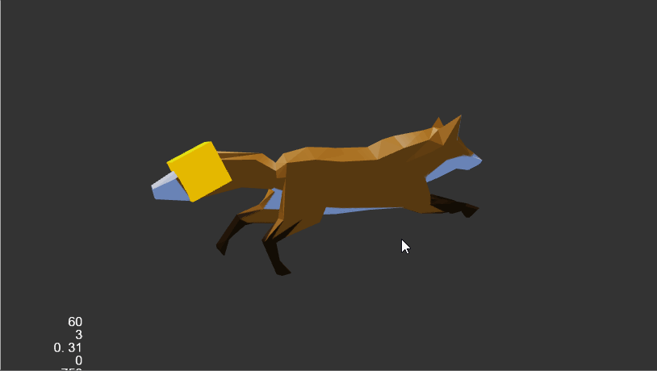
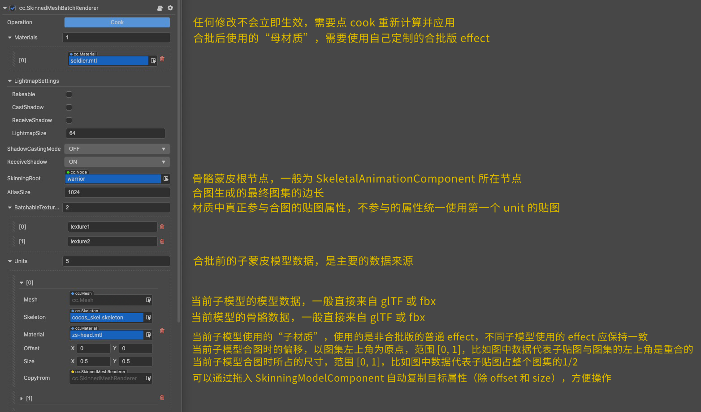

# 骨骼动画

骨骼动画是一种常见但类型特殊的动画。我们提供了 **预烘焙骨骼动画** 和 **实时计算骨骼动画** 两套系统，针对不同方向的需求，分别优化。

这两套系统的唯一开关就是 **SkeletalAnimation** 组件中的 `useBakedAnimation` 属性，运行时也可以无缝切换。

- 启用 `useBakedAnimation` 时会使用预烘焙骨骼动画系统
- 禁用 `useBakedAnimation` 后会使用实时计算骨骼动画系统

骨骼动画的组件接口请参考 [SkeletalAnimation API](__APIDOC__/zh/#/docs/3.4/zh/animation/Class/SkeletalAnimation)。

## 预烘焙骨骼动画系统

这个系统的压倒性目的是性能，因此部分表现力的牺牲被认为是可以接受的。我们针对性地做了很多底层优化，目前的运行时流程大致如下：

- 所有动画数据都会按照指定帧率提前预采样、烘焙到全局复用的骨骼动画贴图合集上；
- 根据运行平台是否支持浮点纹理，对应使用 **RGBA32F** 或 **RGBA8** 格式的备用方案（该步骤流程用户不必关心，不会对最终表现有影响，只是低端平台最后的保底策略）；
- 每个骨骼动画组件（**SkeletalAnimation**）负责维护当前的播放进度，以 UBO（一个 Vec4）的形式存储；
- 各蒙皮网格渲染器组件（**SkinnedMeshRenderer**）持有预烘焙蒙皮模型类（BakedSkinningModel），根据同样提前烘焙好的包围盒信息计算 culling，更新 UBO，在 GPU 上从贴图合集内取到当前数据完成蒙皮。

## 实时计算骨骼动画系统

这个系统的压倒性目的是表现力，确保所有细节的正确显示，以及完整的程序控制能力。

目前的运行时流程大致如下：

- 所有动画数据根据当前全局时间动态插值计算；
- 动画数据会输出到场景的骨骼节点树中；
- 用户和其他任何系统都可以通过操纵这个骨骼节点树对蒙皮效果产生影响；
- 各蒙皮网格渲染器组件（SkinnedMeshRenderer）持有普通蒙皮模型类（SkinningModel），每帧提取骨骼节点树信息计算 culling，将当前帧完整骨骼变换信息上传 UBO，在 GPU 内完成蒙皮。更多关于蒙皮的介绍，请参考下文 **蒙皮算法** 部分的内容。

这为以下所有功能提供了最基础的支撑：

- blendshape 支持
- 任意数量动画片段的混合和 masking
- IK、二级物理影响
- 纯程序控制关节位置

## 两套系统的选择与最佳实践

目前所有模型资源在导入后，Prefab 中全部默认使用 **预烘焙系统**，以达到最佳性能。建议只在明显感到预烘焙系统的表现力无法达标的情况下，再使用 **实时计算系统**。

> **注意**：虽然两套系统可以在运行时无缝切换，但尽量不要高频执行，因为每次切换都涉及底层渲染数据的重建。

## 蒙皮算法

我们内置提供两种常见标准蒙皮算法，它们性能相近，只对最终表现有影响：

1. **LBS（线性混合蒙皮）**：骨骼信息以 **3 x 4** 矩阵形式存储，直接对矩阵线性插值实现蒙皮。目前有体积损失等典型已知问题。
2. **DQS（双四元数蒙皮）**：骨骼信息以 **双四元数** 形式插值，对不含有缩放变换的骨骼动画效果更精确自然，但出于性能考虑，对所有缩放动画有近似简化处理。

引擎默认使用 LBS，可以通过修改引擎 `skeletal-animation-utils.ts` 的 `updateJointData` 函数引用与 `cc-skinning.chunk` 中的头文件引用来切换蒙皮算法。

推荐对蒙皮动画质量有较高追求的项目可以尝试启用 DQS，但因 GLSL 400 之前都没有 `fma` 指令，例如 `cross` 等操作在某些 GPU 上无法绕过浮点抵消问题，误差较大，可能引入部分可见瑕疵。

## 挂点系统

如果需要将某些外部节点挂到指定的骨骼关节上，使其在动画过程中随骨骼关节一起运动变换，需要使用骨骼动画组件的 **挂点（Socket）系统**。下面通过一个范例来介绍如何使用骨骼挂点。

### 在编辑器中配置挂点
## 挂点系统

如果需要将某些外部节点挂到指定的骨骼关节上，使其在动画过程中随骨骼关节一起运动变换，需要使用骨骼动画组件的 **挂点（Socket）系统**。下面通过一个范例来介绍如何使用骨骼动画挂点。

> **注意**：**FBX** 或 **glTF** 资源内的挂点模型会自动对接挂点系统，无需任何手动操作。

### 通过编辑器实现

1. 将骨骼动画资源导入到 **资源管理器** 中，然后将其拖拽到 **层级管理器** 中，生成骨骼动画节点（例如下图中的 `Fox` 节点）；

2. 在 Fox 节点下新建一个空子节点 `Node`；

    

3. 在 **层级管理器** 中选中 Fox 节点，在 **属性检查器** 中将 SkeletalAnimation 组件的 **Sockets** 属性设置为 1（Sockets 属性的值代表了挂点的数量）。然后设置 **Sockets** 中的 **Path** 和 **Target** 属性：

    - Path 的下拉框中会列出所有的骨骼，选择想要挂载的目标骨骼，这里以 Fox 的尾巴为例

    - 将刚才创建的子节点 `Node` 拖拽到 Target 属性框中，可以看到 **层级管理器** 中的子节点 `Node` 根据所选的目标骨骼名称被自动重命名了。

    

4. 这样子节点就成为目标挂点了，接下来我们在子节点下创建一个 Torus（圆环）节点，即可在 **场景编辑器** 中看到圆环套在了狐狸尾巴上。

    

    Torus 节点可以根据自己的需要调整其位置大小等属性，也可以在作为目标节点的子节点下添加多个节点，都会跟随指定骨骼的变换而变换。

5. 保存场景，点击编辑器上方的预览按钮，可以看到圆环套在狐狸的尾巴上，并随着狐狸的尾巴一起晃动。

> **注意**：若要设置多个挂点，则相对应地，也需要在骨骼动画节点下创建多个空的子节点作为目标挂点。如下图：
>
> 

### 通过脚本配置挂点

1. 前两个步骤与通过编辑器实现的一致。然后在骨骼动画节点的空子节点下再创建一个 Cube 节点。

    

2. 在 **资源管理器** 中新建一个 **TypeScript** 脚本并命名为 `SkeletalAttach`，编写组件脚本。脚本代码如下：

    ```ts
    import { _decorator, Component, Node, SkeletalAnimation } from 'cc';
    const { ccclass, property } = _decorator;

    @ccclass('SkeletalAttach')
    export class SkeletalAttach extends Component {

        @property(Node)
        cubeNode: Node | undefined;

        start () {
            let target = new Node();
            if(this.cubeNode != undefined) {
                // cubeNode 包含一个立方体模型
                this.cubeNode.parent = target;    
            }        
            let skeletalAnimation = this.node.getComponent(SkeletalAnimation);
            if(skeletalAnimation! = null) {
                // target 父节点需设置为 SkeletalAnimation 所在的节点
                target.parent = skeletalAnimation.node;
                let path = "root/_rootJoint/b_Root_00/b_Hip_01/b_Tail01_012/b_Tail02_013/b_Tail03_014";
                // 基于路径和目标节点创建一个 ‘Socket’
                let socket = new SkeletalAnimation.Socket(path, target);
                skeletalAnimation.sockets.push(socket);
            }       
        }

    }
    ```

    > **注意**：若不知道目标骨骼的名称，可将 SkeletalAnimation 组件中的 Sockets 属性设置为 1，然后在 Path 的下拉框中查找所需的目标骨骼名称。查找完成后再将 Sockets 属性还原为 0 即可。
    
点击预览按钮，即可看见立方体小块随狐狸模型的尾巴一起摆动。



**FBX** 或 **glTF** 资源内的挂点模型会自动对接挂点系统，无需任何手动操作。

## 关于动态 Instancing

基于 **预烘焙系统** 的框架设计，蒙皮模型的 instancing 也成为了触手可及的功能，但要保证正确性还需要收集一些比较底层的信息。

这里的根本问题是，同一个 Drawcall 内的各个模型使用的骨骼贴图必须是同一张，如果不是同一张，显示效果会完全错乱。所以如何将动画数据分配到每张骨骼贴图上，就成为了一个需要用户自定义的信息，可以在编辑器菜单栏 **面板 -> 动画** 的 [骨骼贴图布局面板](joint-texture-layout.md) 进行配置。

> **注意**：
> 1. 只有 **预烘焙系统** 下支持 instancing。我们虽然没有严格禁止在 **实时计算框架** 下启用 instancing（只有编辑器内的警告），但动画效果一定会有问题，取决于模型实际的材质分配情况。最好的情况是不同 instance 间显示完全一致的动画，最坏情况下会导致模型完全错乱。
> 2. 对于材质中已经开启 instancing 的模型，平面阴影系统也会自动同步使用 instancing 绘制。特别地，蒙皮模型的阴影合批对骨骼贴图布局的要求更高一些，因为阴影的管线状态是统一的，**所有开启阴影的蒙皮模型的动画** 都需要保证在同一张贴图上（相比绘制模型本身，只需要相同 Drawcall 内的 instance 之间保持骨骼贴图一致）。

## BatchedSkinnedMeshRenderer 组件

目前底层上传 GPU 的骨骼纹理已做到全局自动合批复用，上层数据目前可以通过使用 **批量蒙皮网格渲染器组件**（BatchedSkinnedMeshRenderer）将同一个骨骼动画组件控制的所有子蒙皮模型合并：



合批版 effect 书写相对复杂一点，但基本可以基于子材质使用的普通 effect，加入一些相对直接的预处理和接口改动即可。可参考在编辑器内置资源（`util/batched-unlit`）中提供的合批版 `builtin-unlit`。

> **注意**：只有预烘焙系统下使用批量蒙皮网格渲染器组件可以保证正确性，实时计算框架下虽然也能使用，但当合并后的骨骼数量超过 30 个（Uniform 数组最大数量限制）时会有渲染问题。
