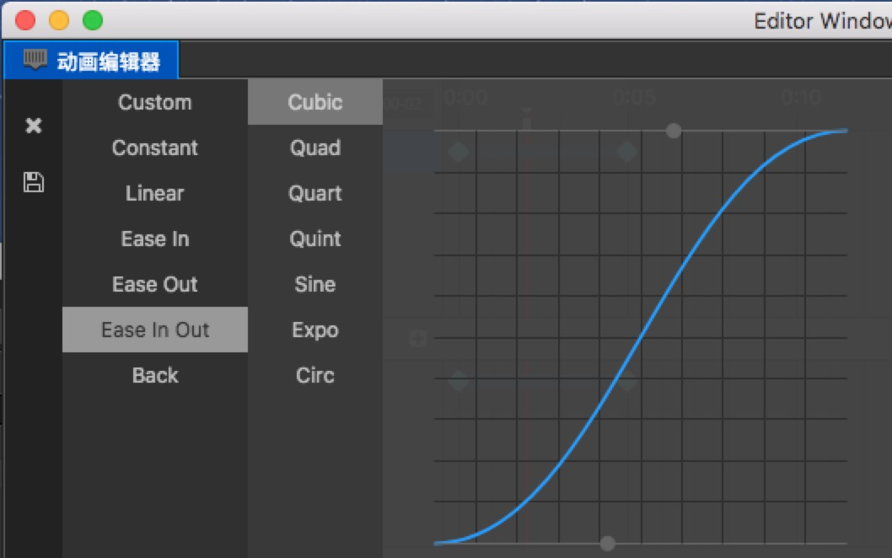

# 编辑时间曲线

我们已经创建了基本的动画了。
但有时候我们会需要在两帧之间实现EaseInOut等缓动效果，那么在动画编辑器中怎么实现呢？

我们首先需要在一条轨道上创建两个不相等的帧，比如在position上创建两帧，从 0,0 到 100,100。
这时候两帧之间会出现一根连接线（连接俩关键帧之间的蓝色线段），双击连接线，则可以打开时间曲线编辑器。

## 使用预设曲线

我们在曲线编辑器左侧可以选择预设的各种效果。比如说 Ease In 等。
选中后右侧上方还会出现一些预设的参数，可以根据需求选择。

## 自定义曲线

有时候预设的不能够满足动画需求，我们也可以自己修改曲线。
右侧下方预览图内，有两个灰色的控制点，拖拽控制点可以更改曲线的轨迹。
如果控制点需要拖出视野外，则可以使用鼠标滚轮或者右上角的小比例尺缩放预览图，支持的比例从 0.1 到 1。