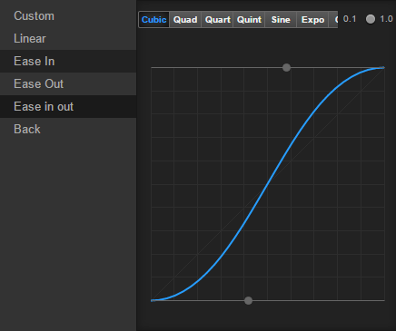

# 编辑时间曲线

我们已经创建了基本的动画了，但有时候我们需要在两帧之间实现 EaseInOut 等缓动效果，那么在动画编辑器中怎么实现呢？

我们首先需要在一条轨道上创建两个不相等的关键帧。比如在 **动画编辑器** 的 position 属性轨道上创建两个关键帧，位置坐标分别为 (0, 0) 和 (100, 100)。这时候两个关键帧之间会出现一条蓝色的连接线：

双击连接线，就可以打开时间曲线编辑器。在最左侧有两个按钮，上方的是关闭面板按钮，下方的是保存按钮。

## 使用预设曲线

我们在时间曲线编辑器的左侧可以选择预设的各种效果，比如 **Ease In** 等。选中效果后，在效果列表的右侧会出现一些预设的参数，可以根据需求选择。

## 自定义曲线

有时候预设的效果不能满足动画需求，我们也可以手动修改曲线。

在时间曲线编辑器右侧的预览图中，有两个灰色的控制点，拖拽控制点即可更改曲线的轨迹。如果控制点需要拖出视野外，则可以使用鼠标滚轮或者右上角的小比例尺来缩放预览图，支持的比例从 0.1 到 1。

