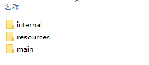
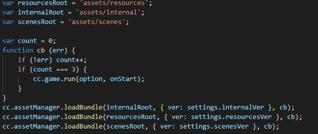

# Asset Bundle 介绍

> 文：Santy-Wang

从 v2.4 开始，Creator 正式支持 Asset Bundle 功能。Asset Bundle 作为模块化资源的工具，能够允许开发者按照项目需求将贴图，脚本，场景等等资源划分在不同的 Asset Bundle 中，在游戏运行过程中，按照需求去加载不同的 Asset Bundle，尽可能减少启动时需要加载的资源数量。Asset Bundle 能够按需求随意放置，比如可放在远程服务器上，本地，或者小游戏平台的分包中。

## FAQ

Q：Asset Bundle 所带来的优势是什么？

A：Asset Bundle 主要用于对工程中的资源按照开发者的意愿进行模块划分，可以将不同场景不同需求的资源划分在多个包中，从而可以减少首次下载和加载游戏时所需要的时间，也可以跨项目复用，用于加载子项目中的 Asset Bundle。

Q：Asset Bundle 与 v2.4 之前的资源分包有什么区别？

A：
1. 资源分包本质上是游戏平台的基础功能，比如微信小游戏支持分包功能，而 Creator 进行了一次封装，帮助用户进行设置，但本质上此功能由对应平台控制，如果对应平台不支持分包功能，则 Creator 也不支持，而 Asset Bundle 完全由 Creator 设计实现，是帮助开发者对资源进行划分的模块化工具，与平台无关，理论上可在所有平台上支持。

2. 资源分包实际上是将一些图片，网格拆分出去单独放在一个包内，但这个包是不完整，无法复用，无逻辑的，而 Asset Bundle 是通过逻辑划分对资源进行模块化，Asset Bundle 中包括资源，脚本，元数据，资源清单，所以 Asset Bundle 是完善的，有逻辑的，可复用的，完全可以从 Asset Bundle 中加载出整个场景或其他任何资源，Asset Bundle 通过拆分，可以极大减少首包中的 json 数量以及 settings.js 的大小。

3. 资源分包是跟平台相关的，意味着需要按照平台要求的方式进行设置，比如微信分包是无法放在远程服务器上的，只能放在腾讯的服务器上，而 Asset Bundle 不受这些限制，Asset Bundle 可以放在本地，放在远程服务器上，甚至就放在微信的分包中。

Q：Asset Bundle 是以什么形式组织的？

A：在项目中 Asset Bundle 是通过对文件夹进行设置，**文件夹中的资源以及文件夹之外的相关依赖资源** 都会被合并到同个 Asset Bundle 中，而在打包之后，所有的 Asset Bundle 都会放在 `${OUTPUT_PATH}/assets/` 中，每一个文件夹为一个 Asset Bundle，你可以按照自己的需求不移动或将不同的 Asset Bundle 移动到远程服务器或微信分包中。

Q：Asset Bundle 可以用来做大厅加子游戏的模式么？

A：当然可以，可以将子游戏的场景放在 Asset Bundle 中，在需要时进行加载，子游戏甚至可以在其它工程中预先以 Asset Bundle 的形式构建出来，然后在主工程中加载使用。

Q：Asset Bundle 可以减少 settings.js 的大小么？

A：当然可以，实际上在 v2.4 之后，打包之后的工程完全是基于 Asset Bundle 的，setting.js 不再存储跟资源相关的任何配置信息。所有的配置关系表以 config.json 的形式存储于每个 Asset Bundle 中。每一个 config.json 只存储本 Asset Bundle 中的资源信息，也就减小了首包的包体。可以简单的理解为所有的 config.json 合起来等于以前的 settings.js。

Q：Asset Bundle 能跨项目复用么？

A：当然可以，不过需要满足以下条件：1. 引擎版本相同，2. Asset Bundle 中用到的脚本都包含在其本身之中，3. Asset Bundle 没有其他外部依赖 bundle，如果有其他依赖 bundle，你必须也对依赖 bundle 进行加载。

Q：Asset Bundle 可以做到分离首场景么？

A：当然可以，你可以在构建面板上勾选首场景分包，则首场景会被放到内置 Asset Bundle `start-scene` 中，从而实现分离首场景。

Q：Asset Bundle 可以嵌套设置么？比如 A 文件夹中有 B 文件夹，A 和 B 都可以设置为 Asset Bundle 么？

A：Asset Bundle 不支持嵌套，请避免如此使用。

## 内置 Asset Bundle

从 v2.4 开始，Creator 内置了 4 个 Asset Bundle，如图所示：



即是说，从 v2.4 开始，所有资源都会存在 Asset Bundle 中。 所有 resources 目录下的资源以及其依赖资源将放在 resources 的 Asset Bundle 中，所有内置资源以及其依赖资源将放在 internal 的 Asset Bundle 中，所有在构建面板所勾选的场景以及其依赖资源都将放在 main 的 Asset Bundle 中，如果你勾选了首场景分包，则首场景将会被构建到 start-scene 中。

与其他 Asset Bundle 一样，你也可以设置内置的 Asset Bundle 的压缩类型，甚至将其放到远程服务器上。你可以通过在构建时配置远程服务器地址来设置，也可以通过自定义构建模板功能修改 main.js 代码来控制内置 Asset Bundle 的加载，类似下图所示。

 

## 优先级

当文件夹设置为 Asset Bundle 之后，会将文件夹内以及文件夹外部依赖的资源都合并到 Asset Bundle 中，也就是说可能存在某个资源本身不在 Asset Bundle 文件夹下，但同时被两个 Asset Bundle 所依赖，从而属于两个 Asset Bundle 的情况，如图所示：

 

另一种情况是资源在一个 Asset Bundle 文件夹下，但是又被其他 Asset Bundle 所引用，如图所示：


两种情况下，资源 c 既属于 Asset Bundle A，也属于 Asset Bundle B。那资源 c 究竟会存在哪一个 bundle 中呢？此时就需要通过调整 Asset Bundle 的优先级来指定资源 c 究竟放在哪一个 bundle 中。

Bundle 可设置不同的优先级，Creator 内置了 10 个优先级可选择，编辑器构建时将会按照优先级从大到小对 bundle 进行依次构建，当同个资源被不同优先级的多个 bundle 引用时，资源会优先放在优先级高的 bundle 中，低优先级的 bundle 只会存储一条记录信息，此时低优先级的 bundle 会依赖高优先级的 bundle，如果你想在低优先级的 bundle 中加载此共享资源，必须在加载低优先级 bundle 之前先加载高优先级 bundle；当同个资源被相同优先级的多个 bundle 引用时，资源会在每个 bundle 中复制一份，此时不同 bundle 没有依赖关系，可用任意顺序加载。所以请尽量让共享的资源，例如 `Texture`、`SpriteFrame`、`Audio` 等资源所在 bundle 的优先级更高，从而让更多的低优先级 bundle 可共享其资源，从而最小化包体。

**注意**：四个内置 Asset Bundle 的优先级分别为：internal 为 11，start-scene 为 9，resources 为 8，main 为 7。当四个内置 bundle 包含相同资源时，资源会优先存储在优先级高的 bundle 中。建议其他自定义的 bundle 优先级不要高过内置的 bundle 优先级，从而尽可能共享内置 bundle 中的资源。

## 压缩类型

Bundle 目前还提供了五个压缩选项，用于对 bundle 进行优化，分别是 `无`，`默认`，`合并所有JSON`，`小游戏分包`，`Zip`。**所有 bundle 默认使用 `默认` 类型，开发者可重新设置包括内置 bundle 在内的所有 bundle 的压缩类型**。压缩类型的作用分别是：
1. 当选择 `无` 时没有任何压缩操作；
2. 当选择 `默认` 时，bundle 会尝试将相互依赖的资源的 JSON 文件合并在一起，从而减少运行时的加载请求数量；
3. 当选择 `合并所有JSON` 时，bundle 会将所有资源的 JSON 文件合并为一个，将最大化减少请求数量，但可能会增加单个资源的加载时间；
4. 部分游戏平台例如微信小游戏，百度小游戏提供了分包功能，当选择 `小游戏分包` 时，会将这些 bundle 设置为对应平台上的分包。小游戏分包详细请参考 [小游戏分包](../publish/subpackage.md)
5. 在部分平台上，bundle 支持将资源文件压缩成一个 zip 文件，从而减少运行时的加载请求数量
**另外，不同平台可采用不同的压缩类型，构建时将根据对应平台的设置来构建 bundle。**

**注意**：2.4 版本之前，如果你的工程中有文件夹勾选了 `配置为分包` ，在升级到 2.4 之后，Creator 将会自动将其转化为 Asset Bundle，并将其压缩类型在支持的平台上设置为 `小游戏分包` 选项。

## Asset Bundle 的构造

构建发布时，会对 Asset Bundle 文件夹下所有的 **代码** 和 **资源** 进行以下的相关处理：

  - **代码**：Asset Bundle 文件夹下的所有代码会根据发布平台合并成一个命名为 `index.js` 或 `game.js` 的入口脚本文件，并且会将这些代码从主包中剔除。
  - **资源**：会把 Asset Bundle 文件夹下的所有资源以及外部所依赖的资源都放在 `import` 或 `native` 目录下。
  - **资源配置**：会将所有资源的配置信息包括路径，类型，版本信息合并为一个命名为 `config.json` 的文件。

构建之后的目录如图所示：

 

## Asset Bundle 中的脚本

因为 Asset Bundle 是支持脚本分包的，如果你的 Asset Bundle 下有脚本文件，则所有脚本会被合并为一个 js 文件，并从主包中剔除。在加载 Asset Bundle 时，会尝试去加载这个脚本文件。

**注意**：有些平台不允许加载远程的脚本文件，例如微信，在这些平台上，Creator 会将 Asset Bundle 的代码拷贝到 `src/script` 下，从而保证正常加载。

## 加载 Asset Bundle

AssetManager 提供了 `loadBundle` 用以加载 Asset Bundle，`loadBundle` 能通过 Asset Bundle 的名称和 url 进行加载，但当你复用其他项目的 bundle 时，将只能使用 url 进行加载，所以你需要如下使用：

```js
cc.assetManager.loadBundle('bundleA', (bundle) => {
  bundle.load('xxx');
});

// 当复用其他项目 bundle 时
cc.assetManager.loadBundle('https://othergame.com/remote/bundleB', (bundle) => {
  bundle.load('xxx');
});
```

在通过 API 加载 Asset Bundle 时，引擎并没有去将该 bundle 中的所有资源加载出来，而只是去加载 Asset Bundle 的资源清单，以及包含的所有脚本。加载完成之后会返回一个使用资源清单构造出来的 `cc.AssetManager.Bundle` 类的实例。你可以用这个实例去加载 Bundle 中的各类资源。

## 获取 Asset Bundle

当 Asset Bundle 已经被加载过之后，将被缓存下来，此时你可以使用名称来获取该 bundle。例如：

```js
let bundleA = cc.assetManager.getBundle('bundleA');
```

Bundle 的详细 API 可参考 [Bundle](../../../api/en/classes/Bundle.html)