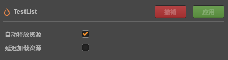

# 终结器

> 文： Santy-Wang

Asset Manager 中提供了终结器模块，用于管理资源的释放，自动释放等功能。你可以通过 `cc.assetManager.finalizer` 访问，考虑到使用习惯的问题，`cc.assetManager` 也对释放接口进行了转发， `cc.assetManager.finalizer.release` 与 `cc.assetManager.release` 接口完全等价。

## 释放资源

当资源被加载后，将会被保存在缓存中，供下次复用，而这会造成内存和显存持续增长，所以你需要做的是在不需要该资源时，对其进行释放，从而将其移出缓存，释放内存和显存。在 Creator 中，释放资源需要使用 Asset Manager 的相关接口。

例如，你可以如下使用：

```js
    cc.assetManager.release(texture);

    cc.assetManager.finalizer.release(texture);
```

释放该资源将会销毁该资源的所有内部属性，比如渲染层的相关数据，并移出缓存，从而释放内存和显存。

v2.3 中的释放接口与之前版本的释放接口有较大差异，主要体现在以下几点：

1. `cc.assetManager.release` 接口仅能释放单个资源，且为了方便开发者理解，接口只能通过资源本身进行释放，不能通过资源 uuid , 资源 url 等属性进行释放。

2. 为了方便开发者使用，在开发者释放资源时不再需要通过 `getDependsRecursively` 获取依赖资源。你只需关注资源本身，而引擎会去尝试释放其依赖资源。

3. 在 `cc.assetManager.release` 内部会先去检查资源是否可释放，也就是说，即使你调用了这个接口，也不一定能够释放该资源。如果你想要强制释放该资源，你可以指定 `release` 接口的 `force` 参数为 `true` 来进行强制释放。例如：

```js
    cc.assetManager.release(texture, true);
```

## 场景自动释放

除了手动释放资源外，场景还提供了自动释放的选项，如图所示：



勾选之后，则会在该场景切换时尝试释放该场景所有依赖资源。

除非是某些高频使用的场景，比如切换场景，否则我们建议你尽量勾选自动释放选项，以确保内存占用较低。

## 资源锁定

因为资源会在某些引用他的资源（场景、预制体）被释放时进行尝试释放。如果你希望资源永远不会被释放掉，比如某些高频使用的资源，你可以使用 `cc.assetManager.finalizer.lock` 接口来对资源进行锁定。例如：

```js
    cc.assetManager.finalizer.lock(asset);
```

当资源被锁定之后，无论该资源使用与否，都不会被释放，即使强制释放该资源也无法成功。<br>

当你不再需要该资源锁定时，你可以使用 `cc.assetManager.finalizer.unlock` 对该资源进行解锁。例如：

```js
    cc.assetManager.finalizer.unlock(asset);
```

解锁后的资源将可以进行正常释放。

## 释放检查

为了避免错误释放正在使用的资源造成渲染或其他问题，无论是自动释放还是手动释放资源时，都会进行一系列的检查，只有通过检查，才会对该资源进行释放。检查步骤如下：

1. 该资源是否已被锁定，如果已被锁定，则不进行释放。

2. 是否指定了 `force` 参数为真，如果不为真，则进入第三步检查，如果为真，则无需做后续检查，直接摧毁该资源，移除缓存，并将其 **直接** 依赖资源（不包含后代）的引用都减 1 ，并递归调用 release 尝试释放其直接依赖资源。

3. 如果该资源为 cc.SpriteFrame 或 cc.Texture2D 类型，则会通过渲染层的记录判断其在本帧是否被渲染过，如果在本帧被渲染过，则终止释放。

4. 如果该资源的引用计数为 0 ，即没有其他地方引用到该资源，则无需做后续检查，直接摧毁该资源，移除缓存，并将其 **直接** 依赖资源（不包含后代）的引用都减 1 ，并递归调用 release 尝试释放其直接依赖资源。

5. 如果该资源的引用计数不为 0 ，存在其他地方引用它，此时需要进行循环引用检查，避免自己的后代引用自己的情况。如果检查之后引用计数不为 0 ，则终止释放，否则直接摧毁该资源，移除缓存，并将其 **直接** 依赖资源（不包含后代）的引用都减 1 ，并递归调用 release 尝试释放其直接依赖资源。

经过上述检查后，如果该资源可释放，则将会摧毁该资源，并移除缓存，并尝试释放其依赖资源。

## 强制释放

在 Asset Manager 中，资源在释放时会进行一系列的检查，也就是说资源可能释放不成功，在内存告急时或者你不需要做检查时，你可以在释放时指定 `force` 参数为真，此时将会饶过这些检查，强制释放该资源，此时将和 v2.3 之前的释放逻辑是一样的，但可能会因为错误释放资源造成渲染错误等问题。请谨慎使用。

## 引用计数统计

首先需要声明的是，Asset Manager 中的引用计数统计与传统 C++ 语言实现的引用计数不同。 Asset Manager 只能对静态资源的引用情况进行记录，并不能真实的反应所有资源的被使用情况。原因在于：

1. js 是拥有垃圾回收机制的语言，其会对其内存进行管理，上层无法知道某个资源是否被销毁，是否被引用。

2. js 是动态类型语言，其无法提供赋值运算符的重载，而引用计数的统计是高度依赖于赋值运算符的重载的。

所以，因为这两个问题，在 v2.3 之前， Creator 很长时间里选择让开发者控制所有资源的释放，包括资源本身和它的依赖项，你必须手动获取资源所有的依赖项并选择需要释放的依赖项，这种方式给予了开发者最大的控制权力，对于小型项目来说工作良好，但随着 Creator 的发展，项目的规模不断提升，场景所引用的资源不断增加，而其他场景可能也复用了这些资源，这会造成释放资源的复杂度越来越高，开发者需要掌握所有资源的使用非常困难。为了提升开发者使用的方便程度， Creator 在 v2.3 设计实现了一套静态资源的引用计数，用于帮助开发者在处理资源释放时更加方便。需要说明的是这套方案中引擎仅对静态资源做了准确的计数，但动态资源的计数还需要开发者进行控制以保证资源能够被正确释放。

首先需要先说明什么是动态资源的引用和静态资源的引用：

1. 当你在编辑器中编辑资源时，例如场景，预制体，材质时，此时你会将一些其他资源设置到他们的属性上，例如设置贴图到材质中，将 sprite frame 设置到场景中的 Sprite 组件上，此时这些引用关系将会记录在资源的序列化数据中，引擎可以通过这些数据分析出依赖资源列表，那这些资源就被称为静态资源的引用。除非重新编辑该资源或者场景，否则这些引用关系将是不变的。

2. 第二种情况是，当你在编辑器中编辑资源时没有设置任何属性，而在游戏运行时，用 `cc.assetManager.loadRes` 或者从 asset bundle 中动态加载资源并设置到场景中组件上时，此时的引用关系没有存在序列化数据中，所以引擎是无法统计到这部分的计数情况，这部分叫做动态资源的引用。

引擎对静态资源的引用的统计方式为：

1. 在使用 cc.assetManager 或 Asset Bundle 加载某个资源时，在底层加载管线中，记录该资源的所有 **直接** 依赖资源信息，并将所有 **直接** 依赖资源的计数加 1 。

2. 在释放资源时，取得该资源之前记录的 **直接** 依赖资源信息，将所有依赖资源的计数减 1 。

因为在释放资源时，需要检查该资源的引用计数是否为 0 ，所以上述步骤可以保证子资源无法先于父资源被释放，因为其计数肯定不为 0 。也就是说，只要一个资源本身不被释放，其依赖的资源就不会被释放，从而保证在复用资源时不会错误地进行释放。下面举例说明：

1. 现在存在 A 预制体，其依赖两个资源： a 材质， b 材质。在加载 A 预制体之后，则 a ，b 材质的计数都为 1 。

2. 现在有一个 B 预制体，也依赖两个资源： b 材质， c 材质。则在加载之后， b 材质的计数为 2 ，因为其同时被两个预制体所引用， c 材质的计数为 1 。

3. 此时，释放 A 预制体，则 a , b 材质的计数各减 1 。 a 的计数变为了 0 ，a 被释放，而 b 材质的计数为 1 。则 b 被保留。

上面例子说明，在资源复用时，能够保证复用的资源不会被错误释放。

上述的方式在你的项目中只有静态资源的引用时是正确的，但如果你的工程中使用了动态加载资源来进行赋值，例如：

```js
    cc.assetManager.loadRes('images/background', cc.SpriteFrame, function (err, spriteFrame) {
        self.getComponent(cc.Sprite).spriteFrame = spriteFrame;
    });
```

此时，因为资源是动态加载出来，并设置给 Sprite 组件，所以此时的引用计数为 0 ，因为它在加载时不是任何资源的依赖资源。如果你动态加载出来的资源需要进行长期引用、持有，或者复用时，建议你使用 `addRef` 接口手动对其进行引用计数的增加，例如：

```js
    cc.assetManager.loadRes('images/background', cc.SpriteFrame, function (err, spriteFrame) {
        self.getComponent(cc.Sprite).spriteFrame = spriteFrame;
        spriteFrame.addRef();
    });
```

增加引用计数后，能够保证该资源不会被自动释放触发时错误释放掉。而在不需要引用该资源时，请 **务必记住** 使用 `removeRef` 移除引用计数，并释放该资源，例如：

```js
    onDestroy () {
        this.spriteFrame.removeRef();
        cc.assetManager.release(this.spriteFrame);
        this.spriteFrame = null;
    }
```

## 封装自己的资源释放机制

需要再次注意的是，上述方案引擎只能统计静态资源的引用关系。如果你的项目存在大量动态加载的资源，并且使用了类似节点池等功能在不同的场景中复用节点，你需要更加敏感的管理，我们建议你在此基础上实现一套自己的资源管理，保证资源能够正确的释放，例如：

```js
    retainDynamicSpriteFrame (path, callback) {
        cc.assetManager.loadRes(path, cc.SpriteFrame, function (err, spriteFrame) {
            // 在动态加载资源后手动增加对其的引用
            spriteFrame.addRef();
            callback(err, spriteFrame);
        });
    },

    chanageDynamicSpriteFrame (spriteFrame) {
        var sprite = self.getComponent(cc.Sprite);
        if (sprite.spriteFrame) {
            // 在切换精灵时，移除之前精灵的引用并释放
            sprite.spriteFrame.removeRef();
            cc.assetManager.release(sprite.spriteFrame);
        }
        this.spriteFrame = spriteFrame;
        sprite.spriteFrame = spriteFrame;
    },

    onDestroy () {
        // 在摧毁该节点时移除当前使用精灵的引用并释放
        this.spriteFrame.removeRef();
        cc.assetManager.release(this.spriteFrame);
    }

```

在实现了类似的上层管理机制后，就可以避免在跨场景复用节点时，资源被其他地方错误释放的问题。

---

继续前往 [可选参数](custom-parameter.md) 说明文档。

