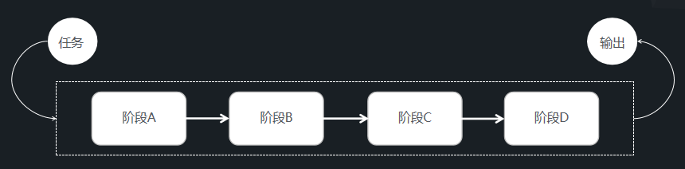
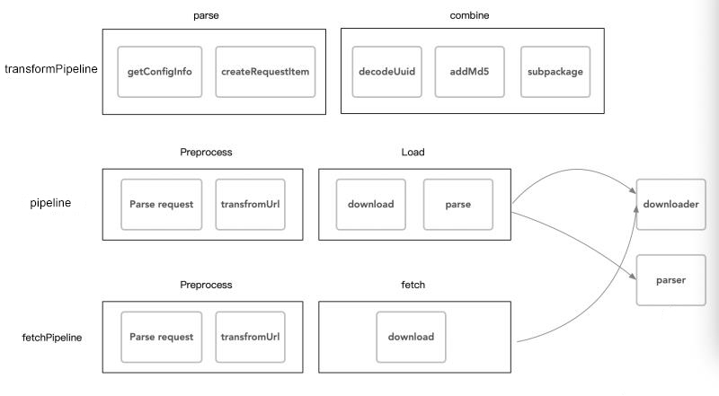

# 管线与任务

> 文：Santy-Wang
> 本文适合对加载流程有定制需求的进阶开发者

为了更容易扩展及修改引擎加载流程，Asset Manager 底层通过使用 **管线与任务**，**下载器与解析器** 来对资源进行加载，本篇主要介绍 **管线与任务**。

在 v2.4 之前的 `cc.loader` 就已经开始使用管线的概念来进行资源加载。而在 Asset Manager 中，我们重构了管线，使得逻辑更加清晰，更易扩展，你可以扩展现有管线，也可以使用引擎提供的 `cc.AssetManager.Pipeline` 类来创建自定义的管线。

**管线** （在 cc.AssetManager.Pipeline 中定义）可以理解为一系列过程的串联组合，而当一个请求经过管线时，会被管线的各个阶段依次进行处理，最后将处理后的结果进行输出。示意图如下：



管线与一般的固定流程相比的优势在于，管线中的所有环节都是可拼接和组合的，这意味着你可以在现有管线的任意环节插入新的阶段或移除旧的阶段，这带来了极大的灵活性，你可以对现有流程做出自定义的扩展。 

Asset Manager 中内置了三条管线，如图所示：



1. 第一条管线用于转换资源路径，找到真实资源路径。
2. 第二条管线是正常加载流程。
3. 第三条管线用于预加载流程。

**注意**：第二条管线使用了下载器与解析器，第三管线使用了下载器，详细可参考 [下载器和解析器](downloader-parser.md)。

你可以对内置管线进行扩展以实现自己的定制需求，例如：

```js
cc.assetManager.pipeline.insert(function (task, done) {
    task.output = task.input; 
    for (var i = 0; i < task.input; i++) {
        console.log(task.input[i].content);
    }
    done();
}, 1);
```

你也可以构建一条新的管线，例如：

```js
var pipeline = new cc.AssetManager.Pipeline('test', [(task, done) => {
    console.log('first step');
    done();
}, (task, done) => {
    console.log('second step');
    done();
}]);
```

构建管线仅需要一系列方法，每个方法接受一个任务参数和一个完成回调参数。你可以在方法中访问该任务的所有内容，在完成时调用完成回调即可。

在管线中流动的请求被称为任务，详细请参考 `cc.AssetManager.Task` 类型，一个任务将包括其所有信息，包括输入，输出，完成回调，[可选参数](options.md) 等内容。当任务在管线中流动时，管线的每个阶段可以取出任务的输入，做出一定的处理后存回到输出中。例如：

```js
cc.assetManager.pipeline.insert(function (task, done) {
    for (var i = 0; i < task.input.length; i++) {
        task.input[i].content = null;
    }
    task.output = task.input;
    done();
}, 1);
```