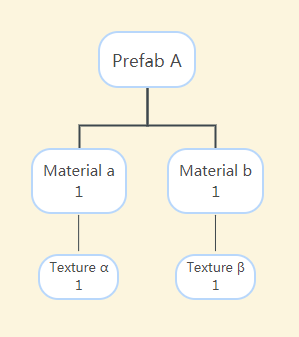

# 资源释放

> 文：Santy-Wang、Xunyi

Asset Manager 中提供了资源释放模块，用于管理资源的释放。

在资源加载完成后，会被临时缓存到 `cc.assetManager` 中，以便下次复用。但是这也会造成内存和显存的持续增长，所以有些资源如果不需要用到，可以通过 **自动释放** 或者 **手动释放** 的方式进行释放。释放资源将会销毁资源的所有内部属性，比如渲染层的相关数据，并移出缓存，从而释放内存和显存（对纹理而言）。

## 自动释放

场景的自动释放可以直接在编辑器中设置。在 **资源管理器** 选中场景后，**属性检查器** 中会出现 **自动释放资源** 选项。


勾选后，点击右上方的 **应用** 按钮，之后在切换该场景时便会自动释放该场景所有的依赖资源。建议场景尽量都勾选自动释放选项，以确保内存占用较低，除了部分高频使用的场景（例如主场景）。

另外，所有 `cc.Asset` 实例都拥有成员函数 `cc.Asset.addRef` 和 `cc.Asset.decRef`，分别用于增加和减少引用计数。一旦引用计数为零，Creator 会对资源进行自动释放（需要先通过释放检查，具体可参考下部分内容的介绍）

```js
start () {
    cc.resources.load('images/background', cc.Texture2D, (err, texture) => {
        this.texture = texture;
        // 当需要使用资源时，增加其引用
        texture.addRef();
        // ...
    });
}

onDestroy () {
    // 当不需要使用资源时，减少引用
    // Creator 会在调用 decRef 后尝试对其进行自动释放
    this.texture.decRef();
}
```

自动释放的优势在于不用显式地调用释放接口，开发者只需要维护好资源的引用计数，Creator 会根据引用计数自动进行释放。这大大降低了错误释放资源的可能性，并且开发者不需要了解资源之间复杂的引用关系。对于没有特殊需求的项目，建议尽量使用自动释放的方式来释放资源。

### 释放检查

为了避免错误释放正在使用的资源造成渲染或其他问题，Creator 会在自动释放资源之前进行一系列的检查，只有检查通过了，才会进行自动释放。

1. 如果资源的引用计数为 0，即没有其他地方引用到该资源，则无需做后续检查，直接摧毁该资源，移除缓存。

2. 资源一旦被移除，会同步触发其依赖资源的释放检查，将移除缓存后的资源的 **直接** 依赖资源（不包含后代）的引用都减 1，并同步触发释放检查。

3. 如果资源的引用计数不为 0，即存在其他地方引用到该资源，此时需要进行循环引用检查，避免出现自己的后代引用自己的情况。如果循环引用检查完成之后引用计数仍不为 0，则终止释放，否则直接摧毁该资源，移除缓存，并触发其依赖资源的释放检查（同步骤 2）。

## 手动释放

当项目中使用了更复杂的资源释放机制时，可以调用 Asset Manager 的相关接口来手动释放资源。例如：

```js
cc.assetManager.releaseAsset(texture);
```

因为资源管理模块在 v2.4 做了升级，所以释放接口与之前的版本有一点区别：

1. `cc.assetManager.releaseAsset` 接口仅能释放单个资源，且为了统一，接口只能通过资源本身来释放资源，不能通过资源 uuid、资源 url 等属性进行释放。

2. 在释放资源时，开发者只需要关注资源本身，引擎会 **自动释放** 其依赖资源，不再需要通过 `getDependsRecursively` 手动获取依赖。

**注意**：`release` 系列接口（例如 `release`、`releaseAsset`、`releaseAll`）会直接释放资源，而不会进行释放检查，只有其依赖资源会进行释放检查。所以当显式调用 `release` 系列接口时，可以确保资源本身一定会被释放。

## 引用计数统计

在 v2.4 之前，Creator 选择让开发者自行控制所有资源的释放，包括资源本身及其依赖项，开发者必须手动获取资源所有的依赖项并选择需要释放的依赖项。这种方式给予了开发者最大的控制权，对于小型项目来说工作良好。但随着 Creator 的发展，项目的规模不断扩大，场景所引用的资源不断增加，其他场景也可能复用了这些资源，这就会导致释放资源的复杂度越来越高，开发者要掌握所有资源的使用非常困难。

为了解决这个痛点，Asset Manager 提供了一套基于引用计数的资源释放机制，让开发者可以简单高效地释放资源，不用担心项目规模的急剧膨胀。需要说明的是 Asset Manager 只会自动统计资源之间的静态引用，并不能真实地反应资源在游戏中被动态引用的情况，动态引用还需要开发者进行控制以保证资源能够被正确释放。原因如下：

- JavaScript 是拥有垃圾回收机制的语言，会对其内存进行管理，在浏览器环境中引擎无法知道某个资源是否被销毁。
- JavaScript 无法提供赋值运算符的重载，而引用计数的统计则高度依赖于赋值运算符的重载。

### 资源的静态引用

当开发者在编辑器中编辑资源时（例如场景、预制体、材质等），需要在这些资源的属性中配置一些其他的资源，例如在材质中设置贴图，在场景的 Sprite 组件上设置 SpriteFrame。那么这些引用关系会被记录在资源的序列化数据中，引擎可以通过这些数据分析出依赖资源列表，像这样的引用关系就是静态引用。

引擎对资源的静态引用的统计方式为：

1. 在使用 `cc.assetManager` 或者 Asset Bundle 加载某个资源时，引擎会在底层加载管线中记录该资源所有 **直接依赖资源** 的信息，并将所有 **直接依赖资源** 的引用计数加 1，然后将该资源的引用计数初始化为 0。

2. 在释放资源时，取得该资源之前记录的所有 **直接依赖资源** 信息，并将所有依赖资源的引用计数减 1。

因为在释放检查时，如果资源的引用计数为 0，才可以被自动释放。所以上述步骤可以保证资源的依赖资源无法先于资源本身被释放，因为依赖资源的引用计数肯定不为 0。也就是说，只要一个资源本身不被释放，其依赖资源就不会被释放，从而保证在复用资源时不会错误地进行释放。下面我们来看一个例子：

1. 假设现在有一个 A 预制体，其依赖的资源包括 a 材质和 b 材质。a 材质引用了 α 贴图，b 材质引用了 β 贴图。那么在加载 A 预制体之后，a、b 材质的引用计数都为 1，α、β 贴图的引用计数也都为 1。

    

2. 假设现在又有一个 B 预制体，其依赖的资源包括 b 材质和 c 材质。则在加载 B 预制体之后，b 材质的引用计数为 2，因为它同时被 A 和 B 预制体所引用。而 c 材质的引用计数为 1，α、β 贴图的引用计数也仍为 1。

    

3. 此时释放 A 预制体，则 a，b 材质的引用计数会各减 1
    - a 材质的引用计数变为 0，被释放，所以贴图 α 的引用计数减 1 变为了 0，也被释放。
    - b 材质的引用计数变为 1，被保留，所以贴图 β 的引用计数仍为 1，也被保留。
    - 因为 B 预制体没有被释放，所以 c 材质的引用计数仍为 1，被保留。
    
    

### 资源的动态引用

当开发者在编辑器中没有对资源做任何设置，而是通过代码动态加载资源并设置到场景的组件上，则资源的引用关系不会记录在序列化数据中，引擎无法统计到这部分的引用关系，这些引用关系就是动态引用。

如果开发者在项目中使用动态加载资源来进行动态引用，例如：

```js
cc.resources.load('images/background', cc.SpriteFrame, function (err, spriteFrame) {
    self.getComponent(cc.Sprite).spriteFrame = spriteFrame;
});
```

此时会将 SpriteFrame 资源设置到 Sprite 组件上，引擎不会做特殊处理，SpriteFrame 的引用计数仍保持 0。如果动态加载出来的资源需要长期引用、持有，或者复用时，建议使用 `addRef` 接口手动增加引用计数。例如：

```js
cc.resources.load('images/background', cc.SpriteFrame, function (err, spriteFrame) {
    self.getComponent(cc.Sprite).spriteFrame = spriteFrame;
    spriteFrame.addRef();
});
```

增加引用计数后，可以保证该资源不会被提前错误释放。而在不需要引用该资源以及相关组件，或者节点销毁时，请 **务必记住** 使用 `decRef` 移除引用计数，并将资源引用设为 `null`，例如：

```js
this.spriteFrame.decRef();
this.spriteFrame = null;
```
