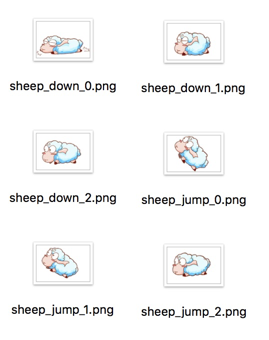

# 图集资源（Atlas）

图集（Atlas）也称作 Sprite Sheet，是游戏开发中常见的一种美术资源。图集是通过专门的工具将多张图片合并成一张大图，并通过 **plist** 等格式的文件索引的资源。可供 Cocos Creator 使用的图集资源由 **plist** 和 **png** 文件组成。下面就是一张图集使用的图片文件：

## 为什么要使用图集资源

在游戏中使用多张图片合成的图集作为美术资源，有以下优势：

- 合成图集时会去除每张图片周围的空白区域，加上可以在整体上实施各种优化算法，合成图集后可以大大减少游戏包体和内存占用
- 多个 Sprite 如果渲染的是来自同一张图集的图片时，这些 Sprite 可以使用同一个渲染批次来处理，大大减少 CPU 的运算时间，提高运行效率。

更形象生动的解释可以观看来自 CodeAndWeb 的教学视频 [What is a Sprite Sheet（什么是图集）](https://www.codeandweb.com/what-is-a-sprite-sheet)（如无法访问请科学上网）。

## 制作图集资源

要生成图集，首先您应该准备好一组原始图片：

接下来可以使用专门的软件生成图集，我们推荐的图集制作软件包括：

- [TexturePacker](https://www.codeandweb.com/texturepacker)
- [Zwoptex](https://zwopple.com/zwoptex/)

使用这些软件生成图集时请选择 cocos2d-x 格式的 plist 文件。最终得到的图集文件是同名的 **plist** 和 **png**。

**注意**：

- Zwoptex 暂时不支持最新版 macOS。
- 若没有特殊需求，也可以直接使用 [自动图集](./auto-atlas.md) 功能生成图集。

## 导入图集资源

将上面所示的 **plist** 和 **png** 文件同时拖拽到 **资源管理器** 中，就可以生成可以在编辑器和脚本中使用的图集资源了。

### Atlas 和 SpriteFrame

在 [图像资源文档](sprite.md#texture-spriteframe-) 中，我们介绍了 Texture 和 SpriteFrame 的关系。导入图集资源后，我们可以看到类型为 `Atlas` 的图集资源，点击左边的三角图标展开，展开后可以看到图集资源里包含了很多类型为 `SpriteFrame` 的子资源，每个子资源都是可以单独使用和引用的图片。

Sprite Frame 的使用方法和图像资源中介绍的一样，请查阅相关文档。

## 碎图转图集

在项目原型阶段或生产初期，美术资源的内容和结构变化都会比较频繁，我们通常会直接使用碎图（也就是多个单独的图片）来搭建场景和制作 UI。在之后为了优化性能和节约包体，需要将碎图合并成图集。Creator 提供了自动图集功能，可以在发布项目时无缝地将生产阶段的碎图合并成图集，并且自动更新资源索引。请查看 [自动图集资源](./auto-atlas.md) 获取详细用法。
