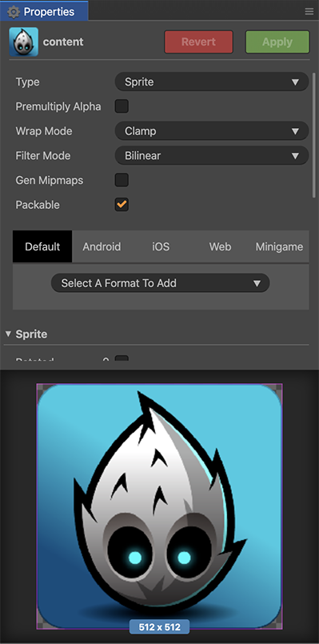
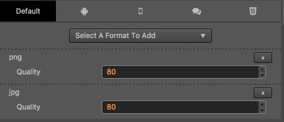
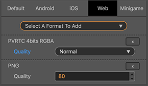

# 压缩纹理

Cocos Creator 可以直接在编辑器中设置纹理需要的压缩方式，然后在项目发布时自动对纹理进行压缩。针对 Web 平台，支持同时导出多种图片格式，引擎将根据不同的浏览器自动下载合适的格式。

## 配置压缩纹理

Cocos Creator 支持导入多种格式的图片（具体见下表），但是在实际游戏运行中，我们不建议使用原始图片作为资源来加载。比如在手机平台上可能只需要原图 80% 或者更少的画质，又或者是没有使用到透明通道的 .png 可以将其转换成 .jpg，这样可以减少很大一部分图片的存储空间。

图片格式 | Android | iOS | 微信小游戏 | Web
------------ | ------------- | --------- | -------- | --------
PNG | 支持 | 支持 | 支持 | 支持
JPG | 支持 | 支持 | 支持 | 支持
WEBP | Android 4.0 以上原生支持 其他版本可以使用 [解析库](https://github.com/alexey-pelykh/webp-android-backport) | 可以使用 [解析库](https://github.com/carsonmcdonald/WebP-iOS-example) | 不支持 | [部分支持](https://caniuse.com/#feat=webp)
PVR | 不支持 | 支持 | 支持 iOS 设备 | 支持 iOS 设备
ETC1 | 支持 | 不支持 | 支持 Android 设备 | 支持 Android 设备
ETC2 | 只支持生成资源，引擎部分需要参考 pr 自己实现：<https://github.com/cocos/engine-native/pull/1685>

默认情况下 Cocos Creator 在构建的时候输出的是原始图片，如果在构建时需要对某一张图片进行压缩，可以在 **资源管理器** 中选中这张图片，然后在 **属性管理器** 中对图片的纹理格式进行编辑。

## 压缩纹理详解

Cocos Creator 在构建图片的时候，会查找当前图片是否进行了压缩纹理的配置，如果没有，则继续查找是否做了默认（Default）的配置，如果没有，则最后按原图输出。

如果查找到了压缩纹理的配置，那么会按照找到的配置对图片进行纹理压缩。在一个平台中可以指定多种纹理格式，每种纹理格式在构建时都会根据原图压缩生成一张指定格式的图片。

这些生成的图片不会都被加载到引擎中，引擎会根据 [cc.macro.SUPPORT_TEXTURE_FORMATS](../../../api/zh/classes/macro.html#supporttextureformats) 中的配置来选择加载合适格式的图片。`cc.macro.SUPPORT_TEXTURE_FORMATS` 列举了当前平台支持的所有图片格式，引擎加载图片时会从生成的图片中找到在这个列表中 **优先级靠前**（即排列靠前）的格式来加载。

用户可以通过修改 `cc.macro.SUPPORT_TEXTURE_FORMATS` 来自定义平台的图片资源支持情况以及加载顺序的优先级。

## 示例

在上面的示例图中，默认平台配置了 png 格式的压缩纹理，web 平台配置了 pvr、png 格式的压缩纹理，而其他平台没有添加任何配置。那么在构建 web 平台的时候这张图片就会被压缩成 pvr，png 两种格式，在构建其他平台的时候则只会生成 png 格式的图片。

而默认设置的 `cc.macro.SUPPORT_TEXTURE_FORMATS` 中只有 ios 平台上才添加了 .pvr 的支持，所以只有在 ios 的浏览器上才会加载 pvr 格式的图片，其他平台上的浏览器则加载 png 格式的图片。
