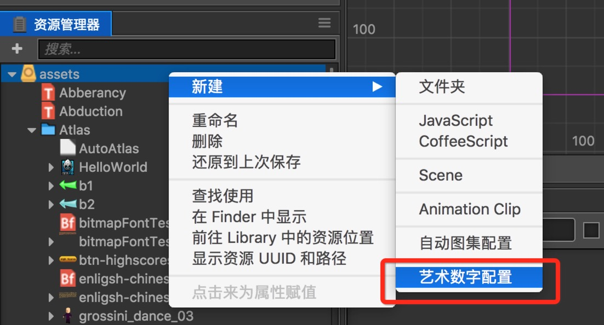

# 艺术数字资源 (LabelAtlas)

**艺术数字资源** 是一种用户自定义的资源，它可以用来配置艺术数字字体的属性。

## 创建艺术数字资源

在 **资源管理器** 中右键，可以在如下菜单中找到 **新建 -> 艺术数字配置** 的子菜单，点击菜单将会新建一个类似 **LabelAtlas.labelatlas** 的资源。

**艺术数字资源** 在使用之前需要进行一些配置，比如关联渲染的图片资源，设置每一个字符的宽高和起始字符信息。

## 配置艺术数字资源

在资源管理器中选中一个 **艺术数字资源** 后，**属性检查器** 面板将会显示 **艺术数字资源** 的所有可配置项。

| 属性             | 功能说明                                                                                                       |
| --------------   | -----------                                                                                                    |
| Raw Texture File | 指定渲染图片                                                                                                   |
| Item Width       | 指定每一个字符的宽度                                                                                           |
| Item Height      | 指定每一个字符的高度                                                                                           |
| Start Char       | 指定艺术数字字体里面的第一个字符，如果字符是 Space，也需要在这个属性里面输入空格字符                           |

配置完成后需要点击 **属性检查器** 右上角的绿色的打勾按钮来保存设置。

## 使用艺术数字资源

使用艺术数字资源非常简单，你只需要新建一个 Label 组件，然后把新建好的艺术数字资源拖到 Label 组件的 Font 属性即可。
