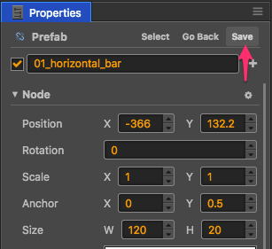
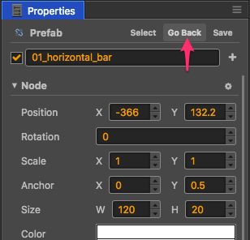

# 预制资源（Prefab）

## 创建预制

在场景中编辑好节点后，直接将节点从 **层级管理器** 拖到 **资源管理器**：

即可创建出一个预制：

## 保存预制

在场景中修改了预制实例后，在 **属性检查器** 中直接点击 **保存**，即可保存对应的预制资源：

## 还原预制

在场景中修改了预制实例后，在 **属性检查器** 中直接点击 **回退**，即可将预制对象还原为资源中的状态：

## 自动同步和手动同步

每个场景中的预制实例都可以选择要自动同步和还是手动同步。 
设为**手动同步**时，当预制对应的原始资源被修改后，场景中的预制实例不会同步刷新，只有在用户手动还原预制时才会刷新。 
设为**自动同步**时，该预制实例会自动和原始资源保持同步。

图中的图标表示当前预制的同步方式，点击图标将会在两种模式之间切换：

上面的图标表示当前预制使用手动同步，点击图标会切换到自动同步：

注意，为了保持引擎的精简，自动同步的预制实例有如下限制：
 - 为了便于对各场景实例进行单独定制，场景中的预制根节点自身的 name、active、position 和 rotation 属性不会被自动同步。而其它子节点和所有组件都必须和原始资源保持同步，如果发生修改，编辑器会询问是要撤销修改还是要更新原始资源。
 - 自动同步的预制中的组件无法引用该预制外的其它对象，否则编辑器会弹出提示。
 - 自动同步的预制外面的组件只能引用该预制的根节点，无法引用组件和子节点，否则编辑器会弹出提示。

> 这些限制都仅影响编辑器操作，运行时不影响。

## 将预制还原成普通节点

从 **资源管理器** 中删除一个预制资源后，你可以将场景中对应的预制实例还原成普通节点。方法是选中预制实例，然后点击菜单 `节点 > 还原成普通节点`。

## 预置的选项

在 **资源管理器** 中，选中任一预置资源，可以在 **属性检查器** 中编辑以下选项。

### 设置“优化策略”

在 v1.8.0 中加入了“优化策略”选项，能优化所选预置的实例化时间，也就是执行 `cc.instantiate` 所需的时间。可设置的值有：
 - **自动调整**（默认）： 
   设为这个选项后，引擎将根据创建次数自动调整优化策略。初次创建实例时，等同于“优化单次创建性能”，多次创建后将自动“优化多次创建性能”。
 - **优化单次创建性能**： 
   该选项会跳过针对这个 prefab 的代码生成优化操作。
 - **优化多次创建性能**： 
   该选项会启用针对这个 prefab 的代码生成优化操作。

如果这个预置需要反复执行 `cc.instantiate`，请选择“优化多次创建性能”，否则保持默认的“自动调整”即可。

> 在旧版本引擎中，优化方式固定为“优化多次创建性能”，在需要批量创建对象的场合中效果拔群。但是有不少人将 prefab 作为多人协作或者分步加载的工具，这些 prefab 基本只会实例化一次，就会导致节点创建速度变慢。新版本默认采用“自动调整”以后，很好的解决了这个问题。

### 设置“延迟加载资源”

该项默认关闭。勾选之后，使用 **属性检查器** 关联、loadRes 等方式单独加载预置资源时，将会延迟加载预置所依赖的其它资源，提升部分页游的加载速度。详情请参考[场景的延迟加载](scene-managing.md#async-load-assets)。
