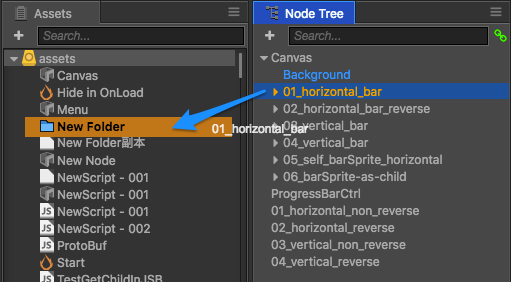
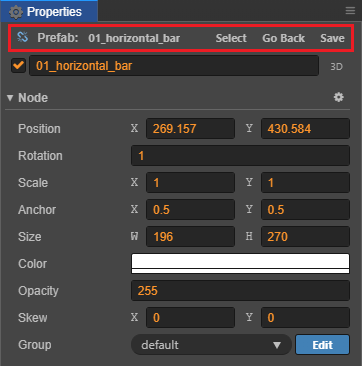
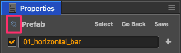
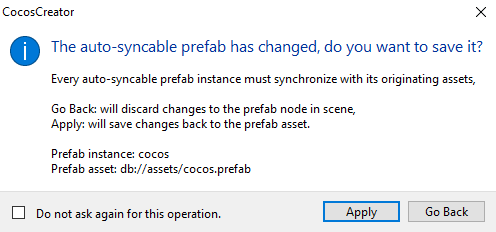

# 预制资源（Prefab）

预制资源（Prefab）是预先配置好的游戏对象，可作为我们动态生成节点时使用的模板。

## 创建预制

在场景中编辑好节点后，直接将节点从 **层级管理器** 拖到 **资源管理器**：

即可创建一个 **预制资源**：

## 使用预制

将预制资源从 **资源管理器** 拖拽到 **层级管理器** 或 **场景编辑器**，即可在场景中生成一个 **预制实例**，预制实例节点在 **层级管理器** 中显示为蓝色。

如果对场景中预制实例的各项属性进行修改，然后保存场景，修改的数据会被存储在该预制实例中，不会影响到 **资源管理器** 中的预制资源，以及使用预制资源生成的其他预制实例的数据。

## 编辑预制

若需要修改预制资源，可通过以下两种方式进行编辑。

### 预制编辑模式

在 **资源管理器** 中双击预制资源，可将 **场景编辑器** 的场景编辑模式切换为预制编辑模式。

此时可以在编辑器中编辑预制资源，编辑完成之后，点击 **场景编辑器** 上方的 **保存** 按钮即可保存编辑后的预制资源，然后点击 **关闭** 按钮即可退出预制编辑模式，返回场景编辑模式。

### 场景中编辑

在 **层级管理器**/**场景编辑器** 中选中预制实例节点，**属性检查器** 面板顶部便会出现几个可操作的按钮：

#### 选择

点击该按钮即可在 **资源管理器** 中黄色高亮生成该预制实例的预制资源。

#### 回退

若修改了预制实例，点击 **回退** 按钮，即可将预制实例还原为初始预制资源的状态。

> **注意**：回退操作对 **节点激活状态**、**节点名称**、`Position`、`Rotation` 的修改无效。

#### 保存预制

在场景中修改了预制实例后，在 **属性检查器** 中直接点击 **保存**，即可将修改同步到对应的预制资源中。

#### 自动同步和手动同步

当预制实例对应的原始预制资源被修改后，每个场景中的预制实例都可以选择要自动同步还是手动同步预制资源。选中预制实例后，点击  按钮即可切换手动/自动同步，默认为手动同步。

- 设为 **手动同步** 时，预制实例不会自动和原始预制资源同步更新。若需要同步更新，手动点击右上方的 **回退** 按钮即可。且该预制实例节点在 **层级管理器** 中显示为蓝色。

  

- 设为 **自动同步** 时，预制实例会自动和原始预制资源保持同步，且该预制实例节点在 **层级管理器** 中显示为绿色。

  

  > **注意**：为了保持引擎的精简，自动同步的预制实例有如下限制：
  >
  > 1. 为了便于对各场景实例进行单独定制，场景中的预制实例根节点自身的 `name`、`active`、`position` 和 `rotation` 属性不会被自动同步。而其它子节点和所有组件都必须和原始预制资源保持同步，如果发生修改，则在切换到其他节点时，编辑器会询问是要撤销该预制实例的修改还是要保存修改并更新到原始预制资源中。
  >
  >    
  >
  > 2. 自动同步的预制实例中的组件无法引用该预制实例外的其它对象，否则编辑器会弹出提示。
  >
  > 3. 自动同步的预制实例外面的组件只能引用该预制实例的根节点，无法引用其组件和子节点，否则编辑器会弹出提示。
  >
  > 这些限制都只影响编辑器操作，运行时不影响。

## 将预制实例还原成普通节点

若不需要使用某个预制资源，并在 **资源管理器** 中将其删除，那么场景中通过该预制资源生成的预制实例可以还原成普通节点，点击顶部菜单栏中的 **节点 -> 还原成普通节点** 即可。

## 预制的选项

在 **资源管理器** 中选中任一预制资源，便可在 **属性检查器** 中设置其 **优化策略**、**延迟加载资源** 和 **只读状态**，设置完成后需要点击右上方的 **应用** 按钮以生效。

### 设置优化策略

优化策略能优化所选预制资源的实例化时间，也就是执行 `cc.instantiate` 所需的时间。可设置的项包括 **自动调整**（默认）、**优化单次创建性能** 和 **优化多次创建性能**。

- 如果设置为 **自动调整**，引擎会根据创建次数自动调整优化策略。初次创建预制实例时，等同于 **优化单次创建性能**，多次创建后将自动 **优化多次创建性能**。

- 如果这个预制需要反复执行 `cc.instantiate`，请选择 **优化多次创建性能**，否则保持默认的 **自动调整** 即可。

> 在 Creator 旧版本中，优化策略固定为 **优化多次创建性能**，在需要批量创建对象的场合中效果拔群，但是有不少人将 prefab 作为多人协作或者分步加载的工具，这些 prefab 基本只会实例化一次，就会导致节点创建速度变慢。新版本默认使用 **自动调整**，很好地解决了这个问题。

### 设置延迟加载资源

该项默认关闭。若启用该项，将会延迟加载预制所依赖的其它资源，提升部分页游的加载速度。详情请参考 [场景的延迟加载](scene-managing.md#async-load-assets)。

### 只读

编辑器内部创建的预制资源，不允许修改。
